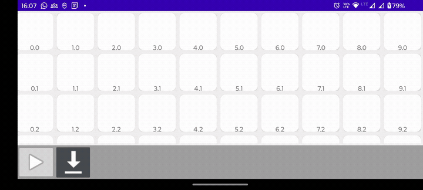

# Application "Virtual Gallery"
## Overview

This application is meant for android users with sdk version from 24 up, with targetSdk(optimal case) 33 

It can be used to create a virtual gallery consisting of walls and paintings attached to them. The user designs the layout of walls in "view 2D", 
then switches to "view 3D" to see that layout brought to life in 3D representation. 
There, user can freely move around, and hang pictures on walls. Pictures to hang come from user mobile camera images.

## How to install:
1. download .apk file from [releases of this repository](https://github.com/bogumil-latuszek/virtual_gallery_3D/releases)
2. find it in file system of user device (it should be in Downloads), then click on it and choose "install"
3. agree to installation and wait until installation finishes

## About this Project

This Project serves as a fundation for my Bachelor's Thesis in Computer Science, which I decided to publish in this very repository, it can be found [here](https://github.com/bogumil-latuszek/virtual_gallery_3D/tree/main/documentation/praca_inzynierska_Bogumil_Latuszek.md). In my Thesis I touch upon topics such as the history and evolution of computer graphics, and explain math behind 3D rendering pipeline. My Thesis was originaly submitted in polish, and at this time I can only share a copy of the original untranslated text. One section in my Thesis that is most relevant for understanding the inns-and-outs of this project can be found in chapter 7 "Dokumentacja techniczna projektu" ("Technical Documentation of the Project"), containing an illustrated guide for using this very program.

## Common problems:

### can't add any pictures
After booting the app for the first time the app should ask you for permission to use photos stored in your device.
If that didn't happen, you can grant this permission manually:
1. make sure to close the app
2. navigate to settings > V-Gallery > permissions > not allowed > choose "allow" for photos and videos permission
3. boot up V-Gallery again, the pictures should now load
   
Alternatively, the app may not read any photos, becouse you don't have any saved in your default camera location, try:
1. navigate in your file explorer to Device/DCIM/Camera, if that folder is empty just make shure to add some and the app will load them
