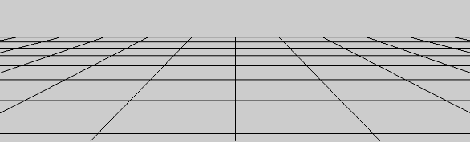
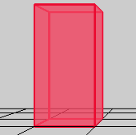
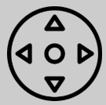
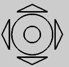

# Application "Virtual Gallery"
## Overview
This application is meant for android users with sdk version from 24 up, with targetSdk(optimal case) 33 

It can be used to create a virtual gallery consisting of walls and paintings attached to them. The user designs the layout of walls in "view 2D", 
then switches to "view 3D" to see that layout brought to life in 3D representation. 
There, user can freely move around, and hang pictures on walls. Pictures to hang come from user mobile camera images.

## How to install:
1. download .apk file from [releases of this repository](https://github.com/bogumil-latuszek/android_OpenGL_learning/releases)
2. find it in file system of user device (it should be in Downloads), then click on it and choose "install"
3. agree to installation and wait until installation finishes

## Common problems:

### can't add any pictures
After booting the app for the first time the app should ask you for permission to use photos stored in your device.
If that didn't happen, you can grant this permission manually:
1. make sure to close the app
2. navigate to settings > V-Gallery > permissions > not allowed > choose "allow" for photos and videos permission
3. boot up V-Gallery again, the pictures should now load
   
Alternatively, the app may not read any photos, becouse you don't have any saved in your default camera location, try:
1. navigate in your file explorer to Device/DCIM/Camera, if that folder is empty just make shure to add some and the app will load them

## Classes used in application and their meaning (in Polish):
* `MainActivity` - ustawianie view 2D, podpięcie Bazy Danych, aktywacja Layoutu Grid, ustawianie i usuwanie ścian 2D w gridzie jako reakcja na dotknięcie ekranu, zapis wybranych ścian 2D do bazy danych, obsługa zgody użytkownika na dostęp do zdjęć z zewnętrznej karty pamięci, aktywacja przejścia aplikacji do trybu 3D
* `Mode3DActivity` - tworzenie obiektów `Surface3DView`, `SceneRenderer`, ustawianie View 3D, przechwytywanie zdarzenia dotknięcia ekranu i przekierowywanie go do renderer-a.
* `Surface3DView` - osadzenie render-a który będzie rysował po View, wybranie wersji 2.0 dla OpenGL ES (defaultowo wybierana jest wersja 1.0 która nie umożliwia stosowania Shaderów)
* `SceneRenderer` - główna część aplikacji rysująca obiekty 3D. Implementuje interface `android.opengl.GLSurfaceView.Renderer` opisany w rodziale 5.9.8. Dodatkowo metoda `handleTouchDrag()` realizuje mechanizm wskazania ściany do zawieszenia/zdjęcia obrazu opisany w rozdziale 3.2 (detekcja kolizji ściany z "półprostą wskazania" ściany).
* `FloorGrid` - rysowanie grida "podłogi" sceny 3D </img> dającego możliwość orientacji w przestrzeni.
* `Cuboid` - realizacja wyświetlania prostopadlościanu </img>
* `Wall` - klasa pochodna od `Cuboid`. Odpowiada za wieszanie, zdejmowanie i wyświetlenie obrazów powieszonych na ścianach bocznych. </img> Zapisuje w bazie danych który obraz został powieszony na której ścianie. Dokłada na bocznych ścianach prostopadlościanu obiekty klasy `Face` biorące udział w detekcji kolizji z "półprostą wskazania" ściany. Na potrzeby algorytmu kolizji odnajduje wszystkie `Face` które zostały trafione przez "półprostą wskazania" ściany.
* `Face` - wieszanie i zdejmowanie pojedynczej tekstury z bocznej ściany `Wall`. Detekcja kolizji tej ściany z "półprostą wskazania" ścian.
* `Ray`, `Point`, `Plane` - reprezentacje półprostej, punktu i plaszczyzny wykorzystywane w algorytmie detekcji kolizji ściany z "półprostą wskazania" ścian. Wynikiem trafienia półprostej w `Face` jest obiekt klasy `PointOnFace` przechowujący parę: punkt trafienia ściany i trafiona ściana.
* `Geometry` - wyliczanie: punktu przecięcia płaszczyzny z półprostą, dystansu punktu od półprostej; budowanie wektora między dwoma punktami (obiekt klasy `Vector3D`).
* `MovementCtrl` - Rysowanie kontrolki </img> umożliwiającej przemieszczenia w przestrzeni 3D. Detekcja który obszar kontrolki został wskazany (przesunięcie w lewo/prawo, w tył/przód) i - na jego podstawie - wyliczenie wektora przesunięcia kamery. Wektor ten jest wykorzystywany wewnątrz `SceneRenderer` do modyfikacji macierzy View (kamery) o skladową translacji.
* `RotationCtrl` - Rysowanie kontrolki </img> umożliwiającej obroty w przestrzeni 3D. Detekcja który obszar kontrolki został wskazany (obrót w lewo/prawo, w górę/dół, środek: reset obrotu) i - na jego podstawie -  modyfikacja macierzy View (kamery) o składową obrotu.
* `Filemanager` - dostęp do plików zdjęć z zewnętrzej karty pamięci
* `TextureHelper` - ładuje plik graficzny jako bitmapę, tworzy z niej teksturę, przesyła ją na GPU i zwraca uchwyt do tej tekstury.
* `Texture` - przechowuje skojarzenie między nazwą tekstury/zdjęcia a uchwytem do tej tekstury.
* `PaintingCollection` - z pomocą `Filemanager` odczytuje pliki zdjęć, z pomocą `TextureHelper` tworzy tekstury i przechowuje uchwyty do wszystkich załadowanych tekstur zdjęć. Przechowuje mapowanie nazwy zdjęcia na uchwyt tekstury (lista `Texture`). Potrafi oddać uchwyt tekstury na podstawie nazwy zdjęcia. Potrafi oddać kolejną teksturę spośród wszystkich załadowanych.
* `Painting` - wyświetlanie pojedynczej tekstury wewnątrz prostokąta w przestrzeni 3D.
* `TextResourceReader` klasa wczytująca kod źródłowy Shaderów.