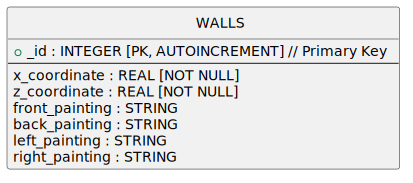

# WYŻSZA SZKOŁA EKONOMII I INFORMATYKI W KRAKOWIE


Bogumił Latuszek
nr albumu 13132

## PROJEKT I IMPLEMENTACJA APLIKACJI MOBILNEJ „WIRTUALNA GALERIA SZTUKI” KORZYSTAJĄCEJ Z BIBLOTEKI OPENGL ES


Praca inżynierska
napisana pod kierunkiem
Prof. Jana Werewki

Kraków 2025 r.

# Streszczenie

Praca ta analizuje problematykę grafiki komputerowej 3D w ujęciu historycznym i algorytmicznym. Celem pracy jest zaprojektowanie i implementacja aplikacji mobilnej oferującej funkcjonalność tworzenia wirtualnej galerii sztuki, w oparciu o technologie grafiki 3D.

Problemem jaki rozwiązuje aplikacja jest potrzeba dostarczenia łatwo dostępnego i prostego w obsłudze programu, który umożliwiałby stworzenie, wyświetlanie, i rozmieszczenie obrazów w przestrzeni 3D. Odbiorcami docelowymi są projektanci galerii sztuki, oraz osoby potrzebujące narzędzia ułatwiającego wykorzystanie techniki pamięciowej - pałacu pamięci * link do opisu pałacu pamięci. 

Projekt został zrealizowany jako aplikacja na system Android, napisana w językach Java i GLSL, z wykorzystaniem biblioteki graficznej OpenGL ES. W projektowaniu został użyty język UML. Do napisania aplikacji zostały też wykorzystane wzorce projektowe.

Aplikacja "Wirtualna Galeria" jest narzędziem łatwo dostępnym dla każdego posiadacza telefonu z systemem android. Dzięki swojej intuicyjności pozwala w szybki sposób zwizualizować w przestrzeni 3D koncepcje artystyczne i fotograficzne jej użytkowników

## Słowa kluczowe

Aplikacja mobilna, Grafika 3D, Open Source, Android, Java, OpenGL ES, Transformacje brył 3D, Fizyka przestrzeni 3D

# Abstract

This Engineer's Thesis aims to analise the problem of 3D computer graphics in terms of it's history and the algorithms being used. The goal is to design and inplement a mobile app, which offers sufficient functionality for the sake of creating a virtual art gallery, based on 3D graphics technology.

The problem that the app solves, is the need for an accessible and easy to use program, which would allow for creation, viewing, and placement of images in 3D space. The target users are designers of art galleries, and people who desire for a tool which would make it easier to use a memory technique called memory palace * link do opisu pałacu pamięci

The Project was brought to life as an app for Android operating system, written in Java and GLSL, using graphics library OpenGL ES. During the diesinging process, UML language has been used. In writing of the application code, there have been used certain design patterns.

"Wirtual Gallery" application is an easily accessible tool for every owner of an android phone. Thanks to it's intuitive design, it allows for quick visualisation of it's users artistic and fotographic ideas in 3D space.

## Keywords

Mobile app, 3D graphics, OpenSource, Android, Java, OpenGL ES, 3D shape transformation, physics of 3D space

# Spis treści:


[Streszczenie](#Streszczenie)

1. [Wstęp](#1-wstęp)
    - 1.1 [Cele projektowe](#11-cele-projektowe)
    - 1.2 [Zakres pracy](#12-zakres-pracy)
    - 1.3 [Skrótowy opis zawartości rozdziałów](#13-skrótowy-opis-zawartości-rozdziałów)
2. [Historia rozwoju narzędzi graficznych](#2-historia-rozwoju-narzędzi-graficznych)
    - 2.1 [Open source](#21-open-source)
    - 2.2 [Grafika komputerowa](#22-grafika-komputerowa)
3. [Matematyka i algorytmy grafiki 3D](#3-Matematyka-i-algorytmy-grafiki-3D)
    - 3.1 [Wyświetlanie grafiki 3D](#31-wyświetlanie-grafiki-3d)
    - 3.1.1 Transformacje obiektów podczas wyświetlania sceny
    - 3.1.2 Implementacja obliczeń macierzowych w grafice 3D
    - 3.1.3 Pipeline, czyli kolejne etapy wyświetlania sceny 3D
    - 3.2 [Obliczenia fizyki sceny 3D](#32-obliczenia-fizyki-sceny-3d)
4. [System Android](#4-system-android)
    - 4.1 [Android – najważniejsze cechy systemu](#41-android--najważniejsze-cechy-systemu)
    - 4.2 [Aplikacje mobilne na Android](#42-aplikacje-mobilne-na-android)
    - 4.2.1 Aplikacje natywne na Android
    - 4.2.2 Aplikacje Web UI na Android 
    - 4.2.3 Aplikacje Hybrydowe na Android
5. [Projekt Rozwiązania](#5-projekt-rozwiązania) 
    - 5.1 [Wymagania](#51-wymagania)
    - 5.2 [Analiza profilu użytkownika](#52-analiza-profilu-użytkownika)
    - 5.3 [Diagram przypadków użycia](#53-diagram-przypadków-użycia)
    - 5.4 [Przegląd istniejących rozwiązań](#54-przegląd-istniejących-rozwiązań)
    - 5.5 [Koncepcja wyglądu UI aplikacji](#55-koncepcja-wyglądu-ui-aplikacji)
    - 5.6 [Język programowania i środowisko programistyczne](#56-język-programowania-i-środowisko-programistyczne)
    - 5.7 [Biblioteka OpenGL ES](#57-biblioteka-opengl-es)
    - 5.7.1 Shadery
    - 5.7.2 Dane wejściowe Shaderów
    - 5.7.3 Struktura danych opisująca bryłę
    - 5.7.4 Przekazywanie wartości do atrybutów i uniformów Shadera
    - 5.7.5 macierze w OpenGL ES
    - 5.7.6 ustawianie Viewport-u
    - 5.7.7 realizacja "Face Culling" i "Deph testing"
    - 5.7.8 Realizacja "Widoku" systemu Android w OpenGL ES
    - 5.7.9 Przekazywanie danych między CPU i GPU - Diagramy UML
6. [Implementacja](#6-implementacja)
    - 6.1 [Wzorce Architektoniczne](#61-wzorce-architektoniczne)
    - 6.2 [Baza Danych](#62-baza-danych)
    - 6.3 [Testowanie aplikacji, napotkane problemy](#63-testowanie-aplikacji-napotkane-problemy)
    - 6.4 [Zarządzanie projektem informatycznym](#64-zarządzanie-projektem-informatycznym)
7. [Dokumentacja techniczna projektu](#7-dokumentacja-techniczna-projektu)
    - 7.1 [Instalacja aplikacji](#71-instalacja-aplikacji)
    - 7.2 [Uruchomienie aplikacji i opis funkcjonalności 2D](#72--uruchomienie-aplikacji-i-opis-funkcjonalności-2d)
    - 7.3 [Opis funkcjonalności 3D](#73-opis-funkcjonalności-3d)

8. [Wnioski końcowe](#wnioski-końcowe)

[Bibliografia](#bibliografia)

[Spis rysunków](#spis-rysunków)


# 1. Wstęp

Praca ta zajmuje się analizą problematyki grafiki komputerowej, skupiając się głównie
na grafice 3D.
    Ważne jest, aby przyjrzeć się dogłębnie historii rozwoju grafiki komputerowej. Pomoże
to w lepszym rozpoznaniu dostępnych opcji jakie można użyć w projekcie, a zarazem pozwoli
na głębsze zrozumienie procesów i technologii z jakimi przyjdzie się nam zmierzyć na etapie
implementacji projektu.
    Jeszcze lepsze zrozumienie da nam sama analiza wzorów matematycznych i rozwiązań
programistycznych związanych z tematyką projektu. Spróbujemy wyprowadzić kluczowe
wzory, wyjaśnić znaczenie ważniejszych procesów, rozbić złożone procesy na łatwe do
zrozumienia etapy. Dzięki temu gdy zmierzymy się z wyborem konkretnych bibliotek, czy
frameworków, będziemy mogli ocenić ich przydatność w bardziej obiektywny sposób.
    W dzisiejszym świecie rynek aplikacji mobilnych jest jednym z największych w sferze
produkcji oprogramowania. Jednak gwałtowny rozwój możliwości obliczeniowych
i pamięciowych urządzeń mobilnych w stosunkowo krótkim czasie postawił przed twórcami
oprogramowania nie lada wyzwanie. Aby zrealizować swój pomysł, muszą już na pierwszych
etapach planowania wybrać na jakim systemie operacyjnym będzie działać ich aplikacja,
a także które wersje wybranego systemu będą wspierane. Mogłoby się wydawać, że
najlepszym wyjściem zawsze będzie wybranie wszystkich systemów operacyjnych we
wszystkich możliwych wersjach. Choć rozwiązanie to pozwoliło by uzyskać maksymalną
ilość potencjalnych użytkowników, zazwyczaj nie jest to realistyczne podejście. Rozwój
aplikacji na więcej niż jednej platformie wiąże się z gamą dodatkowych problemów,
wynikających z samego faktu iż te systemy się między sobą różnią. Chcąc wdrożyć tę samą funkcjonalność,
należy obrać inne podejście na każdej platformie. W dodatku często starsze wersje tych
samych systemów nie posiadają jakiejś kluczowej funkcjonalności którą aplikacja chciałaby
wykorzystać, np wspierają bibliotekę OpenGL ES tylko do wersji 1.0. Dlatego developer
aplikacji mobilnych powinien zdawać sobie sprawę, że podczas planowania często będzie
musiał iść na kompromis pomiędzy dostępnością aplikacji, a kosztami i złożonością procesu
jej stworzenia.
    Do stworzenia Projektu "Wirtualna Galeria" wybrany został system Android,
w minimalnej wersji sdk 24, a docelowej 33.

## 1.1 Cele projektowe

Aplikacja "Wirtualna Galeria" służy do budowania symulacji galerii sztuki, dając
użytkownikowi możliwość wchodzenia z nią w interakcję, poprzez projektowanie ułożenia
ścian, rozmieszczanie obrazów, oraz zwiedzanie galerii.

## 1.2 Zakres Pracy

Praca skupia się na zaprojektowaniu i implementacji aplikacji mobilnej "Wirtualna
Galeria", w oparciu o system Android, język Java, bibliotekę OpenGL ES, oraz bazę danych
SQLite. W pracy zawarta jest również analiza zagadnień teoretycznych dotyczących użytych
narzędzi, oraz szeroko rozumianej dziedziny grafiki 3D, z naciskiem na wzory matematyczne
i rozwiązania techniczne. W celu ukontekstualizowania poruszanych zagadnień, zawarty
został również rozdział poświęcony historii powstania i rozwoju grafiki 3D.

## 1.3 Skrótowy opis zawartości rozdziałów

**Rozdział 2** "Historia rozwoju narzędzi graficznych" opowiada o historii powstania
programów umożliwiających tworzenie i wyświetlanie grafiki 3D. Rozdział ten porusza
również temat ruchu OpenSource który doprowadził do powstania bibliotek takich jak np.
OpenGL ES, czy systemów operacyjnych, w tym min. systemu Android.

**Rozdział 3** "Wzory matematyczne i rozwiązania programistyczne" zawiera w sobie
ogólny zarys działania grafiki komputerowej, wzorów matematycznych i rozwiązań
programistycznych związanych z tematyką projektu. Przyjrzymy się zagadnieniom takim jak:
mnożenie macierzy i wektorów, kolejność operacji podczas wyświetlania sceny, czy
algorytmy obliczania kolizji

**Rozdział 4** "System Android" skupia się na charakterystyce systemu Android.
Wymienione są typy aplikacji dostępnych na Android, wraz z wadami i zaletami każdego
z nich.

**Rozdział 5** "Projekt Rozwiązania" pokazuje proces planowania jaki odbył się w trakcie
rozwoju projektu. Wychodząc od podstawowych założeń, wymagań, poprzez analizę profilu
docelowego użytkownika, krystalizuje się opis aplikacji jaka ma powstać w kolejnych
etapach. Po sprecyzowaniu opisu „Wirtualnej Galerii” porównana jest z istniejącymi już
na rynku podobnymi rozwiązaniami i na podstawie tej analizy pokazana jest konkurencyjność
aplikacji na obecnym rynku. Później w tym rozdziale pokazany jest już koncept wyglądu
interfejsu użytkownika, opisany jest wybrany język i biblioteki użyte w projekcie.
Na wykresach UML pokazane są sekwencje wywołania funkcji istotnych dla zrozumienia
działania części aplikacji wykorzystującej OpenGL ES.

**Rozdział 6** "Implementacja" pokazuje jak wymagania projektowe udało się zrealizować
w procesie tworzenia aplikacji. Opisane są tu także zastosowane narzędzia i rozwiązania
których użycie nie zostało przewidziane w procesie projektowania.

**Rozdział 7** "Dokumentacja techniczna projektu" zawiera instrukcję instalacji i obsługi aplikacji.

Na końcu pracy znajdują się wnioski wyciągnięte z doświadczeń zebranych podczas
rozwoju aplikacji, a także bibliografia i spis rysunków.

# 2. Historia rozwoju narzędzi graficznych

Wirtualna Galeria to aplikacja umożliwiająca użytkownikowi tworzenie spersonalizowanej
galerii sztuki, w której może rozmieszczać ściany, wieszać obrazy etc. Stworzenie jej nie
byłoby możliwe bez biblioteki OpenGL ES i systemu Android, dwóch kluczowych
elementów dzięki którym może działać.

</img>

_Ilustracja 1: wykres przełomowych wydarzeń w historii grafiki komputerowej i open source – opracowanie własne_

Na powyższej ilustracji przedstawiona została historia ruchu Open Source oraz Grafiki
Komputerowej, które doprowadziły do powstania OpenGL ES i systemu Android.

## 2.1 Open source

W 1965 roku MIT we współpracy z kilkoma innymi przedsiębiorstwami (w tym Bell
Labs) rozpoczęło pracę nad systemem operacyjnym Multics 2. Był on przeznaczony do użytku
na specjalnym komputerze - GE 645. Po pięciu latach trwania projektu Multics wciąż nie był
ukończony, co zraziło kierownictwo Bell Labs do inwestowania w systemy operacyjne. Jakiś
czas później grupa programistów pracujących w Bell Labs, na czele której stali poprzednio
pracujący nad Multicsem Ken Thompson i Dennis Ritchie, próbowała przekonać zarząd
do zakupienia nowego komputera do którego zobowiązali się napisać OS. Nie dostali jednak
zgody na to przedsięwzięcie. Udało im się natomiast znaleźć w Bell Labs mało używany mini
komputer PDP-7, na którym stworzyli system Unix, wzorując się na systemie Multics. Warto
wspomnieć że ich system uzyskał nazwę "Unix" dopiero w 1970 r.

W 1970 r. do Bell Labs przyszło zamówienie z Amerykańskiego Biura Patentowego
na edytor tekstowy. Zespół Richiego i Thompsona wykorzystał tę okazję żeby zdobyć zgodę
na zakup komputera PDP-11. Najpierw przenieśli na niego system Unix, a potem zbudowali
na nim edytor tekstowy. W 1971r wdrożyli edytor w biurze patentowym, a projekt oficjalnie
zakończył się sukcesem. W ten sposób naukowcy udowodnili firmie Bell Labs użyteczność
systemu Unix.

Kod źródłowy Unix był przez długi czas zamknięty, dostęp do niego mieli tylko
pracownicy Bell Labs. W 1972 r. Richie i Kernigan stworzyli język C, a w 1973 r. czwarta
edycja Unixa została przepisana z Assemblera na C. W 1975 r. kod źródłowy szóstej wersji
Unixa, wyszedł poza Bell Labs na odpłatnej licencji AT&T do kilku amerykańskich
uniwersytetów. Ponieważ AT&T nie widziało potencjału w komercjalizacji Unixa, koszt był
symboliczny - rzędu kilkuset dolarów. Na jego podstawie powstały klony Unixa, min.
stworzony przez Uniwersytet Berkeley w Kaliforni Unix BSD. Twórcy Unixa BSD
zmodyfikowali go na tyle że mogli upublicznić jego kod źródłowy i uniezależnić się
od licencji AT&T. Na innej uczelni Andrew S. Tanenbaum stworzył MINIX, wersję Unixa
z której korzystał później Linus Thorvalds podczas nauki na Uniwersytecie w Helsinkach.

Tutaj warto wspomnieć o Richardzie Stallmanie, który odegrał wielką rolę w rozwoju
open-source i systemów operacyjnych. Richard ukończył fizykę na Harvardzie w 1974 r.
Jeszcze w trakcie studiów rozpoczął pracę w laboratorium sztucznej inteligencji na MIT, 
gdzie pracował w latach 1971-1984. Tam zetknął się z kodem źródłowym Unixa. W 1983
Stallman rozpoczął pracę na stworzeniem systemu operacyjnego pod nazwą GNU w całości
złożonego z bibliotek free software 4. Kontrybucjami samego Stallmana były min. kompilator
gcc, debugger (gdb), czy edytor Emacs, ale praca nad GNU była wysiłkiem zbiorowym.
Wielu twórców oprogramowania na prośbę Stallmana włączyło swoje biblioteki w jego skład.
W 1985 r. Stworzył Free Software Fundation5 (w skrócie FSF), organizację która miała
na celu chronić prawa użytkowników oprogramowania, w tym przede wszystkim możliwość
wglądu do kodu źródłowego i jego modyfikacji.

Linus Torvalds6, zainspirowany systemem MINIX postanowił napisać swój własny
system operacyjny Linux7. Pisanie go rozpoczął od zbudowania kernela - W 1991 wydał
wersję 0.02, a w 1994 1.0. Podczas gdy Linus kończył pracę nad kernelem Linuxa, projekt
GNU Stallmana zbliżał się ku końcowi. Ponieważ obaj programiści obrali odwrotne podejście
do tworzenia systemu operacyjnego (Linus zaczął od kernela, a Stallman od bibliotek
i narzędzi), postanowili rozpocząć współpracę i połączyć swoje systemy. W ten sposób
powstał system będący fuzją tych dwóch systemów - opierający się na jądrze Linuxa,
i wykorzystujący biblioteki GNU system GNU-Linux, zwany popularnie Linuxem.
GNU-Linux był naprawdę przełomowy, jest rozwijany do dzisiaj i ma ogromną rzeszę
pasjonatów. W połączeniu z Apache, serwerem webowym open-source, GNU-Linux jest
systemem operacyjnym większości serwerów sieci internetowej. Znalazł też zastosowanie
w bardzo wielu obszarach informatyki, od superkomputerów NASA do miniaturowych
komputerów typu Raspberry Pi, a sam kernel Linux został później wykorzystany jako jądro
systemu Android.

Początki Androida sięgają 2003 roku, kiedy to powstał jako przedsięwzięcie Android
Inc., amerykańskiej firmy technologicznej, której celem było stworzenie systemu
operacyjnego dla aparatów cyfrowych. Jednak do 2004 roku projekt przeszedł znaczącą
transformację, przenosząc swój nacisk na rozwój systemu operacyjnego zaprojektowanego
specjalnie dla smartfonów. Dostrzegając jego potencjał, Google Inc., amerykański gigant
wyszukiwarek internetowych, przejął Android Inc. w 2005 roku. Następnie zespół Android
w Google podjął strategiczną decyzję o zbudowaniu swojego projektu na Linux-ie. Pierwsze
komercyjne wydanie Androida miało miejsce w 2008 roku. Działająca na nim aplikacja
Android Market stała się wiodącym sklepem z aplikacjami na całym świecie zarówno pod
względem dostępności aplikacji, jak i liczby pobrań. W 2012 roku Google przeprowadził
rebranding, konsolidując swoje aplikacje na Androida pod nazwą Google Play.

## 2.2 Grafika komputerowa

Historia grafiki komputerowej ma swój początek w programach CAD 8 (Computer
Aided Design). Prawdopodobnie pierwszym w historii 9 programem typu CAD był stworzony
w 1957r. PRONTO10. Na podstawie danych wejściowych zawierających matematyczny opis
kształtów generował instrukcje dla maszyn zajmujących się wytwarzaniem części np. maszyn
CNC. Zarówno dane wejściowe jak i wyjściowe opisywały kształty 2D, dlatego
wykorzystanie programu ograniczało się do tworzenia profili ram itp. Warto zaznaczyć
że PRONTO był dostępny tylko na systemach komputerowych General Electric (GE).
Programy CAD w znacznym stopniu usprawniły pracę projektantów, architektów
i kreślarzy. Podczas gdy ręczne wprowadzenie zmiany do gotowego szkicu wiązało się
najczęściej z całościowym jego przerysowaniem, programy CAD umożliwiły łatwe
wprowadzanie zmian w projekcie.

Niedługo później, w latach 60-tych Ivan Sutherland stworzył Sketchpad. Sketchpad
wprowadził innowacje takie jak wprowadzanie danych bezpośrednio na ekranie przez pióro
świetlne11, oraz instancjonowanie obiektów, ale najbardziej przełomową funkcją Sketchpada
była możliwość tworzenia i manipulacji kształtów w 3D. Wszystkie kształty jakie można było
stworzyć w Sketchpadzie były modelami Wireframe – tzn. były zbudowane z punktów
i łączących je linii. Program Sketchpad był zaprojektowany i pozostaje silnie związany
z komputerem TX-2.

Choć programy CAD początkowo przeznaczone były głównie do tworzenia rysunków
technicznych, to wraz z rozwojem branży komputerowej i programistycznej, poszerzano
je o coraz to bardziej zaawansowane funkcjonalności. 

W 1963 Edward E. Zajac stworzył animację "Simulation of a two-giro gravity attitude
control system"12. Prawdopodobnie było to pierwsze użycie tekstur w grafice komputerowej.
Opracowanie tworzenia modeli wireframe zbudowanych z punktów i linii otworzyło
drogę modelowaniu przestrzeni 3D. Niedługo potem dzięki odkryciom takim jak vertexy,
tekstury, czy post processing, programistom udało się na podstawie modeli wireframe
wygenerować realistyczne obrazy 3D. Stąd wyrosły podstawy animacji komputerowej, gier
wideo, czy druku 3D. Jedną z "gałęzi" które wyrosły z "drzewa grafiki komputerowej"
są właśnie silniki graficzne. Te programy o wszechstronnym zastosowaniu kumulują w sobie
większość innowacji grafiki komputerowej. Jednym z nich jest Open GL, silnik graficzny
którego wpływ na grafikę komputerową odczuwany jest do dziś. W dalszej części pracy
przedstawimy historię jego powstania.

Programy CAD powstałe w latach 6o-tych i 70-tych były w większości nieprzenaszalne,
związane na stałe z komputerem na który zostały zaprojektowane. Miało to się jednak
zmienić gdy w 1982 r. powstał program AutoCAD stworzony przez firmę Autodesk. Był
to prawdopodobnie pierwszy program CADdostępny na więcej niż jednej platformie
sprzętowej.

Lata 80-te i 90-te to okres w którym na rynku narzędzi do tworzenia grafiki
komputerowej rządziły stacje graficzne, czyli wyspecjalizowane do tego celu komputery
o wysokich parametrach sprzętowych. Te maszyny posiadały własne silniki graficzne, choć
ich kod źródłowy najczęściej nie wychodził poza firmę produkującą stację graficzną. Jednym
z wiodących przedsiębiorstw zajmujących się produkcją tego typu maszyn była firma Silicon
Graphics (SGI) powstała w 198213 r. Ciekawostką na temat oprogramowania stacji
graficznych SGI jest fakt, iż systemem operacyjnym tych maszyn był stworzony przez SGI
klon Unixa nazwany Irix, zaś silnikiem graficznym uruchamianym na tym systemie był
IrisGL14.

Odbiorcami ich produktów były studia filmowe, pracownie architektoniczne, wojsko,
instytucje rządowe i akademickie.

W latach 1995-2002 ich produkty cieszyły się wyjątkowo dużą popularnością, o czym
świadczy fakt że wszystkie filmy nominowane w tym okresie do Academy Award za efekty
wizualne były filmami stworzonymi na komputerach SGI. Jednak z biegiem czasu, inni producenci
urządzeń do tworzenia grafiki komputerowej (Sun, HP, IBM), stali się realną konkurencją dla SGI.
Aby utrzymać silną pozycję na rynku, zarząd SGI podjął drastyczną decyzję. Otóż postanowili oni
udostępnić do open source (nieco zmodyfikowane) API swojego silnika graficznego IrisGL pod nową 
nazwą OpenGL 15. SGI zaczął prace nad tym projektem w 1991r i wypuścił OpenGL w wersjii 1.0 w 1992r.

W 1992 SGI utworzyła wraz z innymi firmami konsorcjum OpenGL Architecture
Review Boar aby dbać i promować standard OpenGL. W 2006 obowiązki te przejęło inne
konsorcjum zwane Khronos Group.

Widząc wzrastającą popularność OpenGL grupa Khronos postanowiła wydać także
wersję wyspecjalizowaną na urządzenia embedded, w tym telefony mobilne. Tak powstał
wydany w 2003 roku OpenGL ES16.

W 2017 KG ogłosił że nie będzie wydawać nowych wersji OpenGL, bo skupiają się na
jego następcy "Vulkan" (wydanym w 2016). Ja jednak zdecydowałem się użyć w moim
projekcie silnika OpenGL ES, ponieważ jest w powszechnej opinii łatwiejszy w użyciu dla
nowicjusza nie mającego do tej pory styczności z programowaniem w oparciu o silniki
graficzne. Poza tym OpenGL ES jest wciąż wspierany przez Android (w przeciwieństwie do
ich głównego konkurenta Apple), a jego funkcjonalność wydała mi się wystarczająca do
zrealizowania założeń wstępnych mojego projektu.

# 3. Wzory matematyczne i rozwiązania programistyczne

## 3.1 Wyświetlanie grafiki 3D

Grafika komputerowa znacząco różni się od świata rzeczywistego. Celem programistów
tworzących programy symulujące przestrzeń 3D jest zasymulowanie rzeczywistych
fenomenów otaczającego nas świata w jak najbardziej przekonujący sposób, jednak symulacja
świata wirtualnego zgodnie z zasadami świata rzeczywistego pozostaje wciąż w obrębie
fikcji. Dlatego też programiści zajmujący się grafiką 3D wynaleźli całą gamę algorytmów,
które mają w uproszczony sposób zasymulować zjawiska fizyczne. Przykładowo, wiemy
że ludzkie oko rejestruje widziany przez nas obraz poprzez pochłanianie odbitych w stronę
oka promieni światła widzialnego. Jednak obliczanie trajektorii promieni świetlnych, poza
tymi które trafiłyby do kamery było by z punktu widzenia wydajności algorytmu wielką stratą
zasobów komputera - w końcu takie promienie nie wpływają w żaden sposób na uzyskany
przez kamerę obraz. Mamy tu paradoks drzewa przewracającego się w lesie - jeśli nie ma
w lesie nikogo kto mógłby usłyszeć upadek drzewa, czy możemy powiedzieć że upadło
z hukiem? Z perspektywy programisty grafiki 3D, dźwięk upadającego drzewa w lesie, czy
odchodząc od metafory, promienie świetlne nie rejestrowane przez kamerę, mogłyby równie
dobrze nie istnieć. Liczy się tylko to co rejestruje kamera, to co zostanie wyświetlone
na ekranie. Dlatego też, aby zminimalizować ilość obliczeń, w dwóch najpopularniejszych
podejściach do wyświetlania przestrzeni 3D, nie używa się symulacji promieni świetlnych
wychodzących ze źródła światła.

Zamiast tego w grafice Raymarching, stosuje się odwrócony paradygmat - aby mieć
pewność że obliczenia skupiają się wyłącznie na promieniach światła rejestrowanych przez
kamerę, symulowane promienie wychodzą z samej kamery a nie ze źródła światła.
W najprostszej wersji tego algorytmu, po osiągnięciu minimalnej odległości do obiektu
w przestrzeni 3D, funkcja obliczająca trajektorię promienia potwierdza zderzenie z tą bryłą,
a do piksela z którego wyszedł promień przypisywany jest jej kolor. Promienie które nie
zarejestrują kolizji z żadnym obiektem, po osiągnięciu maksymalnej długości lub cykli
przedłużających promień, zwracają informację o braku kolizji. Wtedy piksel z którego
wyszedł taki promień otrzyma domyślny kolor tła. Jest to oczywiście uproszczony opis
działania algorytmu Raymarching, jednak nawet w takim uproszczeniu, oczywistym jest 
że ograniczenie liczby promieni do tych które rejestrowane są na kamerze, a także
ograniczenie się do prostoliniowych promieni z pominięciem odbić, pozwala drastycznie
przyspieszyć wyświetlenie sceny.

Natomiast w najczęściej stosowanym algorytmie wyświetlania, użytym także
w Wirtualnej Galerii - grafice wektorowej - zupełnie odchodzi się od obliczeń promieni.
Zamiast tego stosuje się transformacje których celem jest stworzenie projekcji brył w scenie
na płaszczyznę widoku kamery. Scena to zbiór wszystkich brył w przestrzeni 3D, w danym
punkcie czasowym działania programu.

</img>

Ilustracja 2: Przykładowa scena 3D (z książki:Brothaler K., OpenGL ES 2 for Android, Pragmatic Bookshelf, b.m., 2013, s.101)

</img>

Ilustracja 3: Projekcja tej sceny w widoku kamery (z książki: Brothaler K., OpenGL ES 2 for Android,Pragmatic Bookshelf, b.m., 2013, s.102)

Każdą bryłę 3D można przedstawić jako zestaw trójkątów, więc projekcja bryły wytworzy na płaszczyźnie kamery igurę 2D będącą zbiorem trójkątów. Trójkąty na płaszczyźnie, powstałe w ten sposób, są wykorzystywane do określenia oloru punktów na ekranie. Każdemu punktowi leżącemu wewnątrz danego trójkąta przypisywany jest odpowiedni kolor. W przypadku gdy kolor bryły jest jednolity, określenie koloru trójkąta jest bardzo proste. Jeżeli natomiast kolor  jest przypisany do wierzchołka - to kolor punktu wewnątrz trójkąta jest interpolowany na podstawie koloru trzech otaczających go wierzchołków. Możliwe jest też zastosowanie tekstury, wtedy obliczenie koloru punktu wewnątrz trójkąta wymaga innego, bardziej skomplikowanego podejścia.

Przyjrzymy się obiektom opisującym bryły zawarte w scenie. Każdy z nich powinien mieć przypisane następujące wartości:

1. Zbiór wierzchołków wychodzących z punktu 0.0.0 w "przestrzeni lokalnej", definiujących kształt bryły.

</img>

Ilustracja 4: Bryła – sześcian (opracowanie własne)

2. Współrzędne x,y,z określające gdzie znajduje się centrum bryły w "przestrzeni świata". Pozycja ta niekoniecznie musi być określona wewnątrz obiektu. Czasem pozycja bryły ustalana jest dynamicznie kiedy jakaś funkcja jej potrzebuje, np. jeśli ta bryła jest "przyczepiona" do innej bryły.

3. Kolor bryły:
◦ jedna wartość dla całej bryły - gdy bryła ma jednolity kolor
◦ zbiór kolorów każdego wierzchołka - gdy kolor bryły to gradient kolorów
przypisanych do wierzchołków
◦ zbiór współrzędnych na teksturze dla każdego wierzchołka - jeśli została użyta
tekstura.

Wymienione powyżej wartości to podstawowe dane dzięki którym biblioteka graficzna może stworzyć reprezentację opisanej przez nie bryły i wyświetlić ją na ekranie.

### 3.1.1 Transformacje obiektów podczas wyświetlania sceny

Rozmowę o wyświetlaniu grafiki komputerowej należy rozpocząć od wyjaśnienia roli macierzy. Macierze transformują wektory (wierzchołki). Transformacja zachodzi poprzez pomnożenie wektora przez macierz. Jest to główna i najważniejsza rola macierzy w matematyce przestrzeni 3D. Mówimy o operacjach macierzowych w kontekście równoległości obliczeniowej, ponieważ najczęściej ta sama macierz jest użyta do transformacji wielu wektorów. 

Transformacje jakim się przyjrzymy to m.in.: przesunięcie, obrót, skalowanie oraz nałożenie perspektywy. Poprzez pomnożenie dwóch macierzy ze sobą otrzymujemy macierz która łączy w sobie transformacje zawarte w obu z nich. Pozwala nam to na stworzenie jednej macierzy zawierającej wszystkie transformacje potrzebne w procesie wyświetlania danej bryły. Następnie aby zastosować tę transformację wystarczy pomnożyć każdy wierzchołek bryły przez tę macierz. Dzięki temu złożoność obliczeniowa wielu transformacji na jednej bryle jest taka sama jak pojedynczej transformacji. 

Przypomnijmy że bryła to zbiór wierzchołków:

</img>

Ilustracja 5: Bryła - sześcian (opracowanie własne)

Widzimy że bryłę tą tworzą wierzchołki wychodzące z początku układu współrzędnych (ang. origin) - punktu 0.0.0. Każdy wierzchołek zawiera w sobie co najmniej 3 podstawowe wartości: pozycję x, y, z w przestrzeni 3D. Każdy wierzchołek możemy więc przedstawić w rachunku macierzowym jako wektor:

</img>

Przyjrzyjmy się mnożeniu macierzy, które składają się na ostateczną macierz transformacji wykorzystaną w procesie wyświetlania sceny. Ponieważ każda z nich reprezentuje jakąś transformację, pokażemy jak wyglądałyby z osobna gdyby nałożyć je na dany obiekt w sekwencji. Aby mieć dostęp do wszystkich potrzebnych transformacji macierzowych użyjemy macierzy 4x4, co oznacza że będziemy mogli zastosować te transformacje jedynie na wektorach czterowymiarowych:

</img>

Na szczęście dzięki prawu o współrzędnych jednorodnych, możemy śmiało konwertować wektory czterowymiarowe na trójwymiarowe i odwrotnie, o ile czwarty komponent wektora (tutaj nazwany "w"), jest równy 1 lub 0.

#### Kolejność transformacji jest następująca:

1. Macierz modelu - rotacja wierzchołka wzdłuż osi x,y,z w przestrzeni modelu. 

Przyjmijmy że chcemy obrócić bryłę o 30 stopni po osi y. Wzór na obrót po osi y:

</img>

(kąt β = 30°)
Po wstawieniu wartości otrzymamy macierz:

</img>

Pokażmy jak macierz transformuje bryłę, na podstawie jednego tworzącego ją wierzchołka (zaznaczonego na rysunku na czerwono):

</img>

Ilustracja nr 6 pokazuję tę transformację. Na pomarańczowo zaznaczono ten wierzchołek przed transformacją, a na czerwono ten sam wierzchołek po transformacji:

</img>

2. Macierz świata - przesunięcie wierzchołka o dx, dy, dz w przestrzeni świata. 

Wzór na macierz świata (macierz translacji):

</img>

powiedzmy że chcemy ustawić model w przestrzeni świata na pozycji 1,2,-5:

</img>

Zobaczmy więc jak macierz świata transformuje wierzchołek ustawiony poprzednio w przestrzeni modelu:

</img>

Ilustracja nr.7 pokazuję tę transformację. Na pomarańczowo zaznaczono ten wierzchołek przed transformacją, a na czerwono ten sam wierzchołek po transformacji:

</img>

Ilustracja 7: Bryła - sześcian - przesunięty przez
macierz świata (opracowanie własne)

3. Macierz kamery – ustawienie brył w scenie w stosunku do pozycji kamery.

Aby uprościć proces wyświetlania sceny, kamera powinna:
- znajdować się w punkcie 0.0.0 w przestrzeni świata
- być skierowana wprost w kierunku osi -z
- a jej środek leżeć na osi z

Dlaczego więc w wielu grach komputerowych kamera porusza się wraz z ruchem gracza? Otóż aby pogodzić potrzebę ruchu kamery, oraz wymogi obliczeniowe, najczęściej stosowanym rozwiązaniem w grafice komputerowej jest użycie odwróconego paradygmatu – zamiast poruszać kamerą (np. obrót o 30 stopni w lewo), wszystkie obiekty w scenie
są poruszane w odwrotny sposób (obrót o 30 stopni w prawo wokół kamery). Dla odbiorcy patrzącego przez okno widoku kamery wrażenie ruchu pozostaje takie samo jak gdyby to kamera się poruszała, a nie cały wirtualny świat wokół niej.

Dlatego aby przejść z przestrzeni świata do przestrzeni kamery, na wszystkich obiektach w scenie należy zastosować translacje odwrotną do zamierzonego ruchu kamery, a potem obrót odwrotny do zamierzonego obrotu kamery. 

Powiedzmy że chcemy przesunąć kamerę o dx: -2, dy: 5, dz: -4, a następnie obrócić ją wokół osi x o 20 stopni. Poniżej pokazujemy równanie złożenia macierzy zawierającej te transformacje:

</img>

Po wstawieniu wartości:

</img>

Zobaczmy jak otrzymana macierz kamery transformuje wierzchołek ustawiony poprzednio w przestrzeni świata:

</img>

Poniższa ilustracja pokazuję tę transformację. Na pomarańczowo zaznaczono ten wierzchołek przed transformacją, a na czerwono ten sam wierzchołek po transformacji:

</img>

Ilustracja 8: Bryła - sześcian - transformowany przez
macierz kamery (opracowanie własne)

4. Macierz perspektywy - transformacja wektorów do przestrzeni przycięcia (ang. clip space) 

Wzór na macierz perspektywy:

</img>

Wyjaśnijmy co oznaczają podane zmienne:

   * aspekt – to stosunek szerokości do wysokości ekranu
   * fov – (ang. field of view - czyli zasięg wzroku) odnosi się do kąta pomiędzy bliższą płaszczyzną przycięcia a środkiem układu współrzędnych
   * far – odległość od środka układu współrzędnych do środka dalszej płaszczyzny przycięcia (ang. far clipping plane)
   * near – odległość od środka układu współrzędnych do środka bliższej płaszczyzny przycięcia (ang. near clipping plane)

</img>

Ilustracja 9: Wizualizacja konceptów związanych z macierzą perspektywy (opracowanie własne)

Przestrzeń wewnątrz powyższego ostrosłupa ściętego (ang. frustum) wyznaczonego pomiędzy płaszczyznami ucięcia to właśnie **przestrzeń przycięcia** (ang. clip space). W grafice komputerowej wykorzystuje się frustum ostrosłupa prostokątnego do obliczenia perspektywy. Warto zauważyć że kształt frustum w pewnym stopniu przypomina pole widzenia człowieka - można sobie wyobrazić, że oko obserwatora znajduje się w środku układu współrzędnych i patrzy przez "okno", czyli mniejszą podstawę frustum.

Przyjmijmy poniższe wartości:

   * `aspekt = 2` 
   * `fov = 60`
   * `far = 20`
   * `near = 1`

Po wstawieniu wartości do wzoru otrzymamy:

</img>

Zobaczmy więc jak otrzymana macierz perspektywy transformuje wierzchołek ustawiony poprzednio w przestrzeni kamery:

</img>

Aby zobrazować opisaną transformację perspektywy, cofnijmy się o krok wstecz. Do tej pory wektor którego transformacje śledzimy, był mnożony przez macierz modelu, świata i kamery. Zacznijmy więc od pokazania jak wygląda opisane frustum w przestrzeni kamery:

</img>

Ilustracja 10: Bryła - sześcian - na tle wizualizacji frustum (w oddaleniu) (opracowanie własne)

</img>

Ilustracja 11: Bryła - sześcian - na tle wizualizacji frustum (w przybliżeniu) (opracowanie własne)

Ciemnozielony kwadrat reprezentuje bliższą płaszczyznę ucięcia, a jasnozielony dalszą płaszczyznę ucięcia. Teraz pokażmy jak będzie wyglądać bryła po transformacji przez opisaną wyżej macierz projekcji. Aby lepiej zobrazować tę transformację, frustum transformujemy w ten sam sposób co bryłę:

</img>

Ilustracja 12: Bryła - sześcian - po transformacji przez macierz perspektywy (w oddaleniu) (opracowanie własne)

</img>

Ilustracja 13: Bryła - sześcian - po transformacji przez macierz perspektywy (w przybliżeniu) (opracowanie własne)

Widzimy że macierz zamienia wartości z na -z, a także deformuję bryłę.

5. Dzielenie przez w - ostatnia transformacja wektorów potrzebna dla uzyskania wrażenia perspektywy, zwana też jako podział jednorodny lub podział perspektywy

Trzeba wspomnieć, że nie jest to transformacja macierzowa ale należy ją zawsze wykonać po transformacji  perspektywy. Dzielenie przez w odbywa się ponieważ wedle prawa o współrzędnych jednorodnych, aby móc użyć wektora 4D jako wektora 3D, w musi wynosić 1 lub 0. Poprzez dzielenie przez w, im dalej dany wektor znajdował się od kamery, tym bliżej będzie osi z. Innymi słowy im dalej się znajduje tym wydaje się mniejszy.

</img>

Ilustracja 14: Droga w Nevadzie pokazująca wrażenie perspektywy (https://img.freepik.com/free-photo/valley-fire-nevada-highway-before-entering-into-park-valley_181624-14194.jpg)

Dzieje się tak, gdyż środek przestrzeni znormalizowanej znajduje się w punkcie 0.0.0, więc im większy jest mianownik "w" (x/w, y/w), tym bliżej wektor znajduje się punktu 0.0.0.

Poniższa ilustracja przedstawia dzielenie przez w. Dla lepszego zobrazowania tego procesu, frustum poddajemy tej samej transformacji co bryłę:

</img>

Ilustracja 15: Bryła - sześcian - po podziale jednorodnym (w oddaleniu) (opracowanie własne)

</img>

Ilustracja 16: Bryła - sześcian - po podziale jednorodnym (w przybliżeniu) (opracowanie własne)

Jak widać, poprzez podzielenie koordynatów x,y,z przez w, bryła kurczy się. Ostatecznie wszystkie bryły wewnątrz frustum znajdą się w kostce o wymiarach 2x2x2 (x,y,z należą do [-1..1]). Aby uzyskać obraz, bryła zostanie następnie poddana rasteryzacji, gdzie jest traktowana jak gdyby leżała na płasko na bliższej płaszczyźnie ucięcia. Jej wartość z zostanie użyta jedynie w teście głębokości, czyli w sytuacji gdy więcej niż jeden fragment znajduje się w tych samych koordynatach (x,y), trzecia wartość z pomoże określić który z nich leży „z przodu”, i to jego kolor zostanie przypisany do odpowiednich pikseli na ekranie.

### 3.1.2 Implementacja obliczeń macierzowych w grafice 3D

Mnożenie macierzy i wektorów jest łatwe do zrównoleglenia. Dlatego używamy do tego procesorów graficznych.
Programy napisane dla GPU to shadery.

Czym są shadery? Ich nazwa wywodzi się w języku angielskim od słowa "Shade", czyli cień lub odcień. Jest to naleciałość historyczna, ponieważ pierwsze shadery zajmowały się głównie obliczaniem koloru pikseli na ekranie. Dziś większość programów uruchamianych na GPU nazywamy shaderami, choć nierzadko ich przeznaczenie znacząco odbiega od tego pierwotnego. Wyróżniamy typy shaderów:
- vertex shader - obliczenia geometrii
- fragment shader - obliczenia koloru pikseli na ekranie
- compute shader - pozostałe obliczenia, przykładowo kopanie kryptowalut.

Warto wspomnieć, że główną charakterystyką shaderów jest równoległość obliczeń w nich zawartych. To właśnie z tego powodu shadery mają być w zamyśle uruchamiane na procesorze graficznym, ponieważ architektura GPU pozwala na prowadzenie wielu równoległych obliczeń na raz.

### 3.1.3 Pipeline, czyli kolejne etapy wyświetlania sceny 3D

Proces wyświetlania sceny 3D może zostać zrealizowany zgodnie z przedstawionym poniżej
schematem:
1) **Przekazanie argumentów** - do Vertex Shadera przekazujemy zbiór wierzchołków i ostateczną (sumaryczną) macierz transformacji. Zazwyczaj wartości macierzy perspektywy i kamery są takie same dla wszystkich obiektów w scenie, w danej klatce animacji. Dlatego aby zmniejszyć ilość potrzebnych obliczeń, można wymnożyć je ze sobą na początku procesu wyświetlania sceny, a potem użyć wyniku mnożenia w kalkulacji ostatecznej macierzy transformacji dla poszczególnych obiektów w scenie.
2) **Vertex shader** - mnoży każdy z przekazanych wierzchołków przez macierz ostatecznej transformacji, przekształcając je do przestrzeni ucięcia.
3) **Primitive Assembly** - wierzchołki bryły otrzymane w poprzednim etapie są łączone w zbiory zwane prymitywami. Dla brył używany jest prymityw złożony z trzech wierzchołków - trójkąt. Ale istnieją też inne prymitywy, np. zbiory dwóch wierzchołków - linie, oraz złożone z pojedynczych wierzchołków punkty.
4) **Clipping** - usunięcie prymitywów których wszystkie wierzchołki znajdują się całkowicie poza przestrzenią ucięcia, oraz "przycięcie" prymitywów częściowo wystających poza przestrzeń ucięcia, tak aby znalazły się całkowicie wewnątrz niej.
5) **Face Culling** - bryły są złożone z trójkątów. Trójkąty mają dwie strony - zwróconą do wewnątrz bryły tylną stronę i zwróconą na zewnątrz przednią stronę. Ponieważ zazwyczaj nie chcemy wyświetlać wnętrza bryły, tylne strony trójkątów są na tym etapie usuwane i nie biorą udziału w dalszych obliczeniach. Jak określić która strona trójkąta to przód, a która to tył? Definiuje to kolejność wierzchołków w trójkącie: przeciwnie do wskazówek zegara oznacza przednią stronę, a zgodnie ze wskazówkami - tylną.
6) **Perspective Division** - dzielenie przez w - przekształcenie wierzchołków z przestrzeni ucięcia na przestrzeń znormalizowanych koordynat urządzenia (ang. Normalized Device Coordinates - NDC). Wszystkie współrzędne x, y, z znajdą się w zakresie [-1, 1]
7) **Viewport Transformation** - viewport to obszar na ekranie gdzie będzie wyświetlona scena 3D. Może to być cały ekran ale nie musi tak być. Viewport definiujemy podając jego lewy dolny narożnik, szerokość i wysokość we współrzędnych ekranu. Viewport Transformation przekształca x, y przestrzeni NDC do x, y przestrzeni ekranu zgodnie z definicją Vieport-u. Zazwyczaj Viewport Transformation przekształca również współrzędną "z" przestrzeni NDC na głębię "z" w zakresie [0, 1]. 
8) **Rasteryzacja** - Zamienia prymitywy na "fragmenty" które zostaną użyte do wyliczenia pikseli ekranu. Dane zawarte w wierzchołkach prymitywu, takie jak kolor, czy pozycja w teksturze, są interpolowane, a uzyskane wartości przypisane do powstałych fragmentów. Zauważmy, że prymitywy są już rozciągnięte do przestrzeni viewport i spłaszczone do głębi [0, 1]. Fragmenty z różnych brył, albo z różnych ścian tej samej bryły mogą znajdować się "pod" tym samym pikselem ekranu ale mieć różną głębię.
9) **Fragment Shader** - jest programem który ma za zadanie obliczyć kolor dla każdego fragmentu. Jeśli została zastosowana tekstura, to on jest odpowiedzialny za zamianę koordynatów tekstury na kolor fragmentu - oblicza go przy użyciu wybranego algorytmu (np. SSAO), który aproksymuje kolor danego punktu na podstawie otaczających go texeli.
10) **Depth Testing** - na tym etapie rozwiązywany jest problem nakładających się fragmentów. W przypadku kiedy więcej niż jeden fragment posiada koordynaty x,y odpowiadające danemu pikselowi, stajemy przed dylematem - który z nich powinien decydować o kolorze piksela? Nie można się tutaj kierować kolejnością wyliczenia fragmentów, gdyż oblicza się je asynchronicznie. Rozwiązaniem jest użycie wartości z (głębi) zawartej we "fragmentach". Jeśli bryły nie posiadają przeźroczystości to wybierany jest fragment posiadający najmniejszą głębię (na "wierzchu") - jego kolor staje się kolorem piksela. Jeśli używamy przeźroczystości to Depth Testing określi których fragmentów użyć do wyliczenia koloru piksela.
11) **Blending** - nakłada kolor fragmentu bliższego na kolor fragmentu znajdującego się "głębiej" z uwzględnieniem przeźroczystości
12) **Zapis do Framebuffer-a** - finalny kolor piksela wpisywany jest do Framebuffer-a. Framebuffer to bufor pamięci, który zawiera dane o obrazie, czyli informacje o każdym pikselu na ekranie.
13) **wyświetlenie sceny 3D** - karta graficzna wyświetla na ekranie całą zawartość Framebuffer-a jako reprezentację sceny 3D.

Zależnie od wybranej biblioteki graficznej nazwy konkretnych etapów w Pipeline, a także ich kolejność mogą odbiegać od tutaj przedstawionych, jednak większość konceptów wykorzystywanych w grafice wektorowej pozostaje wspólna pomiędzy konkretnymi implementacjami.

## 3.2 Obliczenia fizyki sceny 3D

Jednym z przyjętych wymagań funkcjonalnych (patrz rozdz. 5.1.1) jest możliwość wieszania/zdejmowania obrazów na "ścianach galerii". W scenie 3D bryły reprezentujące "ściany galerii" to prostopadłościany. I tak będziemy je nazywać w dalszej części tego rozdziału. Obrazy wieszane są na bocznych ścianach prostopadłościanów. Do jednej ściany może być przypisany maksymalnie jeden obraz.

Jak umożliwić użytkownikowi wybranie ściany na której chce zawiesić obraz? W skrócie, użytkownik wybiera dany punkt na ekranie poprzez dotknięcie go palcem. Następnie program powinien stwierdzić czy wybrany punkt leży na ścianie bocznej któregoś z prostopadłościanów w scenie 3D. Jeśli tak, to do tej ściany przypisany zostanie obraz.

Poniżej znajduje się szczegółowy opis tego procesu (8 etapów):

1. Zdobycie współrzędnych wybranego punktu w płaszczyźnie ekranu (nazwijmy go **Pe**)

</img>

Ilustracja 17: Przestrzeń ekranu (opracowanie własne)

2. Konwersja punktu **Pe** z płaszczyzny ekranu na odpowiadający mu punkt w przestrzeni NDC (nazwijmy go **Pn**)

</img>

Ilustracja 18: Przestrzeń znormalizowana (opracowanie
własne)

3. Stworzenie półprostej, od  punktu startowego **P0**, mającej wektor kierunkowy **D**. Półprosta ta przechodzi przez punkt **Pn**, i w gruncie rzeczy reprezentuje wszystkie punkty w przestrzeni NDC które potencjalnie mógł wybrać użytkownik. **P0** i **Pn** są trójwymiarowymi wektorami o współrzędnych (x,y) tych samych co punkt Pn, i trzecią współrzędną (z) równą -1 dla **P0** i +1 dla **D**.

</img>

Ilustracja 19: Punkty na tylnej i przedniej ścianie
przestrzeni znormalizowanej (opracowanie własne)

4. Rozszerzenie wektorów **P0** i **D** o czwarty wymiar w = 1, na potrzebę obliczeń macierzowych (korzystając z prawa o współrzędnych jednorodnych).

6. Przetransformowanie **P0** i **D** z przestrzeni NDC do przestrzeni świata za pomocą odwróconych macierzy perspektywy i kamery:

</img>

Ilustracja 20: Półprosta w przestrzeni kamery (opracowanie własne)

</img>

Ilustracja 21: Półprosta w przestrzeni kamery i świata (opracowanie własne)

</img>

Ilustracja 22: Półprosta w przestrzeni świata (opracowanie własne)

6. Zamiana wektorów **P0** i **D** na trójwymiarowe. Aby móc użyć półprostej w obliczeniach w przestrzeni świata, musimy z powrotem sprowadzić **P0** i **D** do postaci trój-wymiarowych wektorów. Aby tego dokonać musimy upewnić się że czwarta wartość **w** wynosi 1. W tym celu wystarczy podzielić **P0** i **D** przez ich wartości **w**, po czym odrzucić wartość **w** zamieniając je z powrotem na trójwymiarowe wektory.

7. Znalezienie wszystkich kolizji półprostej ze ścianami w scenie 3D.
   
Prostopadłościany znajdujące się w przestrzeni świata są określone przez zbiór wierzchołków. Na każdy prostopadłościan mamy 4 ściany boczne do sprawdzenia kolizji z półprostą. Wiemy że każda ściana składa się z 4 wierzchołków o znanych koordynatach (xyz). Ponieważ wszystkie ściany w projekcie leżą wzdłuż dwóch osi układu współrzędnych, możemy określić powierzchnię danej ściany jako wycinek pewnej płaszczyzny, którego ramy określone są przez wierzchołki ściany. Zanim jednak przejdziemy do tego jak określić czy dany punkt na płaszczyźnie znajduje się w tym wycinku, musimy odpowiedzieć na pytanie - czy któryś z punktów należących do wyznaczonej półprostej, znajduje się na tej płaszczyźnie?

#### Algorytm znalezienia punktu przecięcia półprostej i płaszczyzny:

</img>

Ilustracja 23: Przecięcie półprostej i płaszczyzny (opracowanie własne)

Legenda:
- P0 - punkt startowy półprostej o koordynatach (x0, y0, z0)
- D - wektor kierunkowy półprostej o składowych (dx, dy, dz)
- Pp - punkt na środku płaszczyzny o koordynatach (a, b, c)
- N - wektor normalny płaszczyzny o składowych (A,B,C) który wychodzi z Pp

(Poszukujemy wartości (x,y,z) punktu P leżącego zarówno na płaszczyźnie jak i na półprostej)
Kolejne kroki algorytmu:

1. wzór na półprostą można zapisać jako L(t)=P0+tD, czyli punkt początkowy P0, oraz wektor kierunkowy półprostej D, gdzie t to skalar determinujący punkt na półprostej.

A więc dla punktu P, wartości x,y,z wynoszą:
- x = x0 + t*dx
- y = y0 + t*dy
- z = z0 + t*dz

2. Iloczyn skalarny (ang. dot product) dwóch wektorów prostopadłych wynosi 0. Wiemy że punkty Pp i P leżą na płaszczyźnie. Dlatego też wektor (V) pomiędzy tymi punktami również leży na płaszczyźnie. Z definicji wektor normalny to wektor prostopadły do płaszczyzny. Zatem wektory V i N są do siebie prostopadłe, a więc wzór na płaszczyznę możemy zapisać jako: 

N dot V = 0

wzór na wektor pomiędzy Pp a P : 

V = P - Pp

z konkatenacji tych dwóch wzorów, otrzymamy wzór:

N dot (P - Pp) = 0

który możemy rozwinąć do:

A(x-a)+B(y-b)+C(z-c) = 0

Ax-Aa+By-Bb+Cz-Cc = 0

Ax+By+Cz-Aa-Bb-Cc = 0

Ax+By+Cz-(Aa+Bb+Cc) = 0

na podstawie danych wejściowych znamy wartość stałej -(Aa+Bb+Cc), dla wygody dalszych obliczeń będziemy ją więc zapisywać jako D:

D = -(Aa+Bb+Cc)

Wzór na płaszczyznę sprowadziliśmy do Ax+By+Cz+D=0

Podstawmy teraz wzory na (x,y,z) punktu P, do wzoru na płaszczyznę:

A(x0 + t*dx)+B(y0 + t*dy)+C(z0 + t*dz)+D=0

A*x0 + A*t*dx + B*y0 + B*t*dy + C*z0 + C*t*dz + D=0

A*x0 + B*y0 + C*z0 + D + t*(A*dx) + t(B*dy) + t(C*dz) = 0

A*x0 + B*y0 + C*z0 + D + t*(A*dx + B*dy + C*dz) = 0 | -(A*x0+B*y0+C*z0+D)

t*(A*dx + B*dy + C*dz) = -(A*x0 + B*y0 + C*z0 + D) | :(A*dx + B*dy + C*dz)

t = -(A*x0 + B*y0 + C*z0 + D) / (A*dx + B*dy + C*dz)

Znając wartość t, możemy znaleźć wartości (x, y, z) punktu P:

x = x0 + t*dx

y = y0 + t*dy

z = z0 + t*dz

Po znalezieniu punktu przecięcia się półprostej z płaszczyzną (P), należy sprawdzić czy znajduje się on w obrębie podanej ściany bocznej. 

</img>

Ilustracja 24: Pozycja punktu na płaszczyźnie
w stosunku do obrębu ściany (opracowanie własne)

Wszystkie wierzchołki tej ściany, oraz punkt P, znajdują się na tej samej płaszczyźnie. Ponieważ wszystkie ściany boczne w scenie 3D (w przestrzeni świata) są ułożone równolegle/prostopadle do osi świata, jedna ze zmiennych (x,y,z) będzie taka sama dla wszystkich punktów leżących na tej płaszczyźnie. Należy więc znaleźć minimalną i maksymalną wartość dwu pozostałych zmiennych, dla wierzchołków ściany, a następnie sprawdzić czy wartości (x,y,z) punktu P znajdują się w wyznaczonym przedziale. Jeśli tak, uznajemy że wykryto kolizję, jeśli nie - brak kolizji.

8. Wybór ściany do zawieszenia/zdjęcia obrazu. Po sprawdzeniu kolizji dla wszystkich ścian w scenie, mamy do czynienia z jedną z trzech opcji, zależnie od tego z iloma ścianami wykryto kolizję:
- 0 : brak kolizji. Wskazany przez użytkownika obszar nie nadaje się do zawieszenia/zdjęcia obrazu.
- 1: stwierdzono kolizję z jedną ścianą - należy zawiesić na niej obraz, lub jeśli jest już jakiś zawieszony, zdjąć go.
- 2+: znaleziono więcej niż jedną ścianę z którą nastąpiła kolizja - półprosta przecina ściany znajdujące się jedna za drugą. W tej sytuacji obraz należy zawiesić/zdjąć na najbliższej ścianie. Jest to ściana której punkt przecięcia jest najbliżej punktu startowego półprostej.

Jak widać z powyższych opisów algorytm wskazania ściany w przestrzeni 3D korzysta z transformacji przestrzeni, rachunku macierzowego i matematycznych równań znajdujących przecięcia obiektów geometrycznych w geometrii przestrzeni trójwymiarowej.

# 4. System Android

Niniejszy rozdział przedstawia najważniejsze zagadnienia dotyczące projektowania aplikacji mobilnych na system Android. 

## 4.1 Android – najważniejsze cechy systemu

Co do samego systemu Android, to jest on w stanie uruchomić aplikacje napisane w języku Kotlin, Java, lub C++. Zdecydowałem się użyć w projekcie języka Java, gdyż jestem z nim najlepiej zaznajomiony. Aby chronić dane systemowe i częściowo zabezpieczyć system przed szkodliwym oprogramowaniem, każdy proces w systemie Android jest odpalany na osobnej wirtualnej maszynie Javy co izoluje go od innych aplikacji. Co więcej Android stosuje zasadę najmniejszych przywilejów - standardowo każda aplikacja dostaje dostęp tylko do zasobów niezbędnych do jej działania. Rozdziela też aktywności i widoki – czyni to poprzez rozdzielenie w strukturze projektu klas aktywności obsługujących logikę aplikacji i prezentację aplikacji. Opis wyglądu aplikacji definiowany jest w plikach xml. Ta separacja umożliwia w prosty sposób zastosowanie MVC - wzorca architektonicznego postulującego rozdzielenie dostępu do danych aplikacji, logiki aplikacji, i części wyświetlającej interfejs użytkownika. Taka architektura wspiera tworzenie kodu, który jest łatwiejszy do utrzymania.

## 4.2 Aplikacje mobilne na Android

### 4.2.1 Aplikacje natywne na Android

Aplikacje natywne mogą być tworzone na dwa sposoby: pisane w językach które posiadają dostęp do pełnej funkcjonalności Android (Java lub Kotlin), lub w innych językach z użyciem NDK (native development kit), albo innym języku wyposażonym w warstwę translacji do obsługi Android API. Posiadają (o ile otrzymają go od użytkownika) pełny dostęp do API systemu Android, co pozwala im na korzystanie z sterowników hardware umożliwiających zapis i odczytywanie danych na urządzeniu, używanie mikrofonu, głośników czy kamery. Pozwala to twórcom oprogramowania na optymalizacje aplikacji natywnych pod względem wydajności i rozmiaru. Do wad aplikacji natywnych należy zaliczyć ścisłe powiązanie z systemem Android, a co za tym idzie brak przenaszalności, uzależnienie od pośrednika – Sklepu Play, a także brak pełnej kontroli nad
aktualizacją aplikacji - użytkownik może wyłączyć aktualizacje. 

### 4.2.3 Aplikacje Web UI na Android

Aplikacje webowe to po prostu strony internetowe posiadające pewną dozę interaktywności. W kontekście typów aplikacji dostępnych na Android przez aplikacje webowe mamy na myśli interaktywne strony internetowe zaprojektowane z myślą o urządzeniach mobilnych. Tworzone są za pomocą technologii webowych takich jak html, css i js. Użytkownik może korzystać z aplikacji webowej jedynie przez przeglądarkę, nie można ich zainstalować w pamięci telefonu. Z tego powodu nie da się też ich sprzedać w Sklepie Play, i należy znaleźć inny sposób dystrybucji/reklamy. Sama aplikacja ma dostęp jedynie do funkcjonalności udostępnianej przez przeglądarkę, co oznacza że w porównaniu z innymi typami aplikacji aplikacje webowe są najbardziej ograniczone w możliwości wykorzystania zasobów i funkcjonalności systemu Android. Przez to aplikacje webowe mają zazwyczaj gorszą wydajność od aplikacji natywnych. Zaletami Aplikacji Webowych są m.in. przenaszalność, łatwość utrzymania (aktualizacje na serwerze, obsługa Android API zapewniona przez dostawcę przeglądarki), a także najniższy możliwy rozmiar (nie trzeba ich instalować na urządzeniu klienta). Wiążą się z tym jednak pewne wady, tzn. dostawca aplikacji musi utrzymywać bazę z danymi kont użytkowników, żeby korzystać z aplikacji użytkownik potrzebuje dostępu do internetu.

### 4.2.3 Aplikacje Hybrydowe na Android

Programy napisane w języku webowym, uruchamiane wewnątrz aplikacji napisanej w języku natywnym, nazywanej potocznie "wrapper"-em. Taka struktura pozwala korzystać z większości zalet aplikacji webowych, jednocześnie nie posiada wad takich jak niemożność wystawienia na Sklepie Play, czy brak możliwości dodania ikony aplikacji na ekranie startowym. Mogło by się wydawać iż aplikacje hybrydowe łączące w sobie korzystne cechy aplikacji webowych i natywnych są najlepszym rozwiązaniem w każdym przypadku, jednak
podejście to nie jest bez wad. Należy się zastanowić, jeśli zależy nam przede wszystkim na dostępności naszej aplikacji na wielu systemach, czy tworzenie i utrzymywanie wrappera nie jest zbędnym wysiłkiem przynoszącym niewielkie korzyści, w takiej sytuacji prawdopodobnie lepiej jest wybrać aplikację webową. Z drugiej strony jeśli zależy nam na optymalnym wykorzystaniu zasobów urządzenia, np. dla aplikacji działającej w większości lub całkowicie na systemie klienta, korzystającej w niewielkim stopniu z internetu, aplikacje natywne wydają się lepszym rozwiązaniem.

Wybierając typ aplikacji najlepiej pasujący do wymagań Wirtualnej Galerii, kierowałem się ustalonymi założeniami projektowymi. Aby móc zrealizować funkcjonalność 3D aplikacja potrzebuje pełnego dostępu do API systemu Android, w tym API OpenGL ES, co dyskwalifikuje aplikacje webowe. Wirtualna Galeria wykorzystuje głównie zasoby lokalne, dlatego aplikacja hybrydowa nie miałaby by w tym przypadku przewagi nad aplikacją natywną, więc ze względu na potencjalnie lepszą wydajność, a także dostępność materiałów szkoleniowych dotyczących użycia OpenGL ES w języku Java, wybrałem aplikację natywną.


# 5. Projekt Rozwiązania
Poniższy rozdział poświęcony został opisowi wymagań funkcjonalnych i pozafunkcjonalnych projektu Wirtualna Galeria, analizie profilu użytkownika do którego jest on skierowany, przypadkom użycia oraz opisowi procesu powstawania aplikacji z uzasadnieniem użycia poszczególnych narzędzi i frameworków.

## 5.1 Wymagania

Wymagania funkcjonalne:
- możliwość projektowania układu ścian w widoku 2D
- możliwość wizualizacji pomieszczenia w widoku 3D
- możliwość poruszania się w przestrzeni 3D
- automatyczne zapisywanie i wczytywanie stanu aplikacji do bazy danych
- wieszanie obrazów na ścianach
- zdejmowanie obrazów ze ścian
- aplikacja potrzebuje pozwolenia na odczytywanie zdjęć użytkownika
- aplikacja wysyła użytkownikowi prośbę o pozwolenie na odczyt zdjęć z urządzenia. Jeśli użytkownik wyrazi zgodę aplikacja pozwala na wieszanie tych zdjęć na ścianach. Bez tej zgody aplikacja działa w ograniczonym zakresie - użytkownik może jedynie dodawać/usuwać puste ściany

Wymagania pozafunkcjonalne:
- Prosty i intuicyjny interfejs użytkownika
- Łatwość użycia – maksymalnie 1 godzina szkolenia w celu samodzielnego wykorzystywania podstawowych funkcji

Ponadto Aplikacja ma działać na wersjach Android API od 24 do 33 i używać bazy danych SQLite wbudowanej w system Android.

## 5.2 Analiza profilu użytkownika

Aplikacja będzie skierowana do:
* osób szukających nowego sposobu oglądania swoich kolekcji zdjęć, filmów etc.
* osób chcących wypróbować metodę mnemotechniczną Pokój Pamięci nie wkładając w nią wielkiego wysiłku
* osób chcących zaplanować dekorację wnętrz
* osób pragnących zademonstrować znajomym swoje zdjęcia w ciekawej formie

W projektowaniu aplikacji brane są pod uwagę przede wszystkim potrzeby
wymienionych grup osób.

## 5.3 Diagram przypadków użycia

</img>

Ilustracja 25: Diagram przypadków użycia (opracowanie własne)

Diagram pokazuje podstawowe funkcjonalności aplikacji z punktu widzenia użytkownika.

## 5.4 Przegląd istniejących rozwiązań

Co do aplikacji dostępnych na system Android, jest bardzo prawdopodobne że w momencie pisania tej pracy nie istnieje druga aplikacja podobna do Wirtualnej Galerii. W Sklepie Play znajdują się przykładowo aplikacje nazwane „Mind Palace”, czy „Trening Pałacu Pamięci”, ale żadna z nich nie oferuje funkcjonalności 3D. Istnieje też wiele aplikacji ze słowami „3D” i „Gallery” w nazwie, np. „Galeria zdjęć 3D i HD” czy „Pro 3D Magic Gallery”. Jednak we wszystkich znalezionych przypadkach są to galerie 2D, a funkcjonalność 3D ogranicza się do obracania przeglądanych zdjęć podczas przeglądania galerii. Funkcjonalność taka jak projektowanie układu ścian, czy wieszanie obrazów na ścianach wydaje się być na ten moment unikalna dla Wirtualnej Galerii. Jest to obiecująca informacja pokazująca potencjalną niszę rynkową.

## 5.5 Koncepcja wyglądu UI aplikacji

</img>

Ilustracja 26: Koncept UI w widoku 2D (opracowanie własne)

Powyższa ilustracja przedstawia pierwotny koncept interfejsu użytkownika widocznego po uruchomieniu aplikacji. Użytkownik może zapełniać kolorem komórki kratownicy. Komórki wypełnione kolorem symbolizują ściany Wirtualnej Galerii, i będą odpowiadać rozmieszczeniem ścianom w widoku 3D. Poniżej kratownicy widzimy pasek narzędzi, użytkownik wybiera poszczególne narzędzia poprzez wybranie ich ikon. Ikona trójkąta „Play” uruchamia widok 3D, a ikona strzałki skierowanej w dół zapisuje układ kratownicy 

(aby aplikacja mogła wygenerować układ ścian w widoku 3D odpowiadający układowi komórek kratownicy należy go zapisać).

</img>

_Ilustracja 27: koncept UI w widoku 3D – opracowanie własne_

Powyższa ilustracja przedstawia pierwotny koncept interfejsu użytkownika widocznego po uruchomieniu za pomocą przycisku „Play”. Jak widać jest on w pełni trójwymiarowy. W widoku 3D znajdują się trójwymiarowe obiekty takie jak podłoga, ściany, i obrazy. Na Ilustracji widzimy białą ścianę stworzoną w poprzednim widoku 2D, na której użytkownik zawiesił wybrany przez siebie obraz. Perspektywa kamery to tak zwana perspektywa pierwszoosobowa, symulująca obraz widziany z oczu niewidzialnego obserwatora. Po prawej
stronie ilustracji widzimy kontroler sterujący obrotem kamery, a po lewej kontroler sterujący
jej ruchem. Wybór takiego układu kontrolerów jest zainspirowany podobnym układem w wielu popularnych grach mobilnych i konsolowych, np. Minecraft Mobile. Pozwala to na szybsze oswojenie się użytkownika ze sterowaniem

## 5.6 Język programowania i środowisko programistyczne

Java - jest to język obiektowy. Dzięki zastosowaniu języka obiektowego uzyskujemy m.in. dostęp do dziedziczenia klas co znacznie zwiększa tempo rozwoju kodu i pozwala uniknąć duplikacji fragmentów kodu. Użycie klas i interface-ów pozwala na rozległą specyfikację typów danych ponad podstawowe (prymitywne) takie jak int czy string. Jest to język ściśle typowiony, to znaczy wartości danego typu mogą zostać przypisane tylko do zmiennych o tym samym typie, lub przekazane do funkcji które akceptują argumenty tego
samego typu. Ponadto określenie typu zmiennej/parametru jest jawne i następuje zanim do zmiennej/parametru zostanie przypisana jakakolwiek wartość. Ścisłe typowienie umożliwia wykrywanie błędów już na etapie pisania kodu, jeszcze przed kompilacją. Jest to możliwe dzięki „inteligentnym asystentom” wchodzącym w skład popularnych IDE (zintegrowanych środowisk developerskich) takich jak np. Visual Studio czy w naszym
przypadku Android Studio.

## 5.7 Biblioteka OpenGL ES

OpenGL jest zaprojektowany do użycia go razem z GPU, który standardowo obsługuje wiele wątków równocześnie - umożliwia to wykonywanie operacji takich jak obliczenie pozycji wielu wektorów o wiele szybciej niż obliczanie ich wewnątrz CPU. Pisanie programów w OpenGL ES wymaga zrozumienia jego specyficznych konceptów. Aplikacja wykorzystująca bibliotekę OpenGL ES działa równocześnie na CPU i GPU. Część aplikacji
działająca na CPU musi móc się porozumieć z częścią działającą na GPU. Rolę pośrednika pełni biblioteka OpengGL ES. To ona wysyła program do uruchomienia na GPU, i koordynuje przesyłanie danych. Kolejne podrozdziały pokazują podstawowe koncepty tej biblioteki.

### 5.7.1 Shadery

Shadery (patrz rozdział 3.1.2) w OpenGL ES są pisane w języku GLSL (OpenGL Shading Language). Poniżej pokazujemy przykład:

Vertex shader:

```
uniform mat4 u_Matrix;

attribute vec4 a_Position;
void main()
{
    gl_Position = u_Matrix * a_Position;
}
```
Fragment shader:

```
uniform vec4 u_Color;
void main()
{
    gl_FragColor = u_Color;
}
```
OpenGL ES kompiluje shadery i łączy je (vertex shader i fragment shader) w jeden "program". Przedstawiono to na diagramie sekwencji poniżej.

### 5.7.2 Dane wejściowe Shaderów

Dane wejściowe shaderów dzielą się na Attribute i Uniform. Attribute to dane specyficzne dla każdego wierzchołka (np. pozycja). Uniform to dane wspólne dla wszystkich wierzchołków (np. macierze transformacji, kolor).


### 5.7.3 Struktura danych opisująca bryłę

Jednym z najważniejszych atrybutów przekazywanych do "programu" jest lista wierzchołków definiujących kształt bryły. Nazwijmy ją "Vertex Array". Każdy wierzchołek składa się z trzech zmiennych `(x,y,z)`. OpenGL ES wymaga określenia metadanych opisujących wierzchołki: ilości bajtów na każdą zmienną, kolejności bajtów w pamięci (ang. byte order) oraz z ilu zmiennych składa się wierzchołek. Tak opisany "Vertex Array" tworzy ciągły obszar pamięci, który jako całość przesyłany jest do GPU. Dzięki metadanym GPU potrafi odnaleźć kolejne wierzchołki w przesłanym buforze i użyć wierzchołka jako wartości atrybutu `a_Position` w powyższym shaderze.

Prymitywy (patrz rozdział 3.1.3) dostępne w OpenGL ES to: punkty, linie i trójkąty. O tym jakie prymitywy powstaną ze zbioru wierzchołków decyduje pierwsza przekazana zmienna do `glDrawElements()`. Przykładowo, `glDrawElements(GL_LINES, ...)` wskazuje, że wierzchołki są łączone w pary, tworząc prymityw - linię.

Zazwyczaj, w bryłach składających się z więcej niż trzech wierzchołków, prymitywy współdzielą ze sobą część wierzchołków.

<TODO: wstawić obraz pokazujący bryłę - siatkę wierzchołków, oraz jej rozdzielone prymitywy, z zaznaczonymi wierzchołkami które współdzielą>

Ilustracja 28: Wierzchołki sześcianu i powstałe z nich prymitywy (opracowanie własne)

Jak widać na powyższej ilustracji, w sześcianie jeden wierzchołek wchodzi w skład od trzech do sześciu prymitywów. W takich przypadkach, można przekazać w "VertexArray" całą sekwencję wierzchołków:
```
float[] vertices = {
// x      y       z
-1.0f,  -2.0f,   1.0f, // Bottom-left
1.0f,   -2.0f,   1.0f, // Bottom-right
1.0f,    2.0f,   1.0f, // Top-right

1.0f,    2.0f,   1.0f, // Top-right
-1.0f,   2.0f,   1.0f, // Top-left
-1.0f,  -2.0f,   1.0f, // Bottom-left
};
```
Lub, wysłać osobno zbiór unikalnych wierzchołków w "VertexArray", oraz instrukcję
(sekwencję) rysowania wierzchołków w "IndexArray".
```
float[] vertices = {
// x      y       z
-1.0f,  -2.0f,   1.0f, // Bottom-left
1.0f,   -2.0f,   1.0f, // Bottom-right
1.0f,    2.0f,   1.0f, // Top-right
-1.0f,   2.0f,   1.0f, // Top-left
};

short[] rectFaceIndices = {
0, 1, 2, // Rectangle face, triangle 1
2, 3, 0, // Rectangle face, triangle 2
};
```
Oszczędność zajętości pamięci dla takiego rozwiązania będzie widoczna dla sceny
mającej wiele współdzielonych wierzchołków.

### 5.7.4 Przekazywanie wartości do atrybutów i uniformów Shadera

Oprócz zdefiniowania bufora wierzchołków (lub bufora ich indeksów) programista OpenGL musi jeszcze wskazać który bufor ma zostać użyty jako źródło danych dla konkretnego atrybutu Shader-a. Sekwencja tego powiązania jest następująca:
1. pobranie uchwytu (ang. handle) do atrybutu:
`a_PositionLocation = glGetAttribLocation(programObjectId, a_Position)`
3. powiązanie bufora z atrybutem:
`glVertexAttribPointer(a_PositionLocation, vertices)`
5. aktywacja atrybutu:
`glEnableVertexAttribArray(aPositionLocation)`

### 5.7.5 Macierze w OpenGL ES

Sposób wykorzystania macierzy w OpenGL ES do obliczeń 3D, nie odbiega od teorii przedstawionej w rozdziale 3. Większość obliczeń jest przeprowadzanych na macierzach 4x4. 

Tworzenie macierzy:
* w części kodu uruchamianej na CPU (Java) jako tablicy 16 wartości float
  ```
  float[] viewMatrix = new float[16];
  ```
* w shaderach uruchamianych na GPU (GLSL) jako zmienną typu macierzowego o wymiarze 4
  ```
  uniform mat4 u_Matrix;
  ```

Mnożenie macierzy w kodzie Shaderów jest bardzo proste - jest ono wbudowane w składnię języka:
```
uniform mat4 u_Matrix;
attribute vec4 a_Position;
gl_Position = u_Matrix * a_Position;
```
natomiast na CPU wymaga użycia specjalnej biblioteki języka Java:
```
import android.opengl.Matrix;

Matrix.multiplyMM(viewProjectionMatrix, 0, projectionMatrix, 0, viewMatrix, 0);
```
Powyższa funkcja mnoży macierze `viewMatrix` i `projectionMatrix`, a wynik zapisuje do zmiennej `viewProjectionMatrix`.

Biblioteka "Matrix" dostarcza również wielu innych przydatnych funkcji transformujących macierze, m.in.:
```
Matrix.setIdentityM(modelMatrix, 0);
Matrix.translateM(modelMatrix,0, dx, dy, dz);
Matrix.scaleM(modelMatrix,0,width,height,length);
Matrix.rotateM(viewMatrix, 0, Y_rotation, 0f, 1f, 0f);
Matrix.invertM(invertedViewProjectionMatrix, 0, viewProjectionMatrix, 0);
```

#### Macierze Model, World, View, Perspective:

O macierzy modelu nie będziemy wspominać, ponieważ nie została użyta w Projekcie.
Wszystkie obiekty w scenie "Wirtualnej Galerii" są statyczne, i nie ma potrzeby ich obracać.

Macierz świata, czyli macierz translacji, tworzona jest na podstawie pozycji (x,y,z) danej bryły w przestrzeni świata. Wartość ta jest przechowywana wewnątrz każdego obiektu posiadającego reprezentację w scenie 3D (bryły):
```
float[] worldMatrix = new float[16];
Matrix.setIdentityM(worldMatrix, 0);
Matrix.translateM(worldMatrix, 0, this.X_position, 0, this.Z_position);
```
Macierz kamery można stworzyć na podstawie własności kamery takich jak jej pozycja i obrót względem współrzędnych świata. W "Wirtualnej Galerii" najpierw wyliczana jest macierz obrotu, następnie macierz przesunięcia, a na koniec po wymnożeniu ich ze sobą, powstaje macierz kamery (viewMatrix):

```
private float[] viewRotationMatrix;
viewRotationMatrix = new float[16];
Matrix.setIdentityM(viewRotationMatrix, 0);
Matrix.setRotateM(viewRotationMatrix, 0, angle, x, y, z);

private float[] viewTranslationMatrix;
viewTranslationMatrix = new float[16];
Matrix.setIdentityM(viewTranslationMatrix, 0);
Matrix.translateM(viewTranslationMatrix,0, dx, dy, dz);

private final float[] viewMatrix = new float[16];
Matrix.multiplyMM(viewMatrix, 0, viewRotationMatrix, 0, viewTranslationMatrix, 0);
```

Macierz projekcji tworzona jest na podstawie danych takich jak:
- stosunek szerokości do wysokości powierzchni na ekranie na której wyświetlana będzie scena (Viewport)
- pozycji na osi z bliższej płaszczyzny ucięcia
- pozycji na osi z dalszej płaszczyzny ucięcia
Aby stworzyć macierz projekcji, należy użyć funkcji Matrix.frustumM:
```
private final float[] projectionMatrix = new float[16];
float ratio = (float) width / height;
Matrix.frustumM(projectionMatrix, 0, -ratio, ratio, -1, 1, 3, 20);

```
### 5.7.6 Ustawianie Viewport-u

Jak było mówione w poprzednich rozdziałach, Viewport to inaczej część ekranu na której wyświetlana jest scena. W OpenGL ES definiujemy ją przez podanie dwóch punktów na ekranie. Pierwszy traktowany jest jako lewy górny róg prostokąta, a drugi jako prawy dolny. Viewport to przestrzeń na ekranie zawarta w tak opisanym prostokącie. Poniżej pokazano wywołanie funkcji tworzącej Viewport:
```
GLES20.glViewport(0,0,width,height);
```

### 5.7.7 Realizacja "Face Culling" i "Depth testing"

W bibliotece OpenGL ES "Face Culling" i "Depth testing" są domyślnie nieużywane. Aby ich użyć należy wywołać funkcję:
```
import android.opengl.GLES20;

GLES20.glEnable(GLES20.GL_CULL_FACE);
GLES20.glEnable(GLES20.GL_DEPTH_TEST);
```

### 5.7.8 Realizacja "Widoku" systemu Android w OpenGL ES

Klasa `android.opengl.GLSurfaceView` jest klasą pochodną od klasy View, dostarczaną przez bibliotekę OpenGL ES. Podobnie jak inne klasy pochodne od View, może zostać "przypisana" do aktywności, stając się jej reprezentacją graficzną. `GLSurfaceView` wyróżnia się jednak tym, iż aby mogła zostać użyta potrzebuje klasy `android.opengl.GLSurfaceView.Renderer` która posiada zdolność rysowania na `GLSurfaceView`. Co do samej klasy `Renderer`, to warto wspomnieć iż programista chcący jej użyć w projekcie, musi w swojej klasie pochodnej nadpisać (ang. override) trzy istotne metody: 

1. `onSurfaceCreated()` - uruchamiana raz po stworzeniu widoku
2. `onSurfaceChanged()` - uruchamiana za każdym razem kiedy wymiary widoku ulegną zmianie (np. po obróceniu telefonu)
3. `onDrawFrame()` - uruchamiana za każdym razem kiedy widok musi zostać na nowo narysowany na ekranie.

Tak stworzona implementacja Renderer-a może narysować na View całą statyczną scenę 3D. 
Realizuje to wykorzystując w swoim kodzie wszystkie konstrukcje OpenGL ES, takie jak shadery, bufory, macierze, prymitywy, tekstury, mapowanie UV, face culling, depth testing, viewport, oraz wszystkie inne koncepty opisane w poprzednich podrozdziałach. 

Natomiast aby stworzyć dynamiczną scenę, która reaguje na działania użytkownika (dotyk), programista może wykorzystać zdarzenia dotknięcia ekranu dostępne w androidowym Activity.

Te zdarzenia, interpretowane w odpowiedni sposób (obrót kamery, translacja kamery, dodanie/usunięcie obiektu etc.) są przekazywane do Renderer-a, który na ich podstawie odpowiednio modyfikuje scenę 3D pomiędzy kolejnymi wywołaniami onDrawFrame() tworząc w ten sposób iluzję ruchu w przestrzeni.

### 5.7.9 Przekazywanie danych między CPU i GPU - Diagramy UML

Shadery są uruchamiane na procesorze graficznym. Biblioteka Opengl ES i jej funkcje pośredniczą w wymianie informacji między aplikacją uruchomioną na procesorze, z shaderami uruchomionymi na procesorze graficznym.
W danym momencie może być aktywny tylko jeden vertex shader i jeden fragment shader. Aby uniknąć niezgodności pomiędzy nimi, vertex shadery i fragment shadery łączone są w pary zwane jako "program". Do wyświetlenia danej bryły, wykorzystane zostaną shadery z ostatniego aktywowanego programu. Należy wziąć ten fakt pod uwagę w procesie wyświetlania brył, aby mieć pewność że dla każdej z nich zostanie użyty odpowiedni program.

Na poniższej ilustracji przedstawiony został proces stworzenia "programu" dla OpenGL ES.

</img>

_Ilustracja 29: wykres sekwencji przygotowania shader-ów (opracowanie własne)_


1. Funkcja readTextFileFromContent() wczytuje kod shadera z zasobów (katalogu Resources).
2. Funkcja CompileVertexShader() tworzy shader z przekazanego kodu źródłowego:
- glCreateShader() tworzy obiekt shader (zwracając handler do niego)
- glShaderSource() przekazuje do powstałego obiektu (wskazanego poprzez podanie handlera) kod źródłowy 
- glCompileShader() kompiluje kod źródłowy wewnątrz wskazanego obiektu shader (wskazanego poprzez podanie handlera)
3. Funkcja glCreateProgram() tworzy "program", czyli obiekt przechowujący informację o tym jakiego vertex shadera i fragment shadera użyć w danym momencie.
4. Funkcja glAttachShader() dodaje shader do programu.
5. Funkcja glLinkProgram() weryfikuje poprawność programu:
- to czy program posiada vertex shader i fragment shader
- sprawdzana jest zgodność vertex shadera i fragment shadera. Przykładowo, czy output vertex shadera odpowiada inputowi fragment shadera.
Jeśli uzna że program jest poprawny, od tej pory będzie można go używać w procesie wyświetlania sceny. Aktywacja poprawnie "przyłączonego" programu zachodzi poprzez wywołanie funkcji glUseProgram().

Następnie należy wskazać skąd będą przekazywane argumenty do programu. Zmienne wejściowe dla programu są określone w vertex shaderze. Dzielą się na: 
- attribute - zbiór danych, np. lista kolorów dla wierzchołków bryły. Funkcja glGetAttribLocation() zwraca handler do zmiennej typu attribute w programie
- uniform - jedna wartość dla wszystkich wierzchołków, np. Macierz transformacji. Funkcja glGetUniformLocation() zwraca handler do zmiennej typu uniform w programie.


Poniżej pokazano sekwencję wyświetlania brył z zastosowaniem stworzonego "programu".

</img>

_Ilustracja 30: Wykres sekwencji wyświetlania obiektów (opracowanie własne)_

1. Podczas wczytywania sceny w funkcji onSurfaceCreated() tworzone są bryły. Wewnątrz każdej z nich zawarty jest zbiór wierzchołków definiujących jej kształt (VertexArray).
2. Podczas wyświetlania bryły, w funkcji onDrawFrame() ustawiany jest program jaki zostanie wykorzystany
3. Do handler-ów atrybutów i uniformów pobranych z shadera przypisywane są wartości.

***przypisanie wartości atrybutu:***

Wartości z bufora są przekazywane do atrybutu poprzez iterację po zbiorze. Funkcja `glVertexAttribPointer()` łączy handler do atrybutu z podanym buforem, w którym znajdują się przeznaczone dla niego wartości. Aby sfinalizować tę operację, atrybut jest "aktywowany" przez `glEnableVertexAttribArray()`:

```
floatBuffer.position(dataOffset);
// tell OpenGL where to find data for our attribute pointed via attributeLocation
GLES20.glVertexAttribPointer(attributeLocation, componentCount, GLES20.GL_FLOAT,
                             false, stride, floatBuffer);
// we’ve linked our data to the attribute, we need to enable the attribute
GLES20.glEnableVertexAttribArray(attributeLocation);
```

***przypisanie wartości uniformu:***

```
GLES20.glUniformMatrix4fv(uMatrixLocation, 1, false, modelViewProjectionMatrix, 0);
GLES20.glUniform4f(uColorLocation, edgeColor[0], edgeColor[1], edgeColor[2], 1.0f);
```

Po połączeniu wszystkich zmiennych "programu" z buforami, można w końcu użyć "programu" do wyświetlenia bryły.
Funkcja `glDrawElements()` tworzy reprezentację bryły na ekranie i wysyła ją do framebuffera.


# 6. Implementacja

## 6.1 Wzorce Architektoniczne

Głównym wzorcem architektonicznym zastosowanym w projekcie jest Model-View-Presenter (MVP). Zaletami użycia tego wzorca są min.:
- rozdzielenie warstwy odpowiedzialnej za wewnętrzną logikę aplikacji, od źródła danych i sposobu ich wyświetlenia
- możliwość dodania nowego View i zintegrowania go z resztą aplikacji w łatwy sposób

Zastosowanie MVP w Projekcie:

Model, czyli DbmWall przechowuje kluczowe dane dotyczące ścian i obrazów. Prezenter - mainActivity zbiera te dane i przekazuje odpowiednio sformatowane do View - activity_main.xml. To View opisuje interfejs użytkownika, zajmuje się wyświetleniem przekazanych danych, a także rejestruje zdarzenia takie jak dotknięcie ekranu i przekazuje je odpowiednim handlerom w prezenterze:
```
setContentView(R.layout.activity_main);
```

Aplikacja posiada także osobny set prezenter-view do wyświetlania danych w 3D. W skład prezentera wchodzą MainActivity3D, oraz sceneRenderer. Zaś view jest dynamicznie generowane, do czego służy klasa Surface3DView:

```
sceneRenderer = new SceneRenderer(context, walls);
surfaceView = new Surface3DView(context, sceneRenderer);
setContentView(surfaceView);
```

## 6.2 Baza Danych

W projekcie została wykorzystana baza danych wbudowana w system Android, czyli SQLite. Jest to baza działająca lokalnie, nie wymagająca żadnej dodatkowej konfiguracji.

Aplikacja "Wirtualna Galeria" nie ma dużych wymogów bazodanowych. Potrzebuje jedynie możliwości przechowania następujących informacji:
• w którym miejscu przestrzeni użytkownik postawił "ścianę galerii"
- istotne są jedynie współrzędne X i Z, ponieważ Y jest stałe dla wszystkich ścian (ściany leżą na podłodze i mają taką samą wysokość)
• na której ścianie w scenie 3D został zawieszony obraz i jaki to obraz
- w 3D pojedyncza "ściana galerii" to prostopadłościan
- ściana to jedna z 4 ścian bocznych prostopadłościanu
- przyjęto również, że na pojedynczej ścianie tego prostopadłościanu można
powiesić 1 obraz.

Wymagania te zostały zrealizowane w postaci pojedynczej tablicy WALLS
o następującej strukturze

</img>

* `x_coordinate` i `z_coordinate` to współrzędne prostopadłościanu na podłodze galerii
* `front_painting` to nazwa pliku dla obrazu zawieszonego na przedniej __ścianie__ danego prostopadłościanu (string pusty gdy nie ma obrazu)
* `back_painting` to analogicznie - nazwa pliku dla obrazu na tylnej __ścianie__
* `left_painting` - nazwa pliku dla obrazu na lewej __ścianie__
* `right_painting` - nazwa pliku dla obrazu na prawej __ścianie__

Aplikacja startując ładuje z bazy danych informacje o rozmieszczeniu istniejących ścian galerii i na tej podstawie prezentuje początkowy układ galerii w widoku 2D. Użytkownik może zmienić ten uklad - usunąć ścianę galerii lub dodać nową. Nowy układ zostaje zapisany do Bazy Danych w momencie naciśnięcia przycisku SAVE </img>.

Po przejściu do widoku 3D baza danych jest ponownie odczytywana i na jej podstawie tworzone są prostopadłościany ścian galerii. Następnie nazwy plików obrazów z bazy danych oraz ich lokalizacja (przód/tył/lewo/prawo) służą do odtworzenia tekstur i rozmieszczenia ich na ścianach bocznych powstałych prostopadłościanów.

## 6.3 Testowanie aplikacji, napotkane problemy

W związku z tym że główną częścią aplikacji jest funkcjonalność 3D, wykorzystane zostały wyłącznie testy manualne
Rozwój projektu był prowadzony w sposób iteracyjny. Poszczególny etap rozwoju miał precyzyjnie wyznaczony cel (np. wyświetlenie konkretnej bryły 3d), a jego realizację weryfikowano poprzez testy manualne. 
Przykładowo, w jednym z pierwszych etapów rozwoju, celem było wyświetlenie najprostszego możliwego kształtu na ekranie (zgodnie z: odnośnik do kursu opengl es). Po zweryfikowaniu że na ekranie wyświetla się zielony trójkąt, etap został uznany za zakończony
Innym razem, celem było wyświetlenie co najmniej dwuch brył na raz. Podczas weryfikacji stwierdzona została nieprawidłowość charakteryzująca się przenikaniem brył przez siebie. Błąd ten został rozwiązany poprzez użycie poniższej funkcji, która uruchamia testy głębokości:

```
GLES20.glEnable(GLES20.GL_DEPTH_TEST);
```


## 6.4 Kontrola wersji

Innym narzędziem które zostało wykorzystane w projekcie jest Git który jest jednym z najpopularniejszych systemów kontroli wersji. Istotnym elementem procesu tworzenia oprogramowania jest kontrola wersji rozwijanego kodu źródłowego, a główną zaletą użycia takiego systemu jest łatwość rewizji wprowadzanych zmian i przyspieszenie wykrywania błędów. Wraz z wprowadzaniem zmian wytwarzana jest historia rozwoju w której zawarte
są informacje o zmianach, dacie i autorze zmiany. W sytuacji wykrycia błędu w działaniu wyprodukowanej aplikacji, historia wersji tej aplikacji pozwala na szybkie zdiagnozowanie przyczyny błędu i naprawę.

# 7. Dokumentacja techniczna projektu

# 7.1 Instalacja aplikacji

Aby zainstalować aplikację należy pobrać plik .apk z https://github.com/bogumil-latuszek/android_OpenGL_learning/releases/tag/v1.0. Następnie należy odszukać go w systemie plików (najprawdopodobniej będzie w katalogu Downloads), a potem kliknąć na niego i wybrać opcję „zainstaluj”. System poprosi o zgodę na instalację - należy jej udzielić i poczekać aż instalacja zakończy się pomyślnie.

# 7.2 uruchomienie aplikacji i opis funkcjonalności 2D

Po zainstalowaniu i uruchomieniu aplikacji pokaże nam się poniższy ekran:

_Ilustracja 31: Prośba o udzielenie zgody_

Jeśli jest to pierwsze uruchomienie, wyświetli się pop-up z prośbą o udzielenie uprawnienia do odczytu zdjęć z urządzenia. Należy wyrazić zgodę, aby aplikacja miała pełną funkcjonalność. W przypadku odmówienia przyzwolenia użytkownik może tylko tworzyć/usuwać puste ściany. W przypadku jeśli pop-up się nie pojawia, można też przydzielić uprawnienia manualnie. W tym celu należy wejść w ustawienia > aplikacje, wybrać ikonę aplikacji z podanej listy, wejść w przyzwolenia i tam udzielić zgodę na odczyt zdjęć. Po zamknięciu pop-upa ukaże się właściwy ekran aplikacji – widok 2D

_Ilustracja 32: Widok 2D_

pierwsze co rzuca się w oczy w widoku 2D to kratownica zabierająca większość ekranu. Przeciągając palcem po ekranie możemy ją przesuwać w górę/dół prawo/lewo. Na poniższym zdjęciu kierunek przesuwania palcem jest zobrazowany czarną strzałką, a kierunek przesuwania kratownicy czerwoną:

_Ilustracja 33: Nawigacja w widoku 2D_

Okno zawierające kratownicę służy przede wszystkim do projektowania układu ścian, a ściany służą do wieszania obrazów. Opowiemy o nich więcej przy opisie widoku 3D, na razie na potrzebę demonstracji stworzymy tylko jedną ścianę. Aby tego dokonać wystarczy kliknąć w dowolną komórkę na kratownicy. Pojawi się w niej ikona pokazująca, że w tym miejscu znajduje się ściana.
Jeśli umieściliśmy ścianę w złym miejscu, lub po prostu zmienimy zdanie co do układu, wystarczy jeszcze raz kliknąć w zajętą komórkę, a ikona zniknie:

_Ilustracja 34: Dodanie ściany_

Kiedy uznamy, że stworzony układ ścian nam pasuje, możemy go otworzyć w widoku 3D. Jednak aby widok 3D mógł odczytać i wyświetlić tak stworzony układ ścian, należy go wcześniej zapisać. Zapisu dokonujemy poprzez kliknięcie w ikonę zapisu na pasku narzędzi

_Ilustracja 35: Zapis danych_

Teraz możemy już przejść do widoku 3D, aby to zrobić klikamy w ikonę uruchomienia widoku 3D:

_Ilustracja 36: Uruchomienie widoku 3D_

Otworzy się nowy ekran.

# 7.3 Opis funkcjonalności 3D

Po uruchomieniu widoku 3D zobaczymy poniższy ekran:

_Ilustracja 37: Widok 3D_

Jak widać jesteśmy teraz wewnątrz reprezentacji 3D układu ścian który stworzyliśmy w poprzednim rozdziale, nazwijmy ją „pokojem”. Po prawej widzimy stworzoną przez nas jedyną ścianę. Na dole ekranu widzimy kontrolki służące do poruszania się po pokoju. Przyjrzyjmy się najpierw kontrolce w lewym dolnym kącie ekranu, jest to kontrolka rotacji służąca do obracania się. Przytrzymanie jednej ze strzałek wskazujących w 4 kierunkach powoduje obrót w tym kierunku, kliknięcie w okrąg na środku kontrolki spowoduje zresetowanie obrotu, poniżej zobrazowane jest jej użycie, niebieskie punktowe światło reprezentuje dotyk palca.

_Ilustracja 38: Obrót kamery w górę_

_Ilustracja 39: Obrót kamery w dół_

_Ilustracja 40: Obrót kamery w lewo_

_Ilustracja 41: Obrót kamery w prawo_

_Ilustracja 42: Reset obrotu kamery_

Kontrolka w prawym dolnym ekranie służy do poruszania się, poniżej pokazane jest jej użycie:

_Ilustracja 43: Poruszanie kamery w prawo_

_Ilustracja 44: Poruszanie kamery w lewo_

_Ilustracja 45: Poruszanie kamery w tył_

_Ilustracja 46: Poruszanie kamery w przód_

Przejdźmy teraz do omówienia wieszania obrazów. Dostępne obrazy są ładowane z pamięci telefonu podczas uruchamiania aplikacji. Ładują się z katalogu DCIM/Camera. Aby zawiesić któryś z nich na jednej ze ścian należy jej dotknąć

_Ilustracja 47: Interakcja ze ścianą - zawieszenie obrazu_

Pojawi się na niej jeden z dostępnych obrazów:

_Ilustracja 48: Obraz #1 zawieszony na ścianie_

Aby usunąć dany obraz należy jeszcze raz dotknąć ściany na której jest powieszony,

_Ilustracja 49: Interakcja ze ścianą - zdjęcie obrazu_

a obraz zniknie:

_Ilustracja 50: Ściana bez obrazu_

po kliknięciu jeszcze raz na ścianę zostanie zawieszony kolejny dostępny obraz, możemy w ten sposób wybrać który nam pasuje:

_Ilustracja 51: Zawieszenie obrazu #2_

Możemy w ten sposób wybrać obraz który nam pasuje.

# Wnioski końcowe

Celem pracy było zaprojektowanie i implementacja aplikacji będącej symulacją galerii sztuki. Cel ten został w pełni zrealizowany, stworzona aplikacja dostarcza użytkownikowi możliwość projektowanie układu ścian, rozmieszczania obrazów i zwiedzania galerii.

Interfejs użytkownika jest minimalistyczny przez co może się on skupić na swoich celach artystycznych, i nie musi tracić czasu na opanowanie złożonego UI jak w przypadku takich programów 3D jak Blender czy AutoCAD – one mają inne obszary zastosowań. Wirtualna Galeria ma natomiast służyć użytkownikom przez swoją prostotę i intuicyjność, ma pozwolić im wykorzystać swoją kreatywność do tworzenia barwnej, przestrzennej galerii obrazów lub zdjęć.

Praca rozpoczyna się od opisu historii grafiki komputerowej i pokazuje jakie biblioteki graficzne 3D są obecnie najbardziej popularne (OpenGL, DirectX, Vulcan). Do stworzenia projektu wybrana została biblioteka OpenGL w wersji ES 2.0 na Android. Kluczowe mechanizmy działania tej biblioteki opisano w rozdziale 5.7. W rozdziale 3 ukazane są dogłębnie podstawy matematyczne grafiki 3D niezależne od użytej biblioteki graficznej.

Grafika komputerowa to bardzo obszerny dział informatyki. W przyjętych ramach czasowych nie udało się wdrożyć dodatkowej funkcjonalności która pozwoliła by wydać "Wirtualną Galerię" jako pełnoprawny produkt komercyjny. Potencjalne pomysły na dalszy rozwój projektu:
1. umożliwienie personalizacji aplikacji poprzez wybór koloru ścian/tła/podłogi
w ustawieniach
1. zwiększenie realizmu sceny 3D poprzez dodanie oświetlenia
2. wykrywanie kolizji pomiędzy kamerą a elementami otoczenia
3. dodanie funkcjonalności zbliżenia kamery na obraz
4. poszerzenie dostępnych typów obrazów o pliki wideo i możliwość ich odtwarzania
5. umożliwienie wyboru konkretnego zdjęcia lub pliku wideo z dowolnego folderu jako
obrazu do zawieszenia
Poza wymienionymi funkcjonalnościami, aby upewnić się że aplikację można wydać
komercyjnie, należałoby przeprowadzić testy wydajnościowe, obciążeniowe i testy zużycia
pamięci.

# Bibliografia

Książki i Artykuły:
1. Kotarski R., Włam się do Mózgu, ALTENBERG, wydanie 2, Warszawa 2019
2 Dennis M. Ritchie, The Evolution of the Unix Time-sharing System, "AT&T Bell Laboratories Technical Journal", tom 63 wydanie nr. 8, Październik 1984
3 Kilgard M., Akeley K., Modern OpenGL: it’s Design and Evolution, Singapur 13.12.2008
4 Brothaler K., OpenGL ES 2 for Android, Pragmatic Bookshelf, b.m., 2013
5 Fletcher D., Parberry I., 3D Math Primer for Graphics and Game Development 2nd Edition, CRC press, b.m., 2011

Źródła internetowe
1. Stallman R., „A Serious Bio” stallman.org, Dostępne na https://stallman.org/biographies.html#serious
(z dnia 13.01.2025)
2. Stallman R., „Why Open Source Misses the Point of Free Software” gnu.org, Dostępne na
https://www.gnu.org/philosophy/open-source-misses-the-point.html (z dnia 13.01.2025)
3. Free Software Fundation, „History”, fsf.org, Dostępne na https://www.fsf.org/about/ (z dnia
13.01.2025)
4. Britannica, „Linus Torvalds” britannica.com, Dostępne na
https://www.britannica.com/biography/Linus-Torvalds (z dnia 13.01.2025)
5. Britannica, „Linux” britannica.com, Dostępne na https://www.britannica.com/technology/Linux (z dnia
13.01.2025)
6. Diev I., „HISTORY OF 3D MODELING: FROM EUCLID TO 3D PRINTING” ufo3d, Dostępne na
https://ufo3d.com/history-of-3d-modeling/ (z dnia 13.01.2025)
7. Stanisławski M., „Historia CAD/CAM/CAE” cadblog.pl, Dostępne na https://www.cadblog.pl/historia-
systemow-cad/ (z dnia 13.01.2025)
8. Bethany, „How CAD Has Evolved Since 1982”, Scan2cad, Dostępne na
https://www.scan2cad.com/blog/cad/cad-evolved-since-1982/ (z dnia 13.01.2025)
9. Ultimate History of CGI, „Computer Sketchpad (1963) - First 3D wireframe animation”, (1.02.2018),
Film dostępny na https://www.youtube.com/watch?v=Yb66RzGj8TI (z dnia 13.01.2025)
10. Orange Animation, „Simulation of a two-giro gravity attitude control system - Edward Zajac”,
(20.09.2011), Dostępne na https://www.youtube.com/watch?v=m8Rbl7JG4Ng (z dnia 13.01.2025)
11. „The First Quarter-Century” sgi.com, Dostępne na
https://web.archive.org/web/20080609020120/http://www.sgi.com/company_info/features/
2007/25_anniv.html (z dnia 13.01.2025)
12. Developed by Silicon Graphics: OpenGL- the industry’s fundation for high performance graphics”
sgi.com, Dostępne na https://web.archive.org/web/20041101092450/http://www.sgi.com/products/
software/opengl/ (z dnia 13.01.2025)
13. „OpenGL ES Overview” khronos.org, Dostępne na
https://web.archive.org/web/20040215013559/http://www.khronos.org/opengles/index.html (z dnia
13.01.2025)
14. Rozpoznanie rynku aplikacji o podobnym przeznaczeniu: play.google.com
15. developer.android.com, „OpenGL ES”, Dostępne na
https://developer.android.com/develop/ui/views/graphics/opengl/about-opengl (z dnia 14.01.2025)
16. Dokumentacja systemu android: https://developer.android.com/guide
17. Dokumentacja android opengl ES: https://www.opengl.org/Documentation/Specs.html

# Spis rysunków

Ilustracja 1: Wykres przełomowych wydarzeń w historii grafiki komputerowej i open source – opracowanie własne

Ilustracja 2: Przykładowa scena 3D (z książki: Brothaler K., OpenGL ES 2 for Android, Pragmatic Bookshelf, b.m., 2013, s.101)

Ilustracja 3: Projekcja tej sceny w widoku kamery (z książki: Brothaler K., OpenGL ES 2 for Android, Pragmatic Bookshelf, b.m., 2013, s.102)

Ilustracja 4: Bryła – sześcian (opracowanie własne)

Ilustracja 5: Bryła - sześcian (opracowanie własne)

Ilustracja 6: Bryła - sześcian - obracany przez macierz modelu (opracowanie własne)

Ilustracja 7: Bryła - sześcian - przesunięty przez macierz świata (opracowanie własne)

Ilustracja 8: Bryła - sześcian - transformowany przez macierz kamery (opracowanie własne)

Ilustracja 9: Wizualizacja konceptów związanych z macierzą perspektywy (opracowanie własne)

Ilustracja 10: Bryła - sześcian - na tle wizualizacji frustum (w oddaleniu) (opracowanie własne)

Ilustracja 11: Bryła - sześcian - na tle wizualizacji frustum (w przybliżeniu) (opracowanie własne)

Ilustracja 12: Bryła - sześcian - po transformacji przez macierz perspektywy (w oddaleniu) (opracowanie własne)

Ilustracja 13: Bryła - sześcian - po transformacji przez macierz perspektywy (w przybliżeniu) (opracowanie własne)

Ilustracja 14: Droga w Nevadzie pokazująca wrażenie perspektywy (https://img.freepik.com/free-photo/valley-fire-nevada-highway-before-entering-into-park-valley_181624-14194.jpg)

Ilustracja 15: Bryła - sześcian - po podziale jednorodnym(w przybliżeniu) (opracowanie własne)

Ilustracja 16: Bryła - sześcian - po podziale jednorodnym(w przybliżeniu) (opracowanie własne)

Ilustracja 17: Przestrzeń ekranu (opracowanie własne)

Ilustracja 18: Przestrzeń znormalizowana (opracowanie własne)

Ilustracja 19: Punkty na tylnej i przedniej ścianie przestrzeni znormalizowanej (opracowanie własne)

Ilustracja 20: Półprosta w przestrzeni kamery (opracowanie własne)

Ilustracja 21: Półprosta w przestrzeni kamery i świata (opracowanie własne)

Ilustracja 22: Półprosta w przestrzeni świata (opracowanie własne)

Ilustracja 23: Przecięcie półprostej i płaszczyzny (opracowanie własne)

Ilustracja 24: Pozycja punktu na płaszczyźnie w stosunku do obrębu ściany (opracowanie własne)

Ilustracja 25: Diagram przypadków użycia (opracowanie własne)

Ilustracja 26: Koncept UI w widoku 2D (opracowanie własne)

Ilustracja 27: Koncept UI w widoku 3D (opracowanie własne)

Ilustracja 28: Wierzchołki sześcianu i powstałe z nich prymitywy (opracowanie własne)

Ilustracja 29: Wykres sekwencji przygotowania shaderów (opracowanie własne)

Ilustracja 30: Wykres sekwencji wyświetlania obiektów (opracowanie własne)

Ilustracja 31: Prośba o udzielenie zgody

69Ilustracja 32: Widok 2D

Ilustracja 33: Nawigacja w widoku 2D

Ilustracja 34: Dodanie ściany

Ilustracja 35: Zapis danych

Ilustracja 36: Uruchomienie widoku 3D

Ilustracja 37: Widok 3D

Ilustracja 38: Obrót kamery w górę

Ilustracja 39: Obrót kamery w dół

Ilustracja 40: Obrót kamery w lewo

Ilustracja 41: Obrót kamery w prawo

Ilustracja 42: Reset obrotu kamery

Ilustracja 43: Poruszanie kamery w prawo

Ilustracja 44: Poruszanie kamery w lewo

Ilustracja 45: Poruszanie kamery w tył

Ilustracja 46: Poruszanie kamery w przód

Ilustracja 47: Interakcja ze ścianą - zawieszenie obrazu

Ilustracja 48: Obraz #1 zawieszony na ścianie

Ilustracja 49: Interakcja ze ścianą - zdjęcie obrazu

Ilustracja 50: Ściana bez obrazu

Ilustracja 51: Zawieszenie obrazu #2
