# WYŻSZA SZKOŁA EKONOMII I INFORMATYKI W KRAKOWIE


Bogumił Latuszek  
nr albumu 13132  

## PROJEKT I IMPLEMENTACJA APLIKACJI MOBILNEJ „WIRTUALNA GALERIA SZTUKI”   KORZYSTAJĄCEJ  Z  BIBLOTEKI  OPENGL ES


Praca inżynierska  
napisana pod kierunkiem  
Prof. Jana Werewki

Kraków 2025 r.

# Streszczenie

Praca ta analizuje problematykę grafiki komputerowej 3D w ujęciu historycznym i algorytmicznym. Celem pracy jest zaprojektowanie i implementacja aplikacji mobilnej oferującej funkcjonalność tworzenia wirtualnej galerii sztuki, w oparciu o technologie grafiki 3D.

Problemem jaki rozwiązuje aplikacja jest potrzeba dostarczenia łatwo dostępnego i prostego w obsłudze programu, który umożliałby stworzenie, wyświetlanie, i rozmieszczenie obrazów w przestrzeni 3D. Odbiorcami docelowymi są projektanci galerii sztuki, oraz osoby potrzebujące narzędzia ułatwiającego wykorzystanie techniki pamięciowej - pałacu pamięci * link do opisu pałacu pamięci. 

Projekt został zrealizowany jako aplikacja na system Android, napisana w językach Java i GLSL, z wykorzystaniem biblioteki graficznej OpenGL ES. W projektowaniu został  użyty język UML. Do napisania aplikacji zostały też wykorzystane wzorce projektowe.

Aplikacja "Wirtualna Galeria" jest narzędziem łatwo dostępnym dla każdego posiadacza telefonu z systemem android. Dzięki swojej intuicyjności pozwala w szybki sposób zwizualizować w przestrzeni koncepcje artystyczne i fotograficzne jej użytkowników

## Słowa kluczowe

Aplikacja mobilna, Grafika 3D, Open Source, Android, Java, OpenGL ES, Transformacje brył 3D, Fizyka przestrzeni 3D

# Abstract

## Keywords

# Spis treści:

[Streszczenie](#Streszczenie)
1. [Wstęp](#1-wstęp)
    - 1.1 [Cele projektowe](#11-cele-projektowe)
    - 1.2 [Zakres pracy](#12-zakres-pracy)
    - 1.3 [Skrótowy opis zawartości rozdziałów](#13-skrótowy-opis-zawartości-rozdziałów)
2. [Historia rozwoju narzędzi graficznych](#2-historia-rozwoju-narzędzi-graficznych)
    - 2.1 [Open source](#21-open-source)
    - 2.2 [Grafika komputerowa](#22-grafika-komputerowa)
3. [Wzory matematyczne i rozwiązania programistyczne](#3-wzory-matematyczne-i-rozwiązania-programistyczne)
    - 3.1 [Wyświetlanie grafiki 3D](#31-wyświetlanie-grafiki-3d)
    - 3.1.1 Transformacje obiektów podczas wyświetlania sceny
    - 3.1.2 Implementacja obliczeń macierzowych w grafice 3D
    - 3.1.3  Pipeline, czyli kolejne etapy wyświetlania sceny 3D
    - 3.2 [Obliczenia fizyki sceny 3D](#32-obliczenia-fizyki-sceny-3d)
4. [System Android](#4-system-android)
    - 4.1 [Android – najważniejsze cechy systemu](#41-android--najważniejsze-cechy-systemu)
    - 4.2 [Aplikacje mobilne na Android – typy aplikacji, proces tworzenia](#42-aplikacje-mobilne-na-android--typy-aplikacji-proces-tworzenia)
    - 4.2.1 Aplikacje natywne na Android
    - 4.2.2 Aplikacje Web UI na Android 
    - 4.2.3 Aplikacje Hybrydowe na Android
5. [Projekt Rozwiązania](#5-projekt-rozwiązania) 
    - 5.1 [Wizja realizacji projektu](#51-wizja-realizacji-projektu)
    - 5.2 [Wymagania](#52-wymagania)
    - 5.2.1 Wymagania funkcjonalne
    - 5.2.2 Wymagania pozafunkcjonalne
    - 5.2.3 Wymagania techniczne
    - 5.3 [Analiza profilu użytkownika](#53-analiza-profilu-użytkownika)
    - 5.4 [Diagram przypadków użycia](#54-diagram-przypadków-użycia)
    - 5.5 [Przegląd istniejących rozwiązań](#55-przegląd-istniejących-rozwiązań)
    - 5.6 [Koncepcja wyglądu UI aplikacji](#56-koncepcja-wyglądu-ui-aplikacji)
    - 5.7 [Zadania projektowe](#57-zadania-projektowe) 
    - 5.8 [Język programowania i środowisko programistyczne](#58-język-programowania-i-środowisko-programistyczne)
    - 5.9 [Biblioteka OpenGL ES](#59-biblioteka-opengl-es)
    - 5.9.1 Shadery
    - 5.9.2 Dane wejściowe Shaderów
    - 5.9.3 Struktura danych opisująca bryłę
    - 5.9.4 Przekazywanie wartości do atrybutów i uniformów Shadera
    - 5.9.5 macierze w OpenGL ES
    - 5.9.6 ustawianie Viewport-u
    - 5.9.7 realizacja "Face Culling" i "Deph testing"
    - 5.9.8 Implementacja interface-u GLSurfaceView.Renderer
    - 5.9.9 Przekazywanie danych między CPU i GPU - Diagramy UML
6. [Implementacja](#6-implementacja)
    - 6.1 [Wzorce Architektoniczne](#61-wzorce-architektoniczne)
    - 6.2 [Baza Danych](#62-baza-danych)
    - 6.3 [Opis Klas](#63-opis-klas)
    - 6.4 [Narzędzia graficzne](#64-narzędzia-graficzne)
    - 6.5 [Testowanie aplikacji](#65-testowanie-aplikacji)
    - 6.6 [Zarządzanie projektem informatycznym](#66-zarządzanie-projektem-informatycznym)
    - 6.7 [Napotkane problemy](#67-napotkane-problemy)
7. [Dokumentacja techniczna projektu](#7-dokumentacja-techniczna-projektu)
    - 7.1 [Instalacja aplikacji](#71-instalacja-aplikacji)
    - 7.2 [Uruchomienie aplikacji i opis funkcjonalności 2D](#72--uruchomienie-aplikacji-i-opis-funkcjonalności-2d)
    - 7.3 [Opis funkcjonalności 3D](#73-opis-funkcjonalności-3d)
[Podsumowanie projektu](#podsumowanie-projektu)
[Wnioski końcowe](#wnioski-końcowe)
[Bibliografia](#bibliografia)
[Spis rysunków](#spis-rysunków)


# 1. Wstęp
Od długiego czasu ciekawiło mnie jak działa grafika komputerowa. Postanowiłem wybrać ten temat pracy aby przy okazji pisania jej znaleźć odpowiedzi na nurtujące mnie pytania. Jak

## 1.1 Cele projektowe

Celem projektu jest opracowanie i implementacja aplikacji mobilnej umożliwiającej użytkownikowi przeglądanie multimediów w nowatorski sposób. Aplikacja ta wykorzystuje bibliotekę OpenGL ES do stworzenia przestrzeni 3D w której będzie można umiejscowić obiekty takie jak „ściany” i „obrazy”. „Ściany” to prostopadłościany które  wydzielają przestrzeń, oraz służą jako miejsca wieszenia „obrazów” czyli płaskich czworokątów wyświetlających pliki multimedialne. Użytkownik będzie mógł rozmieszczać te obiekty w dowolny sposób, zgodnie z swoim upodobaniem, tworząc swoją własną „Wirtualną Galerię”,  która może też posłużyć jako „Pokój Pamięci”, czyli medium potrzebne do technik mnemotechnicznych.

## 1.2 Zakres pracy

Aplikacja "Wirtualna Galeria" służy do zbudowania symulacji galerii sztuki, dając użytkownikowi możliwość wchodzenia z nią w interakcję, poprzez:
- projektowanie ułożenia ścian
- rozmieszczanie obrazów
- zwiedzanie galerii

## 1.3 Skrótowy opis zawartości rozdziałów

W rozdziale 3 „Cele projektowe” zaczniemy od omówienia celu do jakiego zdąża projekt. Opowiemy też o postawionych wymaganiach funkcjonalnych, poza-funkcjonalnych i technicznych. Przyjrzymy się także profilowi docelowego użytkownika korzystającego z aplikacji. Po sprecyzowaniu opisu  „Wirtualnej Galerii” porównamy ją z istniejącymi już na rynku podobnymi rozwiązaniami i na podstawie tej analizy pokażemy konkurencyjność aplikacji na obecnym rynku. Następnie, przejdziemy do opisu konkretnych kroków jakie muszą być wykonane aby urzeczywistnić powstanie aplikacji. Pokażemy schemat działania aplikacji, koncepcję wyglądu aplikacji, rozbijemy stworzenie aplikacji na jak najmniejsze zadania, co usprawni nam planowanie przyszłych działań,  i śledzenie postępu.
Rozdział 4 skupia się głównie na zagadnieniach teoretycznych. Przyjrzymy się systemowi operacyjnemu na którym aplikacja będzie uruchamiana (Android), językom programowania w których aplikacja będzie napisana (Java, XML), narzędziom użytym w trakcie procesu tworzenia aplikacji (IDE - Android Studio), systemowi kontroli wersji (Git), narzędziu w którym tworzone były pliki graficzne (Krita), a także bibliotekom których funkcjonalność została użyta w kodzie aplikacji. Opowiemy też o testach i zarządzaniu projektem.
Rozdział 5 pokazuje etapy pracy nad projektem, zawarta jest w nim też dokumentacja techniczna.
Na końcu pracy znajdują się wnioski końcowe MOŻE ZROBMY Z TEGO 6 ROZDZIAŁ?  i bibliografia

# 2. Historia rozwoju narzędzi graficznych

Wirtualna Galeria (WG) to aplikacja umożliwiająca użytkownikowi tworzenie spersonalizowanej galerii sztuki, w której może rozmieszczać ściany, wieszać obrazy etc. Stworzenie WG nie byłoby możliwe bez biblioteki OpenGL ES i systemu Android, dwóch kluczowych elementów dzięki którym WG może działać.  Poniżej pragnę przybliżyć historię ruchu Open Source oraz Grafiki Komputerowej, które doprowadziły do powstania OpenGL ES i systemu Android. 

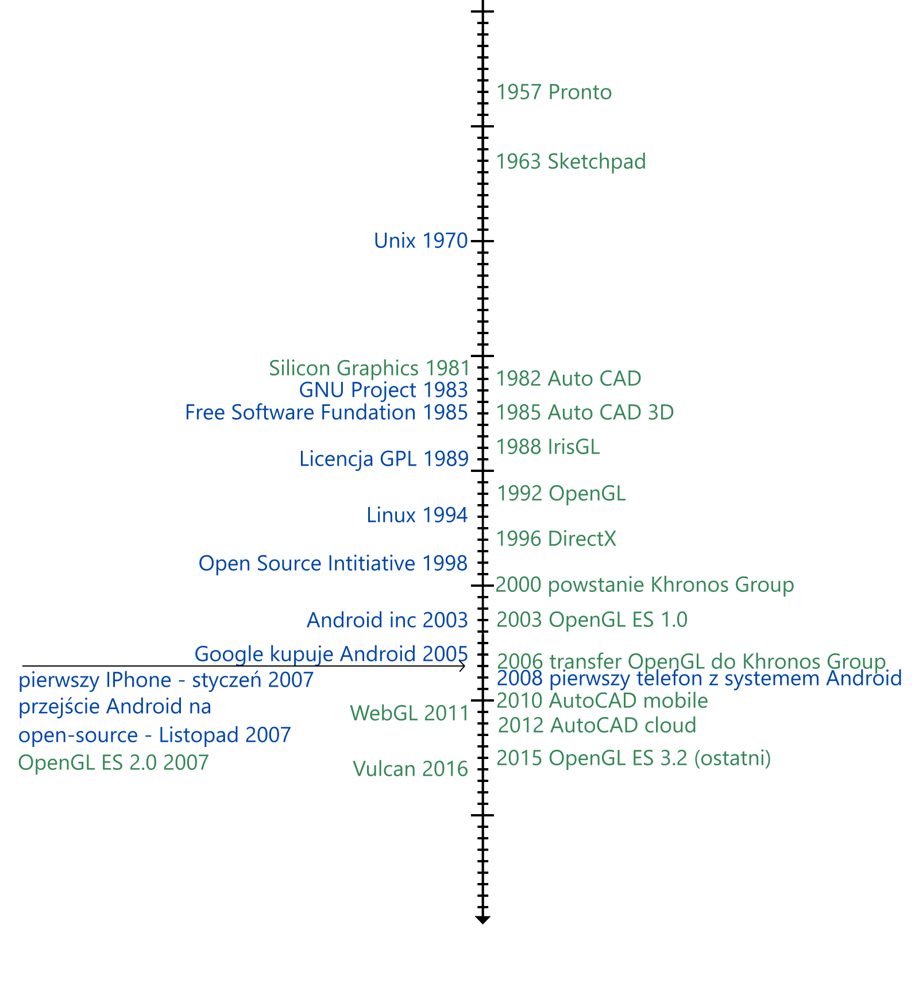</img>

_Ilustracja 1: wykres przełomowych wydarzeń w historii grafiki komputerowej i open source – opracowanie własne_

## 2.1 Open source

   wikipedia, https://archive.is/20120720042557/http://cm.bell-labs.com/cm/cs/who/dmr/hist.html:
W 1965 roku MIT we współpracy z kilkoma innymi przedsiębiorstwami (w tym Bell Labs) rozpoczęło pracę nad systemem operacyjnym Multics1. Był on przeznaczony do użytku na specjalnym komputerze -  GE 645. Po pięciu latach trwania projektu Multics wciąż nie był ukończony, co zraziło kierownictwo Bell Labs do inwestowania w systemy operacyjne. Jakiś czas później grupa programistów pracujących w Bell Labs, na czele której stali poprzednio pracujący nad Multicsem Ken Thompson i Dennis Ritchie, próbowała przekonać zarząd do zakupienia nowego komputera do którego zobowiązali się napisać OS. Nie dostali jednak zgody na to przedsięwzięcie. Udało im się natomiast znaleźć w Bell Labs mało używany mini komputer PDP-7, na którym stworzyli system Unix, wzorując się na systemie Multics. Warto wspomnieć że ich system uzyskał nazwę "Unix" dopiero w 1970 r.

W 1970 r. do Bell Labs przyszło zamówienie z Amerykańskiego Biura Patentowego na edytor tekstowy. Zespół Richiego i Thompsona wykorzystał tę okazję żeby zdobyć zgodę na zakup komputera PDP-11. Najpierw przenieśli na niego system Unix, a potem zbudowali na nim edytor tekstowy. W 1971r wdrożyli edytor w biurze patentowym, a projekt oficjalnie zakończył się sukcesem. W ten sposób naukowcy udowodnili firmie Bell Labs użyteczność systemu Unix.

Kod źródłowy Unix był przez długi czas zamknięty, dostęp do niego mieli tylko pracownicy Bell Labs. W 1972 r. Richie i Kernigan stworzyli język C, a w 1973 r. czwarta edycja Unixa została przepisana z Assemblera na C. W 1975 r. kod źródłowy szóstej wersji Unixa, wyszedł poza Bell Labs na odpłatnej licencji AT&T do kilku amerykańskich uniwersytetów. Ponieważ AT&T nie widziało potencjału w komercjalizacji Unixa, koszt był symboliczny - rzędu kilkuset dolarów. Na jego podstawie powstały klony Unixa, min. stworzony przez Uniwersytet Berkeley w Kaliforni Unix BSD. Twórcy Unixa BSD zmodyfikowali go na tyle że mogli upublicznić jego kod źródłowy i uniezależnić się od licencji AT&T. Na innej uczelni Andrew S. Tanenbaum stworzył MINIX, wersję Unixa z której korzystał później Linus Thorvalds podczas nauki na  Uniwersytecie w Helsinkach.

   https://stallman.org/cgi-bin/showpage.cgi?path=/common/bio.html&term=biography&type=norm&case=0

Tutaj warto wspomnieć o Richardzie Stallmanie, który odegrał wielką rolę w rozwoju open-source i systemów operacyjnych. Richard ukończył fizykę na Harvardzie w  1974 r. Jeszcze w trakcie studiów rozpoczął pracę w laboratorium sztucznej inteligencji na MIT, gdzie pracował w latach 1971-1984. Tam zetknął się z kodem źródłowym Unixa. W 1983 Stallman rozpoczął pracę na stworzeniem systemu operacyjnego pod nazwą GNU w całości złożonego z bibliotek free-software2. Kontrybucjami samego Stallmana były min. kompilator gcc, debugger (gdb), czy edytor Emacs, ale praca nad GNU była wysiłkiem zbiorowym. Wielu twórców oprogramowania na prośbę Stallmana włączyło swoje biblioteki w jego skład. W 1985 r. Stworzył Free Software Fundation3 (w skrócie FSF), organizację która miała na celu chronić prawa użytkowników oprogramowania, w tym przede wszystkim możliwość wglądu do kodu źródłowego i jego modyfikacji.
   https://www.britannica.com/biography/Linus-Torvalds:
   https://www.britannica.com/technology/Linux:
   https://youtu.be/lrcdhzr2qnk?si=mjnZ_knk-_IIarmN
Linus Torvalds, zainspirowany systemem MINIX postanowił napisać swój własny system operacyjny Linux2. Pisanie go rozpoczął od zbudowania kernela - W 1991 wydał wersję 0.02, a w 1994 1.0. Podczas gdy Linus kończył pracę nad kernelem Linuxa, projekt GNU Stallmana zbliżał się ku końcowi. Ponieważ obaj programiści obrali odwrotne podejście do tworzenia systemu operacyjnego (Linus zaczął od kernela, a Stallman od bibliotek i narzędzi), postanowili rozpocząć współpracę i połączyć swoje systemy. W ten sposób powstał system będący fuzją tych dwóch systemów - opierający się na jądrze Linuxa, i wykorzystujący biblioteki GNU system GNU-Linux, zwany popularnie Linuxem.
GNU-Linux był naprawdę przełomowy, jest rozwijany do dzisiaj i ma ogromną rzeszę pasjonatów. W połączeniu z Apache, serwerem webowym open-source, GNU-Linux jest systemem operacyjnym większości serwerów sieci internetowej. Znalazł też zastosowanie w bardzo wielu obszarach informatyki, od superkomputerów NASA do miniaturowych komputerów typu Raspberry Pi, a sam kernel Linux został później wykorzystany jako jądro systemu Android.

   https://marketsplash.com/statystyki-androida/  - stąd wykres udziału Androida w rynku OS w 2023r
Początki Androida sięgają 2003 roku, kiedy to powstał jako przedsięwzięcie Android Inc., amerykańskiej firmy technologicznej, której celem było stworzenie systemu operacyjnego dla aparatów cyfrowych. Jednak do 2004 roku projekt przeszedł znaczącą transformację, przenosząc swój nacisk na rozwój systemu operacyjnego zaprojektowanego specjalnie dla smartfonów. Dostrzegając jego potencjał, Google Inc., amerykański gigant wyszukiwarek internetowych, przejął Android Inc. w 2005 roku. Następnie zespół Android w Google podjął strategiczną decyzję o zbudowaniu swojego projektu na Linux-ie. Pierwsze komercyjne wydanie Androida miało miejsce w 2008 roku. Działająca na nim aplikacja Android Market stała się wiodącym sklepem z aplikacjami na całym świecie zarówno pod względem dostępności aplikacji, jak i liczby pobrań. W 2012 roku Google przeprowadził rebranding, konsolidując swoje aplikacje na Androida pod nazwą Google Play.

## 2.2 Grafika komputerowa

https://www.cadblog.pl/historia-systemow-cad/
https://www.scan2cad.com/blog/cad/cad-evolved-since-1982/   - to jest dobrze napisane
https://inspirationtuts.com/the-history-of-3d-modeling-and-animation/  ma zazębienie z CADami
https://ufo3d.com/history-of-3d-modeling/

Historia grafiki komputerowej ma swój początek w programach CAD(Computer Aided Design).

Prawdopodobnie pierwszym w historii programem typu CAD był stworzony w 1957r. PRONTO. Na podstawie danych wejściowych zawierających matematyczny opis kształtów generował instrukcje dla maszyn zajmujących się wytwarzaniem części np. maszyn CNC. Zarówno dane wejściowe jak i wyjściowe opisywały kształty 2D, dlatego wykorzystanie programu ograniczało się do tworzenia profili ram itp. Warto zaznaczyć że PRONTO był dostępny tylko na systemach komputerowych General Electric (GE)

programy CAD w znacznym stopniu usprawniły pracę projektantów, architektów i kreślarzy. Podczas gdy ręczne wprowadzenie zmiany do gotowego szkicu wiązało się najczęściej z całościowym jego przerysowaniem, programy CAD umożliwiły łatwe wprowadzanie zmian w projekcie.

https://www.youtube.com/watch?v=Yb66RzGj8TI

Niedługo później, w latach 60-tych Ivan Sutherland stworzył Sketchpad. Sketchpad wprowadził innowacje takie jak wprowadzanie danych bezpośrednio na ekranie przez pióro świetlne, oraz instancjonowanie obiektów, ale najbardziej przełomową funkcją Sketchpada była możliwość tworzenia i manipulacji kształtów w 3D. Wszystkie kształty jakie można było stworzyć w Sketchpadzie były modelami Wireframe - tzn byly zbudowane z punktów i łączących je linii. Program Sketchpad był zaprojektowany i pozostaje silnie związany z komputerem TX-2

Choć programy CAD początkowo przeznaczone były głównie do tworzenia rysunków technicznych, to wraz z rozwojem branży komputerowej i programistycznej, poszerzano je o coraz to bardziej zaawansowane funkcjonalności.

https://www.youtube.com/watch?v=m8Rbl7JG4Ng

W 1963 Edward E. Zajac stworzył animację "Simulation of a two-giro gravity attitude control system". Prawdopodobnie było to pierwsze użycie tekstur w grafice komputerowej.

Opracowanie tworzenia modeli wireframe zbudowanych z punktów i linii otworzyło drogę modelowaniu przestrzeni 3D. Niedługo potem dzięki odkryciom takim jak vertexy, tekstury, czy post processing, programistom udało się na podstawie modeli wireframe wygenerować realistyczne obrazy 3D.

Stąd wyrosły podstawy animacji komputerowej, gier wideo, czy druku 3D. Jedną z "gałęzi" które wyrosły z "drzewa grafiki komputerowej" są właśnie silniki graficzne. Te programy o wszechstronnym zastosowaniu kumulują w sobie większość innowacji grafiki komputerowej. Jednym z nich jest Open GL, silnik graficzny którego wpływ na grafikę komputerową odczuwany jest do dziś. W dalszej części pracy przedstawimy historię jego powstania

Programy CAD powstałe w latach 6o-tych i 70-tych były w większości nieprzenaszalne, związane na stałe z komputerem na który zostały zaprojektowane.
 Miało to się jednak zmienić  gdy w 1982 r. powstał program AutoCAD stworzony przez firmę Autodesk. Był to prawdopodobnie pierwszy program CAD  dostępny na więcej niż jednej platformie sprzętowej.

https://en.wikipedia.org/wiki/OpenGL
https://en.wikipedia.org/wiki/IRIS_GL
https://en.wikipedia.org/wiki/IRIX
https://en.wikipedia.org/wiki/Silicon_Graphics

Lata 80-te i 90-te to okres w którym na rynku narzędzi do tworzenia grafiki komputerowej rządziły stacje graficzne, czyli wyspecjalizowane do tego celu komputery o wysokich parametrach sprzętowych. Te maszyny posiadały własne silniki graficzne, choć ich kod źródłowy najczęściej nie wychodził poza firmę produkującą stację graficzną. Jednym z wiodących przedsiębiorstw zajmujących się produkcją tego typu maszyn była firma Silicon Graphics1 (SGI) powstała w 1981 r. Ciekawostką na temat oprogramowania stacji graficznych SGI jest fakt, iż systemem operacyjnym tych maszyn był stworzony przez SGI klon Unixa nazwany Irix, zaś silnikiem graficznym uruchamianym na tym systemie był IrisGL.
Odbiorcami ich produktów były studia filmowe, pracownie architektoniczne,
wojsko, instytucje rządowe i akademickie.
W latach 1995-2002 ich produkty cieszyły się wyjątkowo dużą popularnością, o czym świadczy fakt że wszystkie filmy nominowane w tym okresie do Academy Award za efekty wizualne były filmami stworzonymi na komputerach SGI.
Jednak z biegiem czasu, inni producenci urządzeń do tworzenia grafiki komputerowej (Sun, HP, IBM), stali się realną konkurencją dla SGI. Aby utrzymać silną pozycję na rynku, zarząd SGI podjął drastyczną decyzję. Otóż postanowili oni udostępnić do open source (nieco zmodyfikowane)  API swojego silnika graficznego IrisGL pod nową nazwą OpenGL1. SGI zaczął prace nad tym projektem w 1991r i wypuścił OpenGL w wersjii 1.0 w 1992r.
W 1992 SGI utworzyła wraz z innymi firmami konsorcjum OpenGL Architecture Review Boar aby dbać i promować standard OpenGL. W 2006 obowiązki te przejęło inne konsorcjum zwane Khronos Group.
Widząc wzrastającą popularność OpenGL grupa Khronos postanowiła wydać także wersję wyspecjalizowaną na urządzenia embedded, w tym telefony mobilne.

Tak powstał wydany w 2003 roku OpenGL ES (https://web.archive.org/web/20021204100541/http://www.khronos.org/embeddedapi/index.html - jescze nie ma oficjalnego wydania, https://web.archive.org/web/20040215013559/http://www.khronos.org/opengles/index.html
 - oficjalne wydanie )

https://en.wikipedia.org/wiki/OpenGL
https://en.wikipedia.org/wiki/IRIS_GL
https://en.wikipedia.org/wiki/IRIX
https://en.wikipedia.org/wiki/Silicon_Graphics

W 2017 KG ogłosił że nie będzie wydawać nowych wersji OpenGL, bo skupiają się na jego następcy "Vulkan" (wydanym w 2016). Ja jednak zdecydowałem się użyć w moim projekcie silnika OpenGL ES, ponieważ jest w powszechnej opinii łatwiejszy w użyciu dla nowicjusza nie mającego do tej pory styczności z programowaniem w oparciu o silniki graficzne. Poza tym OpenGL ES jest wciąż wspierany przez Android (w przeciwieństwie do ich głównego konkurenta Apple), a jego funkcjonalność wydała mi się wystarczająca do zrealizowania założeń wstępnych mojego projektu.

# 3 Wzory matematyczne i rozwiązania programistyczne

## 3.1 Wyświetlanie grafiki 3D

Grafika komputerowa znacząco różni się od świata rzeczywistego. Celem programistów tworzących programy symulujące przestrzeń 3D jest zasymulowanie rzeczywistych fenomenów otaczającego nas świata w jak najbardziej przekonujący sposób, jednak symulacja świata wirtualnego zgodnie z zasadami świata rzeczywistego pozostaje wciąż w obrębie fikcji. Dlatego też programiści zajmujący się grafiką 3D wynaleźli całą gamę algorytmów, które mają w uproszczony sposób zasymulować zjawiska fizyczne. Przykładowo, wiemy że ludzkie oko rejestruje widziany przez nas obraz poprzez pochłanianie odbitych w stronę oka promieni światła widzialnego. Jednak obliczanie trajektorii promieni świelnych, poza tymi które trafiłyby do kamery było by z punktu widzenia wydajności algorytmu wielką stratą zasobów komputera - w końcu takie promienie nie wpływają w żaden sposób na uzyskany przez kamerę obraz. Mamy tu paradoks drzewa przewracającego się w lesie - jeśli nie ma w lesie nikogo kto mógłby usłyszeć upadek drzewa, czy możemy powiedzieć że upadło z hukiem? Z perspektywy programisty grafiki 3D, dźwięk upadającego drzewa w lesie, czy odchodząc od metafory, promienie świetlne nie rejestrowane przez kamerę, mogłyby równie dobrze nie istnieć. Liczy się tylko to co rejestruje kamera, to co zostanie wyświetlone na ekranie. Dlatego też, aby zminimalizować ilość obliczeń, w dwóch najpopularniejszych podejściach do wyświetlania przestrzeni 3D, nie używa się symulacji promieni świetlnych wychodzących ze źródła światła. 

Zamiast tego w grafice Raymarching, stosuje się odwrócony paradygmat - aby mieć pewność że obliczenia skupiają się wyłącznie na promieniach światła rejestrowanych przez kamerę, symulowane promienie wychodzą z samej kamery a nie ze źródła światła. W najprostszej wersji tego algorytmu, po osiągnięciu minimalnej odległości do obiektu w przestrzeni 3D, funkcja obliczająca trajektorię promienia potwierdza zderzenie z tą bryłą, a do piksela z którego wyszedł promień przypisywany jest jej kolor. Promienie które nie zarejestrują kolizji z żadnym obiektem, po osiągnięciu maksymalnej długości lub cykli przedłużających promień, zwracają informację o braku kolizji. Wtedy piksel z którego wyszedł taki promień otrzyma domyślny kolor tła. Jest to oczywiście uproszczony opis działania algorytmu Raymarching, jednak nawet w takim uproszczeniu, oczywistym jest że ograniczenie liczby promieni do tych które rejestrowane są na kamerze, a także ograniczenie się do prostoliniowych promieni z pominięciem odbić, pozwala drastycznie przyspieszyć wyświetlenie sceny.

Natomiast w najczęściej stosowanym algorytmie wyświetlania, użytym także w Wirtualnej Galerii - grafice wektorowej - zupełnie odchodzi się od obliczeń promieni. Zamiast tego stosuje się transformacje których celem jest stworzenie projekcji brył w scenie na płaszczyznę widoku kamery. Scena to zbiór wszystkich brył w przestrzeni 3D, w danym punkcie czasowym działania programu.

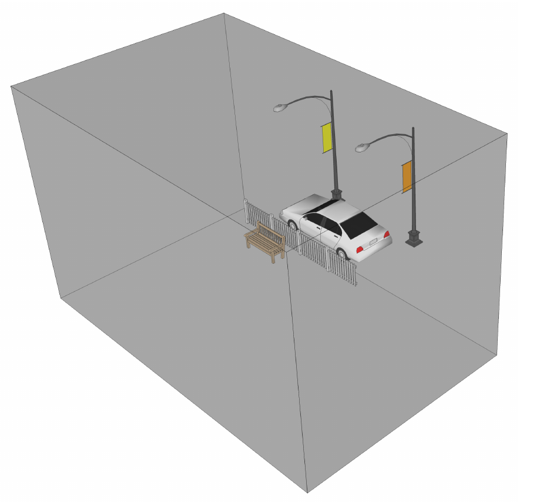</img>

Przykładowa scena 3D (z książki "OpenGL ES 2 for Android" autor Kevin Brothaler)

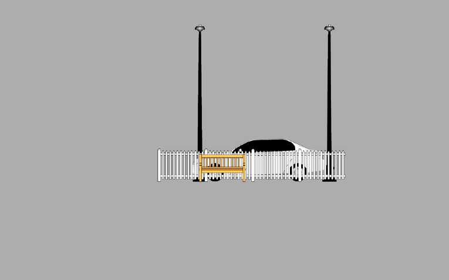</img>

Projekcja tej sceny w widoku kamery (z książki "OpenGL ES 2 for Android" autor Kevin Brothaler)

Każdą bryłę 3D można przedstawić jako zestaw trójkątów, więc projekcja bryły wytworzy na płaszczyźnie kamery figurę 2d będącą zbiorem trójkątów. Trójkąty na płaszczyźnie, powstałe w ten sposób, są wykorzystywane do określenia koloru punktów na ekranie. Każdemu punktowi leżącemu wewnątrz danego trójkąta przypisywany jest odpowiedni kolor. W przypadku gdy kolor bryły jest jednolity, określenie koloru trójkąta jest bardzo proste. Jeżeli natomiast kolor jest przypisany do wierzchołka - to kolor punktu wewnątrz trójkąta jest interpolowany na podstawie koloru trzech otaczających go wierzchołków. Możliwe jest też zastosowanie tekstury, wtedy obliczenie koloru punktu wewnątrz trójkąta wymaga innego, bardziej skomplikowanego podejścia.

Przyjrzymy się obiektom zawartym w scenie. Każdy z nich składa się z następujących elementów:
- zbioru wierzchołków wychodzących z punktu 0.0.0 w "przestrzeni lokalnej", definiujących kształt bryły.

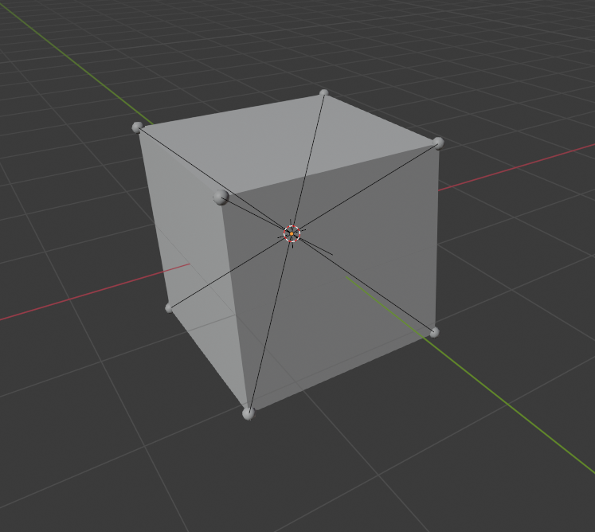</img>

- współrzędnych x, y, z określających gdzie znajduje się centrum bryły w "przestrzeni świata". 
   - Pozycja ta niekoniecznie musi być określona wewnątrz obiektu. Czasem pozycja bryły ustalana jest dynamicznie kiedy jakaś funkcja jej potrzebuje, np. jeśli ta bryła jest "przyczepiona" do innej bryły;
- koloru bryły
   - jedna wartość dla całej bryły - gdy bryła ma jednolity kolor
   - zbiór kolorów każdego wierzchołka - gdy kolor bryły to gradient kolorów przypisanych do wierzchołków
   - zbiór współrzędnych na teksturze dla każdego wierzchołka - jeśli została użyta tekstura.

### 3.1.1 Transformacje obiektów podczas wyświetlania sceny

Rozmowę o wyświetlaniu grafiki komputerowej należy rozpocząć od wyjaśnienia roli macierzy. Macierze transformują wektory (wierzchołki). Transformacja zachodzi poprzez pomnożenie wektora przez macierz. Jest to główna i najważniejsza rola macierzy w matematyce przestrzeni 3D. Mówimy o operacjach macierzowych w kontekście równoległości obliczeniowej, ponieważ najczęściej ta sama macierz jest użyta do transformacji wielu wektorów. 

Transformacje jakim się przyjrzymy to m.in.: przesunięcie, obrót, skalowanie oraz nałożenie perspektywy. Poprzez pomnożenie dwóch macierzy ze sobą otrzymujemy macierz która łączy w sobie transformacje zawarte w obu z nich. Pozwala nam to na stworzenie jednej macierzy zawierającej wszystkie transformacje potrzebne w procesie wyświetlania danej bryły. Następnie aby zastosować tę transformację wystarczy pomnożyć każdy wierzchołek bryły przez tę macierz. Dzięki temu złożoność obliczeniowa wielu transformacji na jednej bryle jest taka sama jak pojedynczej transformacji. 

Przypomnijmy że bryła to zbiór wierzchołków:

</img>

Widzimy że bryłę tą tworzą wierzchołki wychodzące z początku układu współrzędnych (ang. origin) - punktu 0.0.0. Każdy wierzchołek zawiera w sobie co najmniej 3 podstawowe wartości: pozycję x, y i z w przestrzeni 3D. Każdy wierzchołek możemy więc przedstawić w rachunku macierzowym jako wektor:

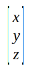</img>

Przyjrzyjmy się mnożeniu macierzy, które składają się na ostateczną macierz transformacji wykorzystaną w procesie wyświetlania sceny. Ponieważ każda z nich reprezentuje jakąś transformację, pokażemy jak wyglądałyby z osobna gdyby nałożyć je na dany obiekt w sekwencji. Aby mieć dostęp do wszystkich potrzebnych transformacji macierzowych użyjemy macierzy 4x4, co oznacza że będziemy mogli zastosować te transformacje jedynie na wektorach cztero wymiarowych:

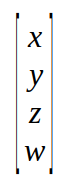</img>

Na szczęście dzięki prawu o współrzędnych jednorodnych, możemy śmiało konwertować wektory cztero wymiarowe na trójwymiarowe i odwrotnie, o ile czwarty komponent wektora (tutaj nazwany "w"), jest równy 1 lub 0.

#### Kolejność transformacji jest następująca:

1. Macierz modelu - rotacja wierzchołka wzdłóż osi x,y,z w przestrzeni modelu. 

Przyjmijmy że chcemy obrócić bryłę o 30 stopni po osi y. Wzór na obrót po osi y:

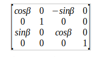</img>

(kąt β = 30°)
Po wstawieniu wartości otrzymamy macierz:

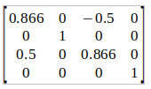</img>

Pokażmy jak macierz transformuje bryłę, na podstawie jednego tworzącego ją wierzchołka (zaznaczonego na rysunku na czerwono):

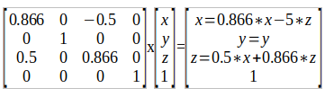</img>

Poniższa ilustracja pokazuję tę transformację. Na pomarańczowo zaznaczono ten wierzchołek przed transformacją, a na czerwono  ten sam wierzchołek po transformacji:

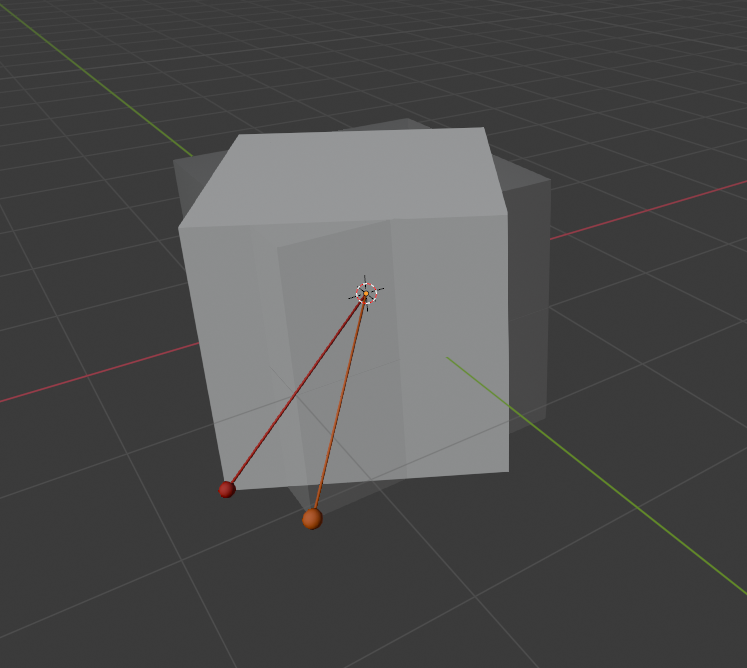</img>

2. Macierz świata - przesunięcie wierzchołka o dx, dy, dz w przestrzeni świata. 

Wzór na macierz świata (macierz translacji):

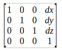</img>

powiedzmy że chcemy ustawić model w przestrzeni świata na pozycji 1,2,-5:

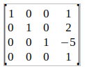</img>

Zobaczmy więc jak macierz świata transformuje wierzchołek ustawiony poprzednio w przestrzeni modelu:

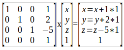</img>

Poniższa ilustracja pokazuję tę transformację. Na pomarańczowo zaznaczono ten wierzchołek przed transformacją, a na czerwono  ten sam wierzchołek po transformacji:

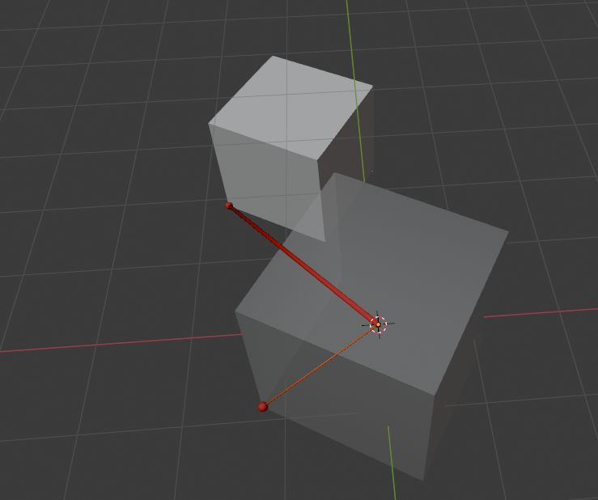</img>

3. Macierz kamery – ustawienie brył w scenie w stosunku do pozycji kamery.

Aby uprościć proces wyświetlania sceny, kamera powinna:
- znajdować się w punkcie 0.0.0 w przestrzeni świata, 
- być skierowana wprost w kierunku osi -z, (TODO: przypis: w używanym w tym przypadku ułożeniu świata „prawej ręki”), 
- a jej środek leżeć na osi z. 

Dlaczego więc w wielu grach komputerowych kamera porusza się wraz z ruchem gracza? Otóż aby pogodzić potrzebę ruchu kamery, oraz wymogi obliczeniowe, najczęściej stosowanym rozwiązaniem w grafice komputerowej jest użycie odwróconego paradygmatu – zamiast poruszać kamerą (np. obrót o 30 stopni w lewo), wszystkie obiekty w scenie są poruszane w odwrotny sposób (obrót o 30 stopni w prawo wokół kamery). Dla odbiorcy patrzącego przez okno widoku kamery wrażenie ruchu pozostaje takie samo jak gdyby to kamera się poruszała, a nie cały wirtualny świat wokół niej.

Dlatego aby przejść z przestrzeni świata do przestrzeni kamery, na wszystkich obiektach w scenie należy zastosować translacje odwrotną do zamierzonego ruchu kamery, a potem obrót odwrotny do zamierzonego obrotu kamery. 

Powiedzmy że chcemy przesunąć kamerę o dx: -2, dy: 5, dz: -4, a następnie obrócić ją wokół osi x o 20 stopni. Poniżej pokazujemy równanie (w złożeniu macierzy, kolejność operacji jest od prawa do lewa?):

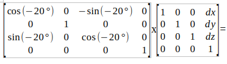</img>

Po wstawieniu wartości:

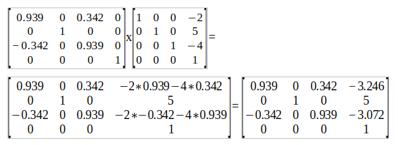</img>

Zobaczmy jak otrzymana macierz kamery transformuje wierzchołek ustawiony poprzednio w przestrzeni świata:

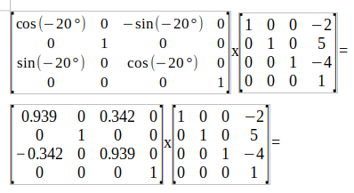</img>

Poniższa ilustracja pokazuję tę transformację. Na pomarańczowo zaznaczono ten wierzchołek przed transformacją, a na czerwono  ten sam wierzchołek po transformacji:

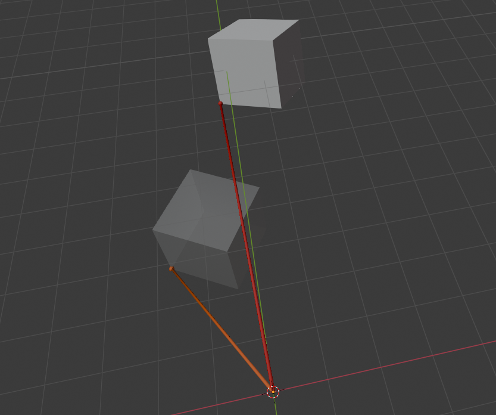</img>

4. Macierz perspektywy - transformacja wektorów do przestrzeni przycięcia (ang. clip space) 

Wzór na macierz perspektywy:

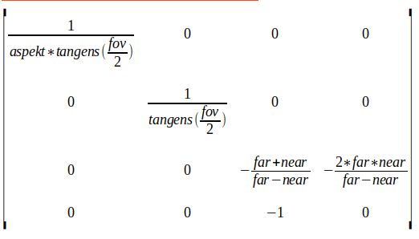</img>

Wyjaśnijmy co oznaczają podane zmienne:

   * aspekt – to stosunek szerokości do wysokości ekranu
   * fov –  (ang. field of view - czyli zasięg wzroku) odnosi się do kąta pomiędzy bliższą płaszczyzną przycięcia a środkiem układu współrzędnych
   * far – odległość od środka układu współrzędnych do środka dalszej płaszczyzny przycięcia (ang. far clipping plane)
   * near – odległość od środka układu współrzędnych do środka bliższej płaszczyzny przycięcia (ang. near clipping plane)

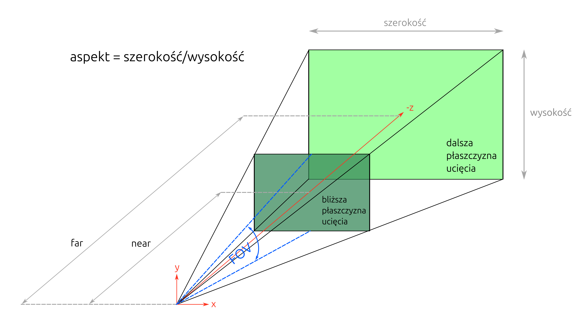</img>
(wizualizacja konceptów z macierzy perspektywy)

Przestrzeń wewnątrz powyższego ostrosłupa ściętego (ang. frustum) wyznaczonego pomiędzy płaszczyznami ucięcia to właśnie **przestrzeń przycięcia** (ang. clip space). W grafice komputerowej wykorzystuje się frustum ostrosłupa prostokątnego do obliczenia perspektywy. Warto zauważyć że kształt frustum w pewnym stopniu przypomina pole widzenia człowieka - można sobie wyobrazić, że oko obserwatora znajduje się w środku układu współrzędnych i patrzy przez "okno", czyli mniejszą podstawę frustum.

Przyjmijmy poniższe wartości:

   * `aspekt = 2` 
   * `fov = 60`
   * `far = 20`
   * `near = 1`
   
Po wstawieniu wartości do wzoru otrzymamy:

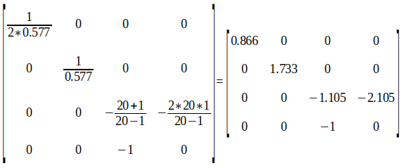</img>

Zobaczmy więc jak otrzymana macierz perspektywy transformuje wierzchołek ustawiony poprzednio w przestrzeni kamery:

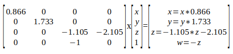</img>

Aby zobrazować opisaną transformację perspektywy, cofnijmy się o krok wstecz. Do tej pory wektor którego transformacje śledzimy, był mnożony przez macierz modelu, świata i kamery. Zacznijmy więc od pokazania jak wygląda opisane frustum w przestrzeni kamery:

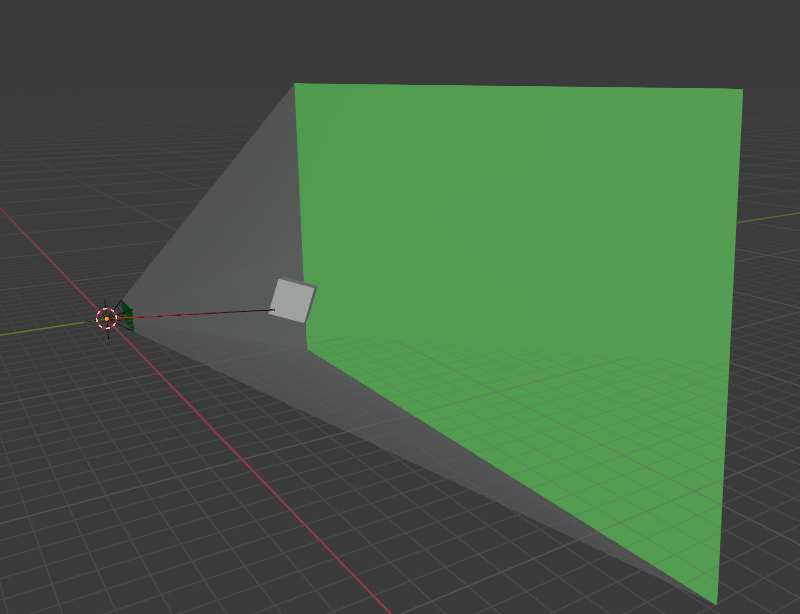</img>

(w oddaleniu)

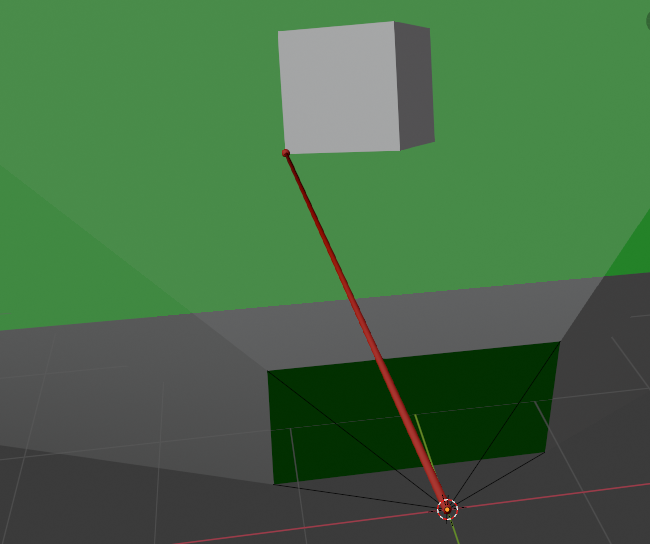</img>

(w przybliżeniu)

Ciemnozielony kwadrat reprezentuje bliższą płaszczyznę ucięcia, a jasnozielony dalszą płaszczyznę ucięcia.
Teraz pokażmy jak będzie wyglądać bryła po transformacji przez opisaną wyżej macierz projekcji. Aby lepiej zobrazować tę transformację, frustum transformujemy w ten sam sposób co bryłę:

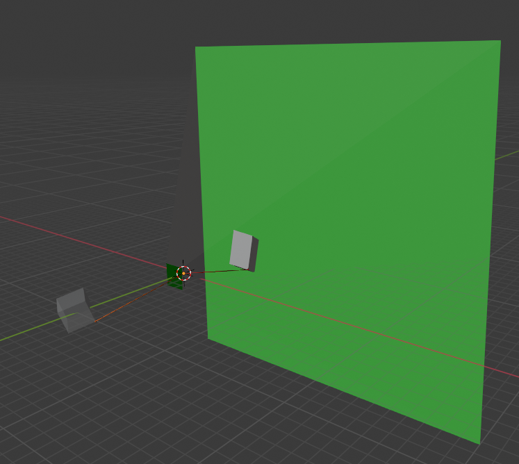</img>

(w oddaleniu)

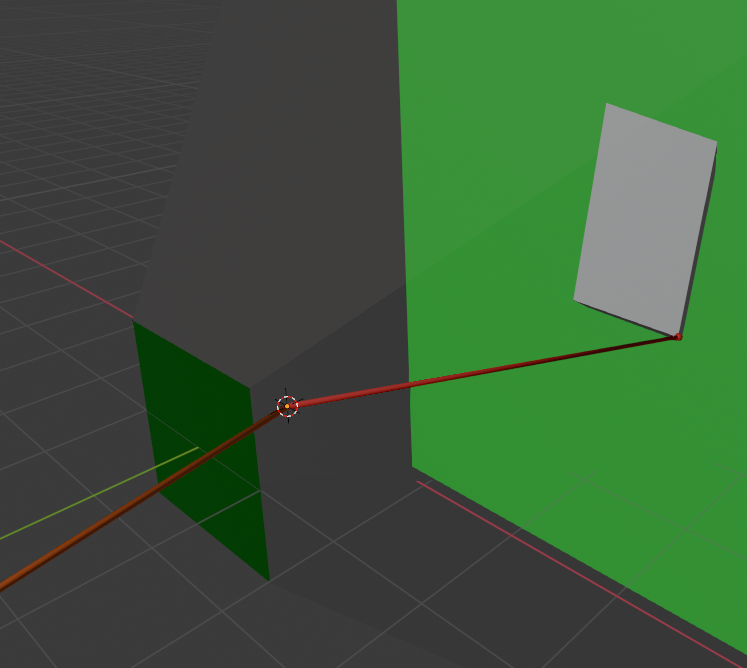</img>

(w przybliżeniu)

Widzimy że macierz zamienia wartości z na -z, a także deformuję bryłę.

5. Dzielenie przez w - ostatnia transformacja wektorów potrzebna dla uzyskania wrażenia perspektywy. 

Trzeba wspomnieć, że nie jest to transformacja macierzowa ale należy ją zawsze wykonać po transformacji perspektywy. Dzielenie przez w odbywa się ponieważ wedle prawa o współrzędnych jednorodnych, aby móc użyć wektora 4D jako wektora 3D, w musi wynosić 1 lub 0. Poprzez dzielenie przez w, im dalej dany wektor znajdował się od kamery, tym bliżej będzie osi z. Innymi słowy im dalej się znajduje tym wydaje się mniejszy.

</img>

( https://img.freepik.com/free-photo/valley-fire-nevada-highway-before-entering-into-park-valley_181624-14194.jpg?t=st=1731765589~exp=1731769189~hmac=2a47435e4b827fd8321ec7ea4290bc7e864fe646a61cd83f256caf00a4803567&w=1380 )

Dzieje się tak, gdyż środek przestrzeni znormalizowanej znajduje się w punkcie 0.0.0, więc im większy jest mianownik "w" (x/w, y/w), tym bliżej wektor znajduje się punktu 0.0.0.

Poniższa ilustracja przedstawia dzielenie przez w. Dla lepszego zobrazowania tego procesu, frustum poddajemy tej samej transformacji co bryłę:

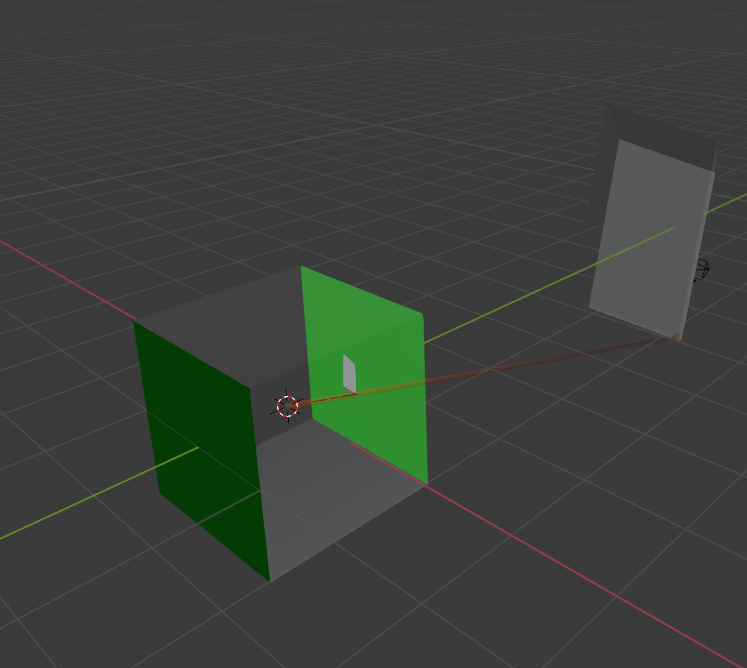</img>

(w oddaleniu)

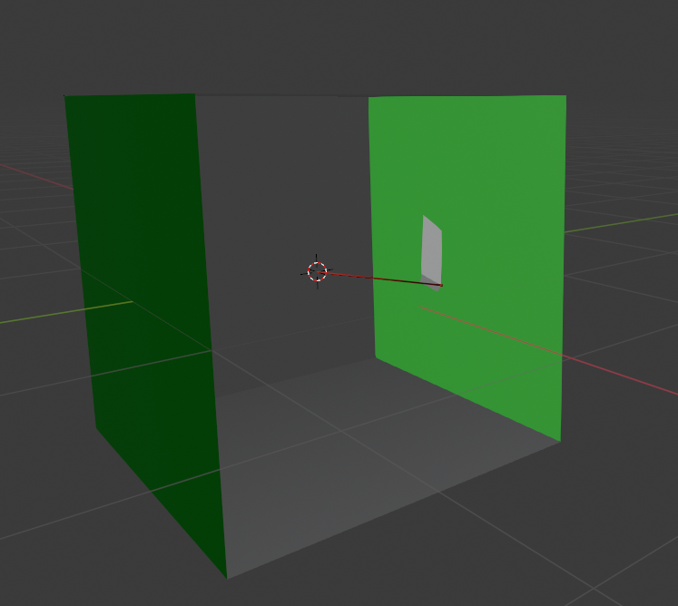</img>

(w przybliżeniu)

Jak widać, poprzez podzielenie koordynatów x, y, z przez w, bryła kurczy się. Ostatecznie wszystkie bryły wewnątrz frustum znajdą się w kostce o wymiarach 2x2x2 (x, y, z należą do [-1 .. 1] ).  Aby uzyskać obraz, bryła zostanie następnie poddana rasteryzacji, gdzie jest traktowana jak gdyby leżała na płasko na bliższej płaszczyźnie ucięcia. Jej wartość z zostanie użyta jedynie w teście głębokości, czyli w sytuacji gdy więcej niż jeden fragment znajduje się w tych samych koordynatach **(x,y)**, trzecia wartość **z** pomoże określić który z nich leży „z przodu”, i to jego kolor zostanie przypisany do odpowiednich pikseli na ekranie.

### 3.1.2 Implementacja obliczeń macierzowych w grafice 3D

Mnożenie macierzy i wektorów jest łatwe do zrównoleglenia. 
Dlatego używamy do tego procesorów graficznych.
Programy napisane dla GPU to shadery.

Czym są shadery? Ich nazwa wywodzi się w języku angielskim od słowa "Shade", czyli cień lub odcień. Jest to naleciałość historyczna, ponieważ pierwsze shadery zajmowały się głównie obliczaniem koloru pikseli na ekranie. Dziś większość programów uruchamianych na GPU nazywamy shaderami, choć nierzadko ich przeznaczenie znacząco odbiega od tego pierwotnego.  Wyróżniamy typy shader-ów:
- vertex shader - obliczenia geometrii
- fragment shader - obliczenia koloru pikseli na ekranie
- compute shader - pozostałe obliczenia, przykładowo kopanie kryptowalut.

Warto wspomnieć, że główną charakterystyką shaderów jest równoległość obliczeń w nich zawartych. To właśnie z tego powodu shadery mają być w zamyśle uruchamiane na procesorze graficznym, ponieważ architektura GPU pozwala na prowadzenie wielu równoległych obliczeń na raz.

### 3.1.3  Pipeline, czyli kolejne etapy wyświetlania sceny 3D

1) **Przekazanie argumentów** - do Vertex Shader-a przekazujemy zbiór wierzchołków i ostateczną (sumaryczną) macierzy transformacji. Zazwyczaj wartości macierzy perspektywy i kamery są takie same dla wszystkich obiektów w scenie, w danej klatce animacji. Dlatego aby zmniejszyć ilość potrzebnych obliczeń, można wymnożyć je ze sobą na początku procesu wyświetlania sceny, a potem użyć wyniku mnożenia w kalkulacji ostatecznej macierzy transformacji dla poszczególnych obiektów w scenie.
2) **Vertex shader** - mnoży każdy z przekazanych wierzchołków przez macierz ostatecznej transformacji, przekształcając je do przestrzeni ucięcia.
3) **Primitive Assembly** - wierzchołki bryły otrzymane w poprzednim etapie są łączone w zbiory zwane prymitywami. Dla brył używany jest prymityw złożony z trzech wierzchołków - trójkąt. Ale istnieją też inne prymitywy, np. zbiory dwóch wierzchołków - linie, oraz złożone z pojedynczych wierzchołków punkty.
4) **Clipping** - usunięcie prymitywów których wszystkie wierzchołki znajdują się całkowicie poza przestrzenią ucięcia, oraz "przycięcie" prymitywów częściowo wystających poza przestrzeń ucięcia, tak aby znalazły się całkowicie wewnątrz niej.
5) **Face Culling** - bryły są złożone z trójkątów. Trójkąty mają dwie strony - zwróconą do wewnątrz bryły tylną stronę i zwróconą na zewnątrz przednią stronę. Ponieważ zazwyczaj nie chcemy wyświetlać wnętrza bryły, tylne strony trójkątów są na tym etapie usuwane i nie biorą udziału w dalszych obliczeniach. Jak określić która strona trójkąta to przód, a która to tył? Definiuje to kolejność wierzchołków w trójkącie: przeciwnie do wskazówek zegara oznacza przednią stronę, a zgodnie ze wskazówkami - tylną.
6) **Perspective Division** - dzielenie przez w - przekształcenie wierzchołków z przestrzeni ucięcia na przestrzeń znormalizowanych koordynat urządzenia (ang. Normalized Device Coordinates - NDC). Wszystkie współrzędne x, y, z znajdą się w zakresie [-1, 1]
7) **Viewport Transformation** - viewport to obszar na ekranie gdzie będzie wyświetlona scena 3D. Może to być cały ekran ale nie musi tak być. Viewport definiujemy podając jego lewy dolny narożnik, szerokość i wysokość we współrzędnych ekranu. Viewport Transformation przekształca x, y przestrzeni NDC do x, y przestrzeni ekranu zgodnie z definicją Vieport-u. Zazwyczaj Viewport Transformation przekształca również współrzędną "z" przestrzeni NDC na głębię z w zakresie [0, 1]. 
8) **Rasteryzacja** - Zamienia prymitywy na "fragmenty" które zostaną użyte do wyliczenia pikseli ekranu. Dane zawarte w wierzchołkach prymitywu, takie jak kolor, czy pozycja w teksturze, są interpolowane, a uzyskane wartości przypisane do powstałych fragmentów.
   - Zauważmy, że prymitywy są już rozciągnięte do przestrzeni viewport i spłaszczone do głębi [0, 1]. Fragmenty z różnych brył, albo z różnych ścian tej samej bryły mogą znajdować się "pod" tym samym pikselem ekranu ale mieć różną głębię.
9) **Fragment Shader** - jest programem który ma za zadanie obliczyć kolor dla każdego fragmentu. Jeśli została zastosowana tekstura, to on jest odpowiedzialny za zamianę koordynatów tekstury na kolor fragmentu - oblicza go przy użyciu wybranego algorytmu (np. SSAO), który aproksymuje kolor danego punktu na podstawie otaczających go texeli (TODO: przypis: Tekstury to obrazy służące do nadania bryłom bardziej złożonych barw. Teksturowanie, to przypisanie tekstury do bryły sześciennej. Każdy wierzchołek trójkąta posiada odpowiadający punkt na płaszczyźnie tekstury. Texel odnosi się do punktu na teksturze).
10) **Depth Testing** - na tym etapie rozwiązywany jest problem nakładających się fragmentów. W przypadku kiedy więcej niż jeden fragment posiada koordynaty x,y odpowiadające danemu pikselowi, stajemy przed dylematem - który z nich powinien decydować o kolorze piksela? Nie można się tutaj kierować kolejnością wyliczenia fragmentów, gdyż oblicza się je asynchronicznie. Rozwiązaniem jest użycie wartości z (głębii) zawartej we "fragmentach". Jeśli bryły nie posiadają przeźroczystości to wybierany jest fragment posiadający najmniejszą głębię (na "wierzchu") - jego kolor staje się kolorem piksela. Jeśli używamy przeźroczystości to Deph Testing określi których fragmentów użyć do wyliczenia koloru piksela.
11) **Blending** - nakłada kolor fragmentu bliższego na kolor fragmentu znajdującego się "głębiej" z uwzględnieniem przeźroczystości
12) **Zapis do Framebuffer-a** - finalny kolor piksela wpisywany jest do Framebuffer-a. Framebuffer to bufor pamięci, który zawiera dane o obrazie, czyli informacje o każdym pikselu na ekranie.
13) **wyświetlenie sceny 3D** - karta graficzna wyświetla na ekranie całą zawartość Framebuffer-a jako reprezentację sceny 3D.

## 3.2 Obliczenia fizyki sceny 3D

Jednym z przyjętych wymagań funkcjonalnych jest możliwość wieszania/zdejmowania obrazów na "ścianach galerii". W scenie 3D bryły reprezentujące "ściany galerii" to **prostopadłościany**. I tak będziemy je nazywać w dalszej części tego rozdziału.  
Obrazy wieszane są na bocznych ścianach prostopadłościanów. Do jednej ściany może być przypisany maksymalnie jeden obraz.

#### Jak umożliwić użytkownikowi wybranie ściany na której chce zawiesić obraz? 

W skrócie, użytkownik wybiera dany punkt na ekranie poprzez dotknięcie go palcem. Następnie program powinien stwierdzić czy wybrany punkt leży na ścianie bocznej któregoś z prostopadlościanów w scenie 3D. Jeśli tak, to do tej ściany przypisany zostanie obraz. 

Poniżej znajduje się szczegółowy opis tego procesu:

1. Zdobycie współrzędnych wybranego punktu w płaszczyźnie ekranu (nazwijmy go **Pe**)

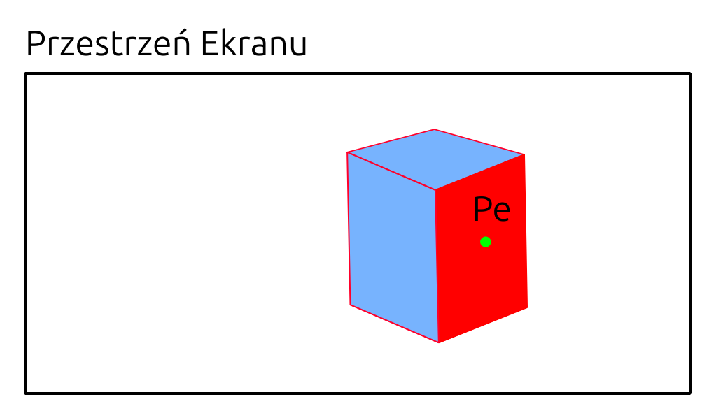</img>

2. Konwersja punktu **Pe** z płaszczyzny ekranu na odpowiadający mu punkt w przestrzeni NDC (nazwijmy go **Pn**)

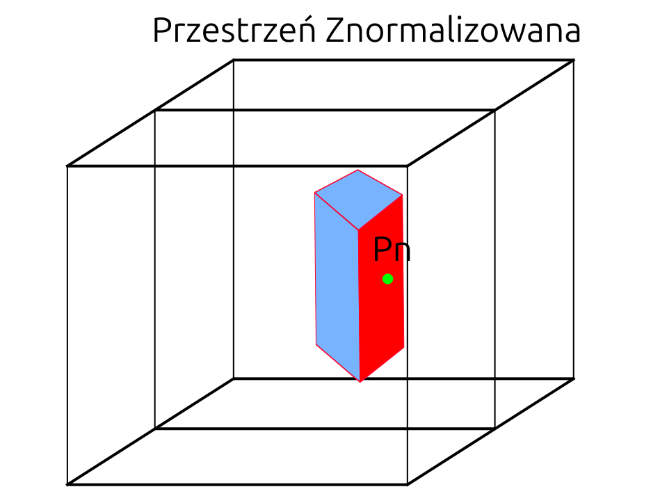</img>

3. Stworzenie półprostej, składającej się z punktu startowego **P0**, oraz wektora kierunkowego **D**. Półprosta ta przechodzi przez punkt **Pn**, i w gruncie rzeczy reprezentuje wszystkie punkty w przestrzeni NDC które potencjalnie mógł wybrać użytkownik. **P0** i **Pn** są 3-wymiarowymi wektorami o współrzędnych (x,y) tych samych co punkt Pn, i trzecią współrzędną (z) równą -1 dla **P0** i +1 dla **D**.

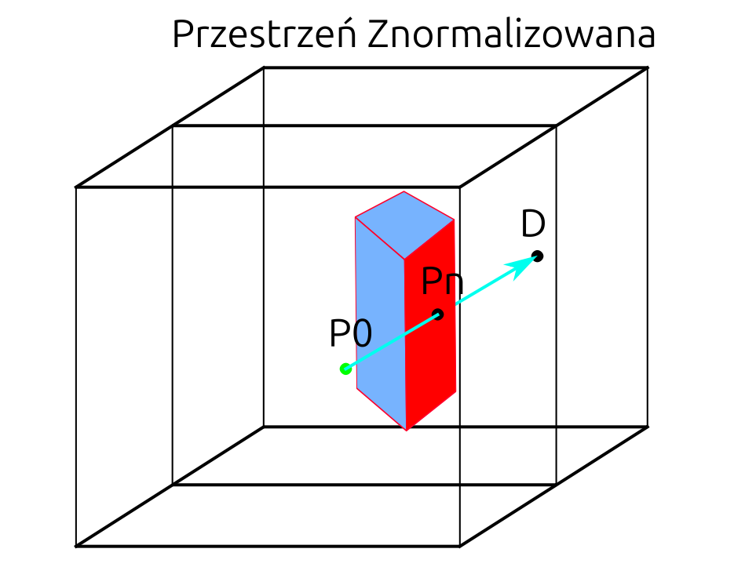</img>

4. Rozszerzenie wektorów **P0** i **D** o czwarty wymiar w = 1, na potrzebę obliczeń macierzowych (korzystając z prawa o współrzędnych jednorodnych).
5. Przetransformowanie **P0** i **D** z przestrzeni NDC do przestrzeni świata za pomocą odwróconych macierzy perspektywy i kamery:

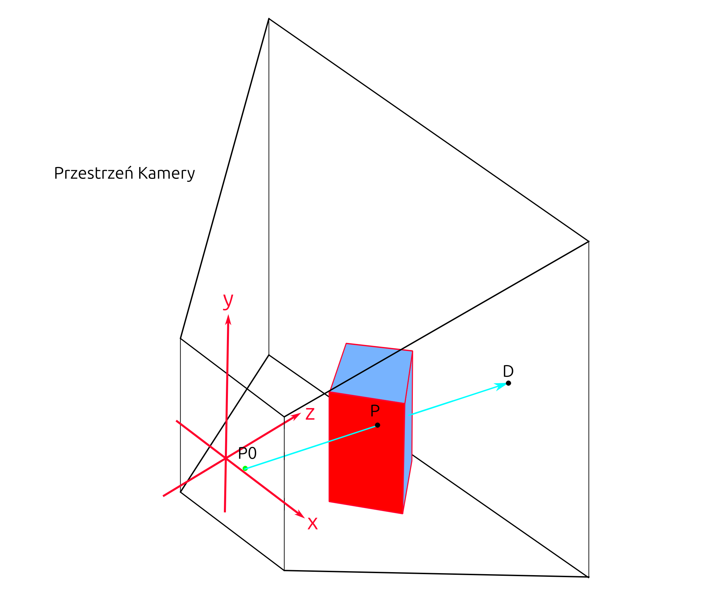</img>

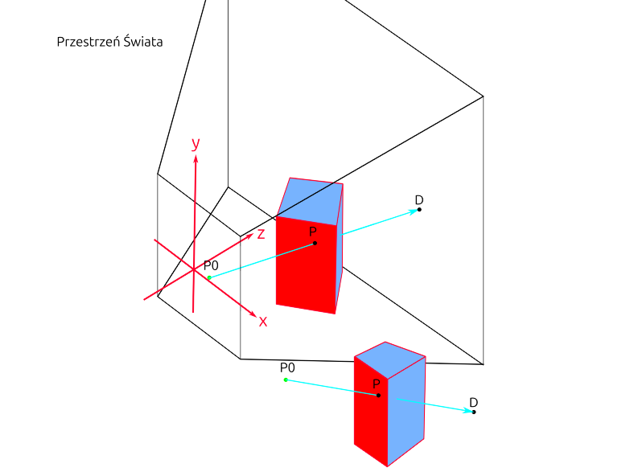</img>

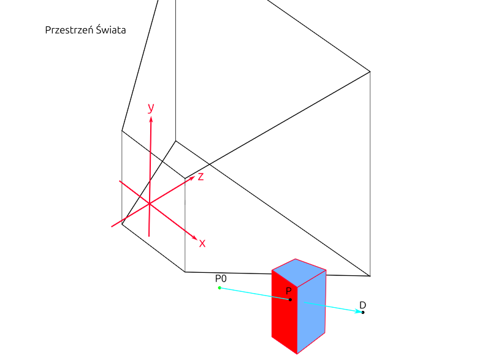</img>

6. Zamiana wektorów **P0** i **D** na trójwymiarowe. Aby móc użyć półprostej w obliczeniach w przestrzeni świata, musimy z powrotem sprowadzić **P0** i **D** do postaci trój-wymiarowych wektorów.  Aby tego dokonać musimy upewnić się że czwarta wartość **w** wynosi 1. W tym celu wystarczy podzielić **P0** i **D** przez ich wartości **w**, po czym odrzucić wartość **w** zamieniając je z powrotem na trójwymiarowe wektory.

7. Znalezienie wszystkich kolizji półprostej ze ścianami w scenie 3D. 


Prostopadłościany znajdujące się w przestrzeni świata są określone przez zbiór wierzchołków. Na każdy prostopadłościan mamy 4 ściany boczne do sprawdzenia kolizji z półprostą. Wiemy że każda ściana składa się z 4 wierzchołków o znanych koordynatach (xyz). Ponieważ wszystkie ściany w projekcie leżą wzdłóż dwóch osi układu współrzędnych, możemy określić powierzchnię danej ściany jako wycinek pewnej płaszczyzny, którego ramy określone są przez wierzchołki ściany. Zanim jednak przejdziemy do tego jak określić czy dany punkt na płaszczyżnie znajduje się w tym wycinku, musimy odpowiedzieć na pytanie - czy któryś z punktów należących do wyznaczonej półprostej, znajduje się na tej płaszczyżnie?

#### Algorytm znalezienia punktu przecięcia półprostej i płaszczyzny:

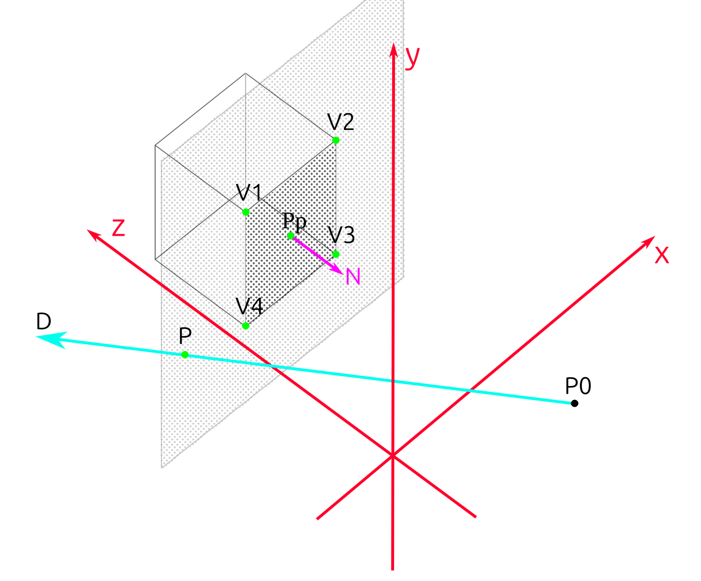</img>

Legenda:
- P0 - punkt startowy półprostej o koordynatach (x0, y0, z0)
- D - wektor kierunkowy półprostej o składowych (dx, dy, dz)
- Pp - punkt na środku płaszczyzny o koordynatach (a, b, c)
- N - wektor normalny płaszczyzny który wychodzi z jej punktu środkowego o składowych (A, B, C)

Poszukujemy wartości koordynat (x,y,z) punktu P leżącego zarówno na płaszczyźnie jak i na półprostej.

1. wzór na półprostą można zapisać jako L(t)=P0+tD, czyli punkt początkowy P0, oraz wektor kierunkowy półprostej D, gdzie t to skalar determinujący punkt na półprostej.

A więc dla punktu P, wartości x,y,z wynoszą:
- x = x0 + t*dx
- y = y0 + t*dy
- z = z0 + t*dz

2. Iloczyn skalarny (ang. dot product) dwóch wektorów prostopadłych wynosi 0. Wiemy że punkty Pp i P leżą na płaszczyźnie. Dlatego też wektor (V) pomiędzy tymi punktami również leży na płaszczyźnie. Z definicji wektor normalny to wektor prostopadły do płaszczyzny. Zatem wektory V i N są do siebie prostopadłe, a więc wzór na płaszczyznę możemy zapisać jako: 

N dot V = 0

wzór na wektor pomiędzy Pp a P : 

V = P - Pp

z konkatenacji tych dwóch wzorów, otrzymamy wzór:

N dot (P - Pp) = 0

króry możemy rozwinąć do:

A(x-a)+B(y-b)+C(z-c) = 0

Ax-Aa+By-Bb+Cz-Cc = 0

Ax+By+Cz-Aa-Bb-Cc = 0

Ax+By+Cz-(Aa+Bb+Cc) = 0

na podstawie danych wejściowych znamy wartość stałej -(Aa+Bb+Cc), dla wygody dalszych obliczeń będziemy ją więc zapisywać jako D:

D = -(Aa+Bb+Cc)

Wzór na płaszczyznę sprowadziliśmy do Ax+By+Cz+D=0

Podstawmy teraz wzory na (x,y,z) punktu P, do wzoru na płaszczyznę:

A(x0 + t*dx)+B(y0 + t*dy)+C(z0 + t*dz)+D=0

A*x0 + A*t*dx + B*y0 + B*t*dy + C*z0 + C*t*dz + D=0

A*x0 + B*y0 + C*z0 + D + t*(A*dx) + t(B*dy) + t(C*dz) = 0

A*x0 + B*y0 + C*z0 + D + t*(A*dx + B*dy + C*dz) = 0 | -(A*x0+B*y0+C*z0+D)

t*(A*dx + B*dy + C*dz) = -(A*x0 + B*y0 + C*z0 + D) | :(A*dx + B*dy + C*dz)

t = -(A*x0 + B*y0 + C*z0 + D) / (A*dx + B*dy + C*dz)

Znając wartość t, możemy znaleść wartości (x, y, z) punktu P:

x = x0 + t*dx

y = y0 + t*dy

z = z0 + t*dz

Po znalezieniu punktu przecięcia się półprostej z płaszczyzną (P), należy sprawdzić czy znajduje się on w obrębie podanej ściany bocznej. 

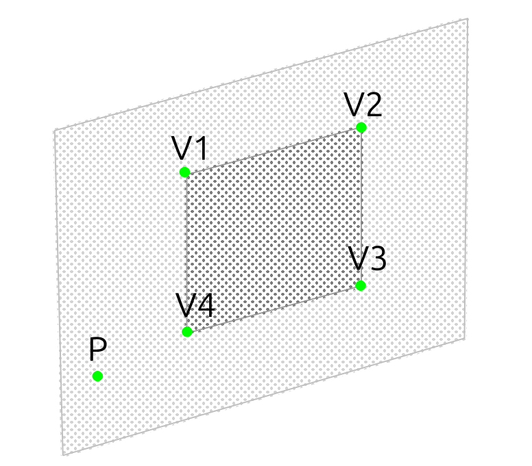</img>

Wszystkie wierzchołki tej ściany, oraz punkt P, znajdują się na tej samej płaszczyźnie. Ponieważ wszystkie ściany boczne w scenie 3D (TODO: przypis: w przestrzeni świata) są ułożone równolegle/prostopadle do osi świata, jedna ze zmiennych (x,y,z) będzie taka sama dla wszystkich punktów leżących na tej płaszczyźnie. Należy więc znaleść minimalną i maksymalną wartość dwu pozostałych zmiennych, dla wierzchołków ściany, a następnie sprawdzić czy wartości (x,y,z) punktu P znajdują się w wyznaczonym przedziale.
Jeśli tak, uznajemy że wykryto kolizję, jeśli nie - brak kolizji.

8. Po spawdzeniu kolizji dla wszystkich ścian w scenie, mamy do czynienia z jedną z trzech opcji, zależnie od tego z iloma ścianami wykryto kolizję:
- 0 : brak kolizji. Wskazany przez użytkownika obszar nie nadaje się do zawieszenia/zdjęcia obrazu.
- 1: stwierdzono kolizję z jedną ścianą - należy zawiesić na niej obraz, lub jeśli jest już jakiś zawieszony, zdjąć go.
- 2+: znaleziono więcej niż jedną ścianę z którą nastąpiła kolizja - półprosta przecina ściany znajdujące się jedna za drugą. W tej sytuacji obraz należy zawiesić na najbliższej ścianie. Jest to ściana której punkt przecięcia jest najbliżej punktu startowego półprostej.

# 4. System Android

Niniejszy rozdział przedstawia najważniejsze zagadnienia dotyczące projektowania aplikacji mobilnych na system Android. 

## 4.1 Android – najważniejsze cechy systemu

Co do samego systemu android, to jest on w stanie uruchomić aplikacje napisane w języku Kotlin,Java, lub C++. Zdecydowałem się użyć w projekcie języka Java, gdyż jestem z nim najlepiej zaznajomiony. Aby chronić dane systemowe i częściowo zabezpieczyć system przed szkodliwym oprogramowaniem, każdy proces w systemie Android jest odpalany na osobnej wirtualnej maszynie Javy co izoluje go od innych aplikacji. Co więcej Android stosuje zasadę najmniejszych przywilejów - standardowo każda aplikacja dostaje dostęp tylko do zasobów niezbędnych do jej działania. Rozdziela też aktywności i widoki – czyni to poprzez rozdzielenie w strukturze projektu klas aktywności obsługujących logikę aplikacji i prezentację aplikacji. Opis wyglądu aplikacji definiowany jest w plikach xml. Ta separacja umożliwa w prosty sposób zastosowanie MVC - wzorca architektonicznego postulującego rozdzielenie dostępu do danych aplikacji, logiki aplikacji, i części wyświetlającej interfejs użytkownika. Taka architektura wspiera tworzenie kodu, który jest łatwiejszy do utrzymania.

## 4.2 Aplikacje mobilne na Android – typy aplikacji, proces tworzenia

https://www.bitstudios.com/blog/types-of-mobile-applications/#:~:text=Types%20of%20Mobile%20Applications%3A%20Native%2C%20Hybrid%2C%20Web%2C%20and,UI.%20...%204%204.%20Progressive%20Web%20Apps%20
https://medium.com/@ashleycooper22/web-ui-vs-native-ui-choosing-the-best-option-for-your-app-df68ce9926fc

### 4.2.1 Aplikacje natywne na Android

Aplikacje natywne - aplikacje natywne mogą być tworzone na dwa sposoby: pisane w języku java lub kotlin które posiadają dostęp do pełnej funkcjonalności Android, lub w innych językach z użyciem ndk(native development kit), albo innym języku wyposażonym w warstwę translacji do obsługi Android API. Posiadają(tu przypis: o ile otrzymają go od urzytkownika) pełny dostęp do API systemu Android, co pozwala im na korzystanie z sterowników hardware umożliwiających zapis i odczytywanie danych na urządzeniu, używanie mikrofonu, głośników czy kamery. Pozwala to twórcą oprogramowania na optymalizacje aplikacji natywnych pod względem wydajności i rozmiaru. Do wad aplikacji natywnych należy zaliczyć ścisłe powiązanie z systemem Android, a co za tym idzie brak przenaszalności, uzależnienie od pośrednika - sklepu play, a także brak pełnej kontroli nad aktualizacją aplikacji - użytkownik może wyłączyć aktualizacje.

### 4.2.3 Aplikacje Web UI na Android

Aplikacje webowe to po prostu strony internetowe posiadające pewną dozę interaktywności. W kontekście typów aplikacji dostępnych na Android przez aplikacje webowe mamy na myśli interaktywne strony internetowe zaprojektowane z myślą o urządzeniach mobilnych. Tworzone są za pomocą technologii webowych takich jak html, css i js. Użytkownik może korzystać z aplikacji webowej jedynie przez przeglądarkę, nie można ich zainstalować w pamięci telefonu. Z tego powodu nie da się też ich sprzedać w sklepie play, i należy znaleść inny sposób dystrybucji/reklamy. Sama aplikacja ma dostęp jedynie do funkcjonalności udostępnianej przez przeglądarkę, co oznacza że w porównaniu z innymi typami aplikacji aplikacje webowe są najbardziej ograniczone w możliwości wykorzystania zasobów i funkcjonalności systemu Android. Przez to aplikacje webowe mają zazwyczaj gorszą wydajność od aplikacji natywnych. Zaletami Aplikacji Webowych są min. przenaszalność, łatwość utrzymania(aktualizacje na serwerze, obsługa Android API zapewniona przez dostawcę przeglądarki), a także najniższy możliwy rozmiar(nie trzeba ich instalować na urządzeniu klienta). Wiążą się z tym jednak pewne wady, tzn. dostawca aplikacji musi utrzymywać bazę z danymi kont użytkowników, żeby korzystać z aplikacji użytkownik potrzebuje dostępu do internetu.

### 4.2.3 Aplikacje Hybrydowe na Android

Programy napisane w języku webowym, uruchamiane wewnątrz aplikacji napisanej w języku natywnym, nazywanej potocznie "wrapper"-em. Taka struktura pozwala korzystać z większości zalet aplikacji webowych, jednocześnie mitygując wady takie jak niemożność wystawienia ich na sklepie play, czy brak możliwości dodania ikony aplikacji na ekranie startowym. Mogło by się wydawać iż aplikacje hybrydowe łączące w sobie korzystne cechy aplikacji webowych i natywnych są najlepszym rozwiązaniem w każdym przypadku, jednak podejście to nie jest bez wad. Należy się zastanowić, gdy zależy nam przede wszystkim na dostępności naszej aplikacji na wielu systemach, czy tworzenie i utrzymywanie wrappera nie jest zbędnym wysiłkiem przynoszącym niewielkie korzyści, w takiej sytuacji prawdopodobnie lepiej jest wybrać aplikację webową. Z drugiej strony jeśli zależy nam na optymalnym wykorzystaniu zasobów urządzenia, np. dla aplikacji działającej w większości lub całkowicie na systemie klienta, korzystającej w niewielkim stopniu z internetu, aplikacje natywne wydają się lepszym rozwiązaniem.

Wybierając typ aplikacji najlepiej pasujący do wymagań Wirtualnej Galerii, kierowałem się ustalonymi założeniami projektowymi. Aby móc zrealizować funkcjonalność 3D aplikacja potrzebuje pełnego dostępu do API systemu android, w tym API OpenGL ES, co dyskwalifikuje aplikacje webowe. Wirtualna Galeria wykożystuje głównie zasoby lokalne, dlatego aplikacja hybrydowa nie miałaby by w tym przypadku przewagi nad aplikacją natywną, więc ze względu na potencjalnie lepszą wydajność, a także dostępność materiałów szkoleniowych dotyczących użycia OpenGL ES w języku Java, wybrałem aplikację natywną.


# 5. Projekt Rozwiązania

Poniższy rozdział poświęcony został opisowi wymagań funkcjonalnych i pozafunkcjonalnych projektu Wirtualna Galeria, analizie profilu użytkownika do którego jest on skierowany, przypadkom użycia oraz opisowi procesu powstawania aplikacji z uzasadnieniem użycia poszczególnych narzędzi i frameworków.

## 5.1 Wizja realizacji projektu

## 5.2 Wymagania

### 5.2.1 Wymagania funkcjonalne

* możliwość projektowania układu ścian w widoku 2D
* możliwość wizualizacji pomieszczenia w widoku 3D
* możliwość poruszania się w przestrzeni 3D
* automatyczne zapisywanie i wczytywanie stanu aplikacji do bazy danych
* wieszanie obrazów na ścianach
* zdejmowanie obrazów ze ścian
* aplikacja potrzebuje pozwolenia na odczytywanie zdjęć użytkownika
* aplikacja wysyła użytkownikowi prośbę o pozwolenie na odczyt zdjęć z urządzenia. Jeśli użytkownik wyrazi zgodę aplikacja pozwala na wieszanie tych zdjęć na ścianach. Bez tej zgody aplikacja działa w ograniczonym zakresie - użytkownik może jedynie dodawać/usuwać puste ściany

### 5.2.2 Wymagania pozafunkcjonalne

* Prosty i Intuicyjny interfejs użytkownika
* Łatwość użycia – maksymalnie 1 godzina szkolenia w celu samodzielnego wykorzystywania podstawowych funkcji

### 5.2.3 Wymagania Techniczne

* wersje Android API: minSdk 24 targetSdk 33
* baza danych SQLite

## 5.3 Analiza profilu użytkownika

Aplikacja będzie skierowana do:
* osób szukających nowego sposobu oglądania swoich kolekcji zdjęć, filmów etc.
* osób chcących wypróbować metodę mnemotechniczną Pokój Pamięci nie wkładając w nią wielkiego wysiłku
* osób chcących zaplanować dekorację wnętrz
* osób pragnących zademonstrować znajomym swoje zdjęcia w ciekawej formie

## 5.4 Diagram przypadków użycia

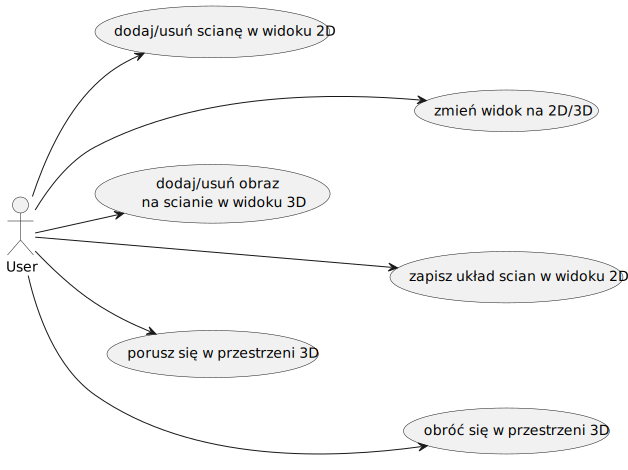</img>

_Ilustracja 4: diagram przypadków użycia - opracowanie własne_

## 5.5 Przegląd istniejących rozwiązań

Co do aplikacji dostępnych na system Android, jest bardzo prawdopodobne że w momencie pisania tej pracy nie istnieje druga aplikacja podobna do Wirtualnej Galerii. W Sklepie Play znajdują się przykładowo aplikacje nazwane „Mind Palace”1, czy „Trening Pałacu Pamięci”2, ale żadna z nich nie oferuje funkcjonalności 3D. Istnieje też wiele aplikacji ze słowami „3D” i „Gallery” w nazwie, np. „Galeria zdjęć 3D i HD”3 czy „Pro 3D Magic Gallery”4. Jednak we wszystkich znalezionych przypadkach są to galerie 2D, a funkcjonalność 3D ogranicza się do obracania przeglądanych zdjęć podczas przeglądania galerii. Funkcjonalność taka jak projektowanie układu ścian, czy wieszanie obrazów na ścianach wydaje się być na ten moment unikalna dla Wirtualnej Galerii. Jest to obiecująca informacja pokazująca potencjalną niszę rynkową.

## 5.6 Koncepcja wyglądu UI aplikacji

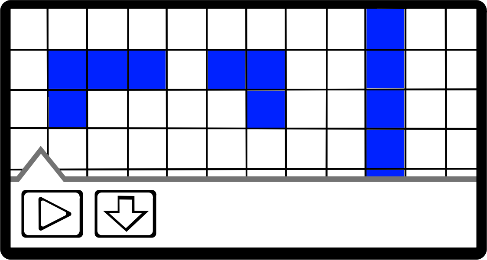</img>

_Ilustracja 5: koncept UI w widoku 2D – opracowanie własne_

Powyższa ilustracja przedstawia pierwotny koncept interfejsu użytkownika widocznego po uruchomieniu aplikacji. Użytkownik może zapełniać kolorem komórki kratownicy. Komórki wypełnione kolorem symbolizują ściany Wirtualnej Galerii, i będą odpowiadać rozmieszczeniem ścianom w widoku 3D. Poniżej kratownicy widzimy pasek narzędzi, użytkownik wybiera poszczególne narzędzia poprzez wybranie ich ikon. Ikona trójkąta „Play” uruchamia widok 3D, a ikona strzałki skierowanej w dół zapisuje układ kratownicy, (aby aplikacja mogła wygenerować układ ścian w widoku 3D odpowiadający układowi komórek kratownicy należy go zapisać).

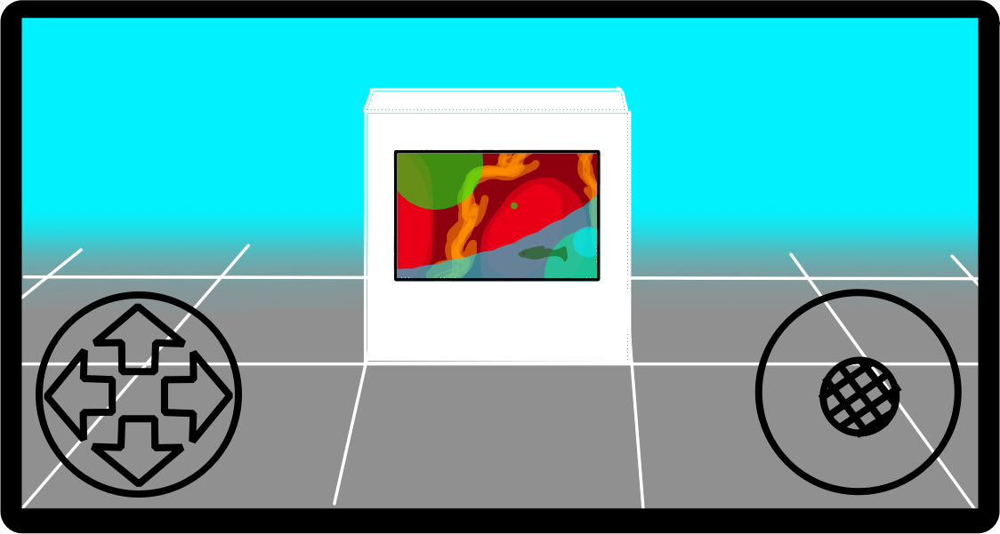</img>

_Ilustracja 6: koncept UI w widoku 3D – opracowanie własne_

Powyższa ilustracja przedstawia  pierwotny koncept interfejsu użytkownika widocznego po uruchomieniu za pomocą przycisku „Play”. Jak widać jest on w pełni trójwymiarowy. W widoku 3D znajdują się trójwymiarowe obiekty takie jak podłoga, ściany, i obrazy. Na Ilustracji widzimy białą ścianę stworzoną w poprzednim widoku 2D, na której użytkownik zawiesił wybrany przez siebie obraz. Perspektywa kamery to tak zwana perspektywa pierwszo-osobowa, symulująca obraz widziany z oczu niewidzialnego obserwatora. Po prawej stronie ilustracji widzimy kontroler sterujący obrotem kamery, a po lewej kontroler sterujący jej ruchem.  Wybór takiego układu kontrolerów jest zainspirowany podobnym układem w wielu popularnych grach mobilnych i konsolowych, np. Minecraft Mobile. Pozwala to na szybsze oswojenie się użytkownika ze sterowaniem.

## 5.7 Zadania projektowe


## 5.8 Język programowania i środowisko programistyczne

(uzasadnić wybór Javy - OpenGL można pisać w C, C++, Javie ale na Android tylko Java)

Java - jest to język obiektowy. Dzięki zastosowaniu języka obiektowego uzyskujemy m.in. dostęp do dziedziczenia klas co znacznie zwiększa tempo rozwoju kodu i pozwala uniknąć duplikacji fragmentów kodu. Użycie klas i interface-ów pozwala na rozległą specyfikację typów danych ponad podstawowe (prymitywne) takie jak int czy string. Jest to język ściśle typowiony, to znaczy wartości danego typu mogą zostać przypisane tylko do zmiennych o tym samym typie, lub przekazane do funkcji które akceptują argumenty tego samego typu. Ponadto określenie typu zmiennej/parametru jest jawne i następuje zanim do zmiennej/parametru zostanie przypisana jakakolwiek wartość. Ścisłe typowienie umożliwia wykrywanie błędów już na etapie pisania kodu, jeszcze przed kompilacją. Jest to możliwe dzięki „inteligentnym asystentom” wchodzącym w skład popularnych IDE (zintegrowanych środowisk developerskich) takich jak np. Visual Studio czy w naszym przypadku Android Studio.

## 5.9 Biblioteka OpenGL ES

OpenGL jest zaprojektowany do użycia go razem z GPU, który standardowo obsługuje wiele wątków równocześnie - umożliwia to wykonywanie operacji takich jak obliczenie pozycji wielu wektorów o wiele szybciej niż obliczanie ich wewnątrz CPU. 
Pisanie programów w OpenGL ES wymaga zrozumienia jego specyficznych konceptów. Aplikacja wykorzystująca bibiotekę OpenGL ES działa równocześnie na CPU i GPU. Część aplikacji działająca na CPU musi móc się porozumieć z częścią działającą na GPU. Rolę pośrednika pełni bibioteka OpengGL ES. To ona wysyła program do uruchomienia na GPU, i koordynuje przesyłanie danych. 

Podstawowe koncepty biblioteki:

* Specyficzne przekazywanie danych między CPU i GPU:
   * vertex shader
   * fragment shader
   * koncept "program"
   * atrybuty i uniformy - dane wejściowe shaderów
   * struktura danych opisująca bryłę
   * bufory - Vertex Buffer Object, Index Buffer Object
   * przekazywanie wartości do atrybutów i uniformów Shadera
* tekstury i mapowanie UV
* dostępne prymitywy - punkt, linia, trójkąt
* macierze w OpenGL ES
* ustawianie Viewport-u
* realizacja "Face Culling" i "Deph testing"
* implementacja interface-u GLSurfaceView.Renderer

(jak te koncepty realizują rodział 3.1 - dać w odnośnikach)

## 5.9.1 Shadery

Shadery ( TODO: wstawić odnośnik do 3.1.2) w OpenGL ES są pisane w języku GLSL (OpenGL Shading Language). Poniżej pokazujemy przykład:

Vertex shader:

```
uniform mat4 u_Matrix;

attribute vec4 a_Position;
void main()                    
{
    gl_Position = u_Matrix * a_Position;
}
```
Fragment shader:

```
uniform vec4 u_Color;
void main()
{
    gl_FragColor = u_Color;
}
```
OpenGL ES kompiluje shadery i łączy je  (vertex shader i fragment shader) w jeden "program". Przedstawiono to na diagramie sekwencji poniżej.

## 5.9.2 Dane wejściowe Shaderów

Dane wejściowe shaderów dzielą się na:
Attribute: Dane specyficzne dla każdego wierzchołka (np. pozycja).
Uniform: Dane wspólne dla wszystkich wierzchołków (np. macierze transformacji, kolor).


## 5.9.3 Struktura danych opisująca bryłę

Jednym z najważniejszych atrybutów przekazywanych do "programu" jest lista wierzchołków definiujących kształt bryły. Nazwijmy ją "Vertex Array". Każdy wierzchołek składa się z trzech zmiennych `(x,y,z)`. OpenGL ES wymaga określenia metadanych opisujących wierzchołki: ilości bajtów na każdą zmienną, kolejności bajtów w pamięci (ang. byte order) oraz z ilu zmiennych składa się wierzchołek. Tak opisany "Vertex Array" tworzy ciągły obszar pamięci, który jako całość przesyłany jest do GPU. Dzięki metadanym GPU potrafi odnaleźć kolejne wierzchołki w przesłanym buforze i użyć wierzchołka jako wartości atrybutu `a_Position` w powyższym shaderze.

Znaczenie wierzchołków zawartych w buforze określane jest dopiero na etapie rysowania. Jeśli np. użyjemy funkcji `glDrawElements(GL_TRIANGLES, ...)` to znaczy, że będziemy iterować po buforze pobierając po 3 wierzchołki. Kolejne 3 wierzchołki opisują pojedynczy trójkąt. Ściana bryły będąca prostokątem wymaga zatem 6 wierzchołków. Jeżeli natomiast użyjemy `glDrawElements(GL_LINES, ...)` to znaczy, że będziemy iterować po buforze pobierając po 2 wierzchołki i rysować na ich podstawie proste odcinki.

OpenGL ES rysuje całość grafiki korzystając z 3 podstawowych prymitywów:
* punktu - `glDrawElements(GL_POINTS, ...)`
* linii (odcinka) - `glDrawElements(GL_LINES, ...)`
* trójkąta - `glDrawElements(GL_TRIANGLES, ...)`

Kolejnym elementem optymalizacji jest "Index Array". Możemy mieć bowiem sytuację gdy te same wierzchołki są użyte do narysowania wielu prymitywów. Np. wierzchołki opisujące prostokąt (2 trójkąty, 6 wierzchołków) mogą też opisać krawędź tego prostokąta (4 odcinki, 8 wierzchołków). Ale możemy też opisać te prymitywy używając tylko 4 wierzchołków oraz indeksów tych wierzchołków:

```
float[] vertices = {
    // x     y      z
    -1.0f, -2.0f,  1.0f,  // Bottom-left
     1.0f, -2.0f,  1.0f,  // Bottom-right
     1.0f,  2.0f,  1.0f,  // Top-right
    -1.0f,  2.0f,  1.0f,  // Top-left
};

short[] rectFaceIndices = {
    0, 1, 2,  // Rectangle face, triangle 1
    2, 3, 0,  // Rectangle face, triangle 2
};

short[] rectEdgeIndices = {
    0, 3,  // Left edge, line 1
    3, 2,  // Top edge, line 2
    2, 1,  // Right edge, line 3
    1, 0,  // Bottom edge, line 4
};
```
OpenGL umożliwia rysowanie prymitywów zarówno bezpośrednio na bazie listy wierzchołków jak i na bazie indeksów w uprzednio zdefiniowanym buforze wierzchołków.

## 5.9.4 Przekazywanie wartości do atrybutów i uniformów Shadera

Oprócz zdefiniowania bufora wierzchołków (lub bufora ich indeksów) programista OpenGL musi jeszcze wskazać który bufor ma zostać użyty jako źródło danych dla konkretnego atrybutu Shader-a. Sekwencja tego powiązania jest następująca:
1. pobranie uchwytu (ang. handle) do atrybutu: `a_PositionLocation = glGetAttribLocation(programObjectId, a_Position)`
2. powiązanie bufora z atrybutem: `glVertexAttribPointer(a_PositionLocation, vertices)`
3. aktywacja atrybutu: `glEnableVertexAttribArray(aPositionLocation)`

## 5.9.5 macierze w OpenGL ES

## 5.9.6 ustawianie Viewport-u

## 5.9.7 realizacja "Face Culling" i "Deph testing"

## 5.9.8 Implementacja interface-u GLSurfaceView.Renderer

`android.opengl.GLSurfaceView` jest implementacją Androidowego View przez OpenGL ES.
Jest to View dynamiczne - jego zawartość jest rysowana z pomocą klasy implementującej interface `Renderer`. 
Aplikacja musi zdefiniować tą klasę i wywołać metody biblioteki OpenGL ES opisane w poprzednich rozdziałach zgodnie z następującymi wytycznymi:
* zadania konstruktora klasy:
   * załadowanie kodu shaderów 
   * zdefiniowanie zmiennych przechowujących:
      * uchwyty do atrybutów i uniformów Shaderów
      * macierze view, projekcji, odwróconą macierz viewProjection
* zadania metody `onSurfaceCreated()` (wywoływana gdy aktywuje się View):
   * inicjowanie wszystkich macierzy
   * zdefiniowanie opisu brył (vertexy i indeksy)
   * aktywowanie "Face Culling" i "Deph Test"
   * kompilacja kodu Shaderów i zbudowanie "programu"
   * pobranie uchwytów do atrybutów i uniformów użytych w Shader-ach
   * załadowanie tekstur
   * ustawienie stałych kolorów (dla brył nie zmianiających koloru w czasie)
* zadania metody `onSurfaceChanged()` (wywoływana gdy zmieniają się wymiary View):
   * określenie Viewport-u
   * policzenie proporcji szerokość/wysokość View i wyliczenie macierzy projekcji
* zadania metody `onDrawFrame()` (wywoływana co każdą klatkę odrysowywania View):
   * czyszczenie sceny - rysowanie tła
   * modyfikacja macierzy view
   * modyfikacja odwróconej macierzy viewProjection (dla detekcji kolizji)
   * aktywacja "programu" który ma być użyty dla renderowania sceny
   * wyliczenie finalnej macierzy transformacji (mnożenie macierzy modelu, view, projekcji)
   * przesłanie macierzy translacji do GPU jako wartości uniforma `u_Matrix` z Vertex Shader-a
   * wywołanie metod rysujących prymitywy

Powyższy interface nie zapewnia jednak interakcji z użytkownikiem - nie reaguje na zdarzenia dotknięcia ekranu urządzenia z Androidem. Musi on być zatem rozszerzony i spięty z Androidowym systemem detekcji zdarzeń.

Aby móc reagować na zdarzenia dotknięcia ekranu i zrealizować algorytm kolizji opisany w rozdziale 3.2 należy:
* w klasie `Activity` Androida zainstalować `View.OnTouchListener` z przeciążoną metodą `onTouch()`
* w tej metodzie przechwycić zdarzenie `MotionEvent.ACTION_DOWN`
* w reakcji na nie wywołać metodę `handleTouchDrag()` rozszerzonej implementacji Render-a opisane poniżej

Klasa implementująca interface `Renderer` może go rozszerzyć o metodę `handleTouchDrag()`
* w niej wykorzystać odwróconą macierz viewProjection do detekcji kolizji półprostej wychodzącej z punktu dotknięcia wgłąb sceny 3D z bryłami wyświetlonymi w tej scenie
* można też wykorzystać punkt dotknięcia do sterowania wirtualną kamerą (zbliżenia, oddalenia, obroty) realizowanego jako modyfikacja macierzy View


## 5.9.9 Przekazywanie danych między CPU i GPU - Diagramy UML

Shadery są uruchamiane na procesorze graficznym. Biblioteka Opengl ES i jej funkcje pośredniczą w wymianie informacji między aplikacją uruchomioną na procesorze, z shaderami uruchomionymi na procesorze graficznym.
W danym momencie może być aktywny tylko jeden vertex shader i jeden fragment shader. Aby uniknąć niezgodności pomiędzy nimi, vertex shadery i fragment shadery łączone są w pary zwane jako "program". Do wyświetlenia danej bryły, wykożystane zostaną shadery z ostatniego aktywowanego programu. Należy wziąść ten fakt pod uwagę w procesie wyświetlania brył, aby mieć pewność że dla każdej z nich zostanie użyty odpowiedni program.
Na poniższym wykresie przedstawiony został proces stworzenia "programu" dla OpenGL ES w aplikacji "Wirtualna Galeria"

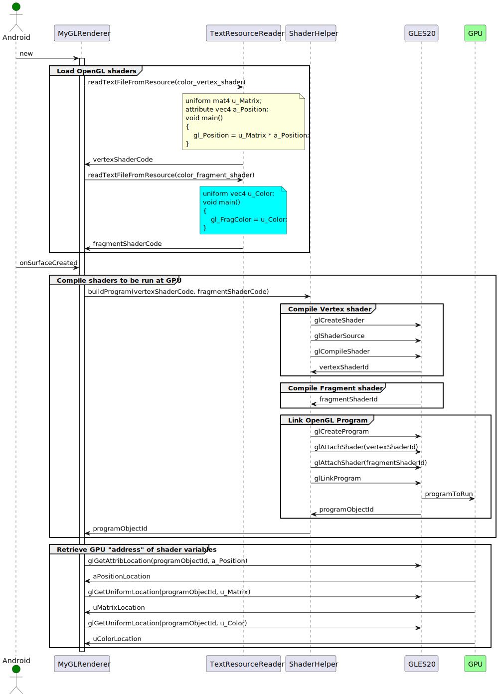</img>

_Ilustracja 2: wykres sekwencji przygotowania shader-ów - opracowanie własne_


1. Funkcja readTextFileFromResource()  wczytuje kod shadera z zasobów (katalogu Resources) i konwertuje go na string.
2. Funkcja CompileVertexShader() tworzy shader z przekazanego kodu źródłowego w formacie string:
- glCreateShader tworzy obiekt shader (zwracając handler do niego)
- glShaderSource przekazuje do powstałego obiektu (wskazanego poprzez podanie handlera) kod źródłowy 
- glCompileShader kompiluje kod źródłowy wewnątrz wskazanego obiektu shader (wskazanego poprzez podanie handlera)
3. Funkcja glCreateProgram() tworzy "program", czyli obiekt przechowujący informację o tym jakiego vertex shadera i fragment shadera użyć w danym momencie.
4. Funkcja glAttachShader() dodaje shader do programu.
5. Funkcja glLinkProgram() weryfikuje poprawność programu:
- to czy program posiada vertex shader i fragment shader
- sprawdzana jest zgodność vertex shadera i fragment shadera. Przykładowo, czy output vertex shadera odpowiada inputowi fragment shadera.
Jeśli uzna że program jest poprawny, od tej pory będzie można go używać w procesie wyświetlania sceny. Aktywacja poprawnie "przyłączonego" programu zachodzi poprzez wywołanie funkcji glUseProgram().

Następnie należy wskazać skąd będą przekazywane argumenty do programu. Zmienne wejściowe dla programu są określone w vertex shaderze. Dzielą się na: 
- attribute - zbiór danych, np. lista kolorów dla wierzchołków bryły. 
- uniform - jedna wartość dla wszystkich wierzchołków, np. Macierz transformacji
1. funkcja glGetAttribLocation() zwraca handler do zmienne wejściowej typu attribute w programie.
2. funkcja glGetUniformLocation() zwraca handler do zmienne wejściowej typu uniform w programie.


Na poniższym diagramie pokazana została sekwencja wyświetlania brył z zastosowaniem stworzonego uprzednio "programu":

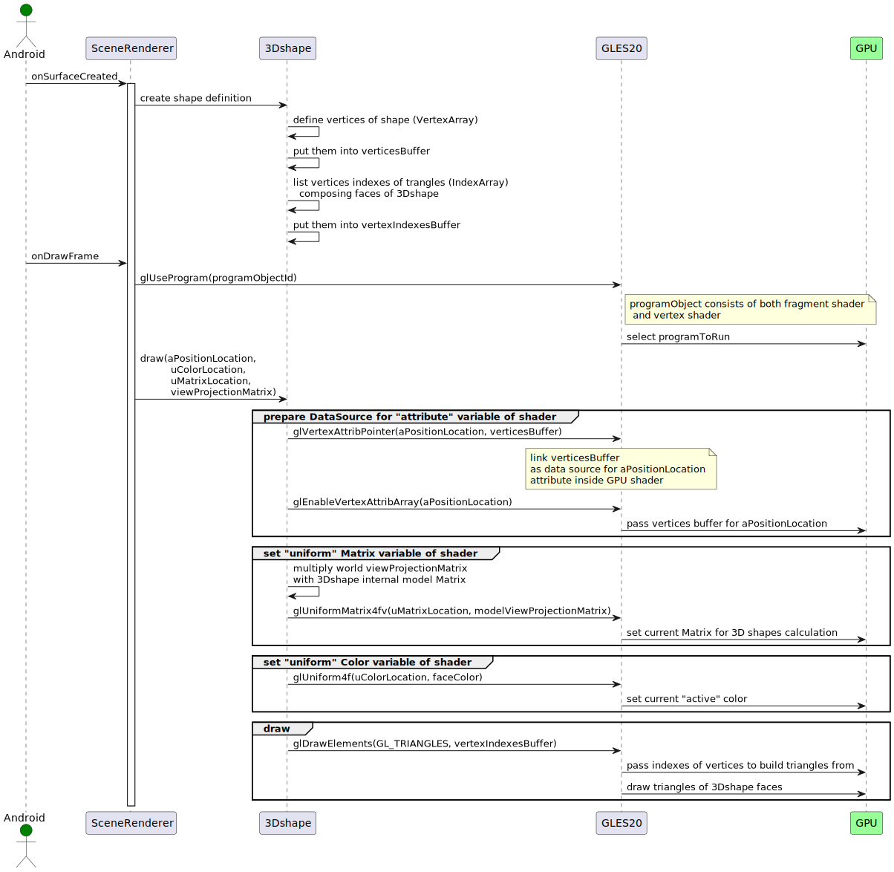</img>

_Ilustracja 3: wykres sekwencji renderowania obiektów - opracowanie własne_

1. Podczas wczytywania sceny, w funkcji onSurfaceCreated(), tworzone są obiekty zwane "ścianami". Wewnątrz każdego z nich zawarty jest zbiór wierzchołków, definiujących kształt tej bryły.
2. Następnie pobierane są handlery do zmiennych "programu".(to już było opisane wcześniej)
3. Podczas wyświetlania sceny, w funkcji onDrawFrame:
ustawienie atrybutu:

najpierw ustawiamy pozycję startową buffera, poprzez użycie funkcji `setVertexAttribPointer()`.
Funkcja `glVertexAttribPointer()` łączy handler do zmiennej "programu" typu atrybut z podanym bufforem.
atrybut jest "aktywowany" przez `GLES20.glEnableVertexAttribArray(attributeLocation);`

        floatBuffer.position(dataOffset);
        // tell OpenGL where to find data for our attribute pointed via attributeLocation
        GLES20.glVertexAttribPointer(attributeLocation, componentCount, GLES20.GL_FLOAT,
                false, stride, floatBuffer);
        // we’ve linked our data to the attribute, we need to enable the attribute
        GLES20.glEnableVertexAttribArray(attributeLocation);

ustawienie uniformu:

```
   GLES20.glUniformMatrix4fv(uMatrixLocation, 1, false, modelViewProjectionMatrix, 0);
   GLES20.glUniform4f(uColorLocation, edgeColor[0], edgeColor[1], edgeColor[2], 1.0f);
```

Po połączeniu wszystkich zmiennych "programu" z buforami, można w końcu użyć "programu" do wyświetlenia bryły.
funkcja GLES20.glDrawElements() tworzy reprezentację bryły na ekranie i wysyła ją do framebuffera


# 6. Implementacja

## 6.1 Wzorce Architektoniczne

## 6.2 Baza Danych

## 6.3 Opis Klas

## 6.4 Narzędzia graficzne

Do wykonania obiektów graficznych takich jak min. logo aplikacji użyłem darmowej aplikacji open-source Krita

## 6.5 Testowanie aplikacji

## 6.6 Zarządzanie projektem informatycznym

Kontrola Wersji – Git 
Innym narzędziem które zostało wykorzystane w projekcie jest git który jest jednym z najpopularniejszych systemów kontroli wersji. Istotnym elementem procesu tworzenia oprogramowania jest kontrola wersji rozwijanego kodu źródłowego, a główną zaletą użycia systemu kontroli wersji jest łatwość rewizji wprowadzanych zmian i przyspieszenie wykrywania błędów. Wraz z wprowadzaniem zmian wytwarzana jest historia rozwoju w której zawarte są informacje o zmianach dacie i autorze zmiany. W sytuacji wykrycia błędu w działaniu wyprodukowanej aplikacji, historia wersji tej aplikacji pozwala na szybkie zdiagnozowanie przyczyny błędu i naprawę.

## 6.7 Napotkane problemy

(przerobić poniższą historię implementacji na opis problemów napotkanych podczas implementacji)

Rozwój projektu był prowadzony w sposób iteracyjny. Poszczególny etap rozwoju miał precyzyjnie wyznaczony cel (np. wyświetlenie konkretnej bryły 3d), który starałem się osiągnąć wprowadzając jak najmniej zmian do kodu. Zakończenie etapu weryfikowane było przez testy manualne. Podejście to pozwoliło mi na szybkie znajdywanie rozwiązań napotkanych problemów. A problemów było wiele ponieważ nie miałem do tej pory styczności z tą technologią. Inkrementalny rozwój kodu pozwolił na dokładniejsze śledzenie tępa postępu pracy.
    • Etap 0 „Konfiguracja Środowiska” – aby móc rozpocząć pracę w android studio musiałem najpierw wykonać kilka niezbędnych kroków. Po pierwsze musiałem dodać ścierzkę komendy adb do zmiennej środowiskowej PATH. Następnie musiałem stworzyć emulator telefonu na którym będę testował działanie aplikacji, a na koniec stworzyć nowy projekt i wybrać odpowiednią wersję sdk.
    • Etap 1 „Widok 2D” – w tym etapie moim celem było stworzenie interaktywnego widoku i aktywności. Rozpocząłem od stworzenia projektu w Android Studio. Następnie zmodyfikowałem wygenerowany layout wedle koncepcji wygląd
    • Etap 2 „Czarny Ekran” – Zacząłem od stworzenia nowej aktywności przeznaczonej do wyświetlania przestrzeni 3D. Po uruchomieniu aktywności, aktywność tworzy klasę „MyGLSurfaceView”i przypisuje ją jako swój widok. W konstruktorze klasy „MyGLSurfaceView” tworzony jest „SceneRenderer” i przypisywany do niej za pomocą metody „setRenderer”. To właśnie w klasie „SceneRenderer” mieści się główna logika wyświetlania obiektów 3D. Trzy główne metody tej klasy to „onSurfaceCreated”, „onSurfaceChanged”, oraz „onDrawFrame”. Na początek, aby wypróbować działanie programu, ustawiłem kolor tła na czarny w „onSurfaceCreated” i sprawdziłem że aplikacja uruchamia się i wyświetla się czarny ekran
    • Etap 3 „Zielony Trójkąt” – celem tego etapu było wyświetlenie jakiejkolwiek bryły w przygotowaniu do wyświetlania bardziej zaawansowanych obiektów składających się na scenę Wirtualnej Galerii. Aby szybko wypróbować działanie programu, wybrałem najprostszą figurę geometryczną do wyświetlenia – trójkąt. W tym celu musiałem stworzyć klasę Triangle, posiadającą listę punktów z których będzie składał się trójkąt (vertex-ów), a następnie napisać „vertex shader”i „fragment shader” Aby można było ich użyć, w metodzie „onSurfaceCreated”, podczas inicjowania klas użytych w aktywności, shadery są przekazywane jako wartości String do metod biblioteki GLES20, gdzie są tworzone, kompilowane, i łączone w „program”. Taki „program” jest następnie wysyłany zapisywany, aby mógł zostać użyty podczas wyświetlania obiektu poprzez „GLES20.glUseProgram”. Po skonfigurowaniu używanego programu, koloru, oraz odnośnika do listy werteksów, figura jest rysowana przez „GLES20.glDrawArrays”. Po uruchomieniu aplikacji na tym etapie wyświetla się statyczny zielony trójkąt
    • Etap 4 „Obrót” –(b6e1da8a) ten etap służył zrozumieniu obrotu figur w przestrzeni 3d. W „SceneRenderer” dodałem zmienną przechowującą macierz rotacji *(w kolejnych etapach przemianowaną na „modelMatrix” i przeniesioną do klasy obiektu do którego się odnosi). Przy każdym wywołaniu funkcji rysującej obiekty, najpierw, na podstawie punktu czasowego w animacji(reszta z dzielenia czasu systemowego przez czas potrzebny na wykonanie pełnej animacji) podstawie czasu systemowego oraz kąta rotacji obliczana jest na nowo macierz rotacji, a następnie na jej podstawie macierz mvp(model, view, projection). W tym przypadku macierz rotacji to macierz „model”, ponieważ odnosi się tylko do modelu – trójkąta (tylko on będzie obracany). Pozostałe macierze „view” i „projection” pozostają bez zmian w trakcie działania programu. Macierz mvp obliczana jest przez pomnożenie tych trzech macierzy, a następnie zostaje przekazana do funkcji „Draw()” w klasie „Triangle”. Stamtąd wysyłana jest do vertex shadera, który na jej podstawie oblicza aktualną pozycję każdego vertexa figury. Po uruchomieniu aplikacji na tym etapie wyświetla się obracający się zielony trójkąt
    • Etap 5 „Sześcian”  - w tym etapie testowałem wyświetlanie jednej z najprostszych figur przestrzennych – sześcianu.
    • Etap 6 „Obrót kamery”
    • Etap 7 „Sterowanie”
    • Etap 8 ostatni „Refaktoring”

# 7 Dokumentacja techniczna projektu

Instrukcja użytkowania

# 7.1 Instalacja aplikacji

Aby zainstalować aplikację należy:

 1. pobrać plik .apk z https://github.com/bogumil-latuszek/android_OpenGL_learning/releases/tag/v1.0
 2. odszukać go w systemie plików, najprawdopodobniej będzie w katalogu Downloads, potem kliknąć na niego i wybrać opcję „zainstaluj”
 3. wyrazić zgodę na instalację i poczekać aż instalacja zakończy się pomyślnie

# 7.2  uruchomienie aplikacji i opis funkcjonalności 2D

Po zainstalowaniu i uruchomieniu aplikacji pokaże nam się poniższy ekran:

Jeśli jest to pierwsze uruchomienie, wyświetli się pop-up z prośbą o udzielenie uprawnienia do odczytu zdjęć z urządzenia. Należy wyrazić zgodę, aby aplikacja miała pełną funkcjonalność. W przypadku odmówienia przyzwolenia użytkownik może tylko tworzyć/usuwać puste ściany. W przypadku jeśli pop-up się nie pojawia, można też przydzielić uprawnienia manualnie. W tym celu należy wejść w ustawienia > aplikacje, wybrać ikonę aplikacji z podanej listy, wejść w przyzwolenia i tam udzielić zgodę na odczyt zdjęć. Po zamknięciu pop-upa ukaże się właściwy ekran aplikacji – widok 2D

pierwsze co rzuca się w oczy w widoku 2D to kratownica zabierająca większość ekranu. Przeciągając palcem po ekranie możemy ją przesuwać w górę/dół prawo/lewo. Na poniższym zdjęciu kierunek przesuwania palcem jest zobrazowany czarną strzałką, a kierunek przesuwania kratownicy czerwoną:

Okno zawierające kratownicę służy przede wszystkim do projektowania układu ścian, a ściany służą do wieszania obrazów. Opowiemy o nich więcej przy opisie widoku 3D, na razie na potrzebę demonstracji stworzymy tylko jedną ścianę. Aby tego dokonać wystarczy kliknąć w dowolną komórkę na kratownicy. Pojawi się w niej ikona pokazująca, że w tym miejscu znajduje się ściana.
Jeśli umieściliśmy ścianę w złym miejscu, lub po prostu zmienimy zdanie co do układu, wystarczy jeszcze raz kliknąć w zajętą komórkę, a ikona zniknie:

Kiedy uznamy, że stworzony układ ścian nam pasuje, możemy go otworzyć w widoku 3D. Jednak aby widok 3D mógł odczytać i wyświetlić tak stworzony układ ścian, należy go wcześniej zapisać. Zapisu dokonujemy poprzez kliknięcie w ikonę zapisu na pasku narzędzi

Teraz możemy już przejść do widoku 3D, aby to zrobić klikamy w ikonę uruchomienia widoku 3D:

# 7.3 Opis funkcjonalności 3D

Po uruchomieniu widoku 3D zobaczymy poniższy ekran:

Jak widać jesteśmy teraz wewnątrz reprezentacji 3D układu ścian który stworzyliśmy w poprzednim rozdziale, nazwijmy ją „pokojem”. Po prawej widzimy stworzoną przez nas jedyną ścianę. Na dole ekranu widzimy kontrolki służące do poruszania się po pokoju. Przyjrzyjmy się najpierw kontrolce w lewym dolnym kącie ekranu, jest to kontrolka rotacji służąca do obracania się. Przytrzymanie jednej ze strzałek wskazujących w 4 kierunkach powoduje obrót w tym kierunku, kliknięcie w okrąg na środku kontrolki spowoduje zresetowanie obrotu, poniżej zobrazowane jest jej użycie, niebieskie punktowe światło reprezentuje dotyk palca.

Kontrolka w prawym dolnym ekranie służy do poruszania się, poniżej pokazane jest jej użycie:

Przejdźmy teraz do omówienia wieszania obrazów. Dostępne obrazy są ładowane z pamięci telefonu podczas uruchamiania aplikacji. Ładują się z katalogu DCIM/Camera. Aby zawiesić któryś z nich na jednej ze ścian należy jej dotknąć

Pojawi się na niej jeden z dostępnych obrazów:

Aby usunąć dany obraz należy jeszcze raz dotknąć ściany na której jest powieszony,

a obraz zniknie:

po kliknięciu jeszcze raz na ścianę zostanie zawieszony kolejny dostępny obraz, możemy w ten sposób wybrać który nam pasuje:

# Podsumowanie projektu

Wymieniona wyżej funkcjonalność pozwala zrealizować założenia projektowe. Stworzony interface jest minimalistyczny przez co użytkownik może skupić się na swoich celach artystycznych, a nie pokonywać złożonego UI jak w przypadku takich programów 3D jak Blender czy AutoCAD – one mają inne obszary zastosowań. Wirtualna Galeria ma natomiast służyć użytkownikom przez swoją Prostotę i intuicyjność – ma pozwolić im wykorzystać ich kreatywność do tworzenia barwnej, przestrzennej galerii obrazów lub zdjęć.

# Wnioski końcowe

# Bibliografia

    1. "OpenGL ES 3.0 Programming Guide – 2014, Ginsburg D, Purnomo B"
Źródła internetowe
    1. oficjalna dokumentacja systemu android:  https://developer.android.com/guide
    2. oficjalna dokumentacja android opengl ES:  https://www.opengl.org/Documentation/Specs.html

# Spis rysunków
